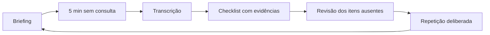

# Prova Prática TEME

Treino individual para transformar conhecimento em **ações observáveis dentro de cinco minutos**. Na estação, o que não foi dito ou demonstrado não entra no checklist, mesmo que o raciocínio estivesse correto.

> **Regra central:** verbalize prioridade, ação, dose/alvo e reavaliação. Ao executar um gesto, narre o que está fazendo e por quê.

## Como usar este módulo

1. Escolha uma estação no [simulador](praticas/SIMULADOR.md).
2. Faça a primeira tentativa sem consultar o resumo e grave sua resposta.
3. Confira item por item; confirme manualmente apenas gestos que realmente executou.
4. Estude os itens ausentes, repita a estação e acompanhe a aba **Desempenho** do simulador.

## Ciclo de treino sozinho

```mermaid
flowchart LR
    A[Briefing] --> B[5 min sem consulta]
    B --> C[Transcrição]
    C --> D[Checklist com evidências]
    D --> E[Revisão dos itens ausentes]
    E --> F[Repetição deliberada]
    F --> A
```

## O que a banca consegue pontuar

| Camada | O que precisa aparecer |
|---|---|
| Segurança | EPI, checagem do cenário, ajuda, monitorização e preparo de resgate quando pertinentes |
| Prioridade | A primeira ação trata a ameaça imediata, não apenas completa uma anamnese |
| Diagnóstico | Nomeia síndrome/achado e mostra quais dados sustentam a conclusão |
| Conduta | Diz ação, dose, via, alvo e sequência |
| Técnica | Escolhe material, posiciona, executa passos críticos e confirma sucesso |
| Reavaliação | Explica o que espera melhorar e o que fará se não melhorar |
| Comunicação | Dá comandos fechados, organiza equipe e explicita consultas/transferência |

## Banco de estações

O simulador reúne **82 estações v2**: seis simulados de treino, cinco estações históricas de 2025, cinco estações com checklist oficial TEME 2026, quinze cenários para as provas de 2022 a 2024 e outros casos de prática. Todas têm cinco minutos, fases progressivas, checklist observável de 100 pontos e correção ao final.

As cinco reconstruções históricas cobrem:

- ventilação mecânica e auto-PEEP;
- trauma com hemorragia exsanguinante;
- POCUS no choque, aneurisma de aorta e acesso guiado;
- síndrome colinérgica pediátrica;
- TCE grave e hipertensão intracraniana.

Os checklists históricos de 2025 já presentes no banco foram mantidos. As folhas disponíveis de 2024, trauma pediátrico e POCUS, foram reproduzidas item a item, preservando as pontuações originais de 0,1/0,2/0,4 ponto por meio de conversão proporcional para 100 pontos. Em 2026, as cinco folhas oficiais fornecem itens e pesos; casos, progressões e imagens do simulador são reconstruções de treino. Os casos e checklists dos demais temas de 2022 a 2024 são **reconstruções autorais para treino**, não reproduções de estações oficiais. As respostas de referência são educativas e devem ser confrontadas com protocolos atuais.

## Modos do simulador

- **Modo prova:** permite escolher os simulados 1 a 6 ou as provas TEME 2022 a 2026, cada qual com cinco estações fixas e nota final própria; os detalhes diagnósticos permanecem ocultos antes do início.
- **Treino dirigido:** permite escolher diretamente um cenário, ver a última nota concluída e refazê-lo.
- **Desempenho:** mostra tentativas, média concluída, lacunas frequentes e exportação do histórico neste navegador.

## Trilhas

- [Matriz da banca](praticas/MATRIZ_DA_BANCA.md): padrões de 2022 a 2026 e prioridades.
- [Procedimentos](praticas/PROCEDIMENTOS.md): roteiro verbal/manual dos gestos mais cobrados.
- [Simulador](praticas/SIMULADOR.md): cronômetro, gravação, checklist e correção.

> Material educacional. Em assistência real, confronte doses, dispositivos e fluxos com protocolos locais e condições do paciente.
