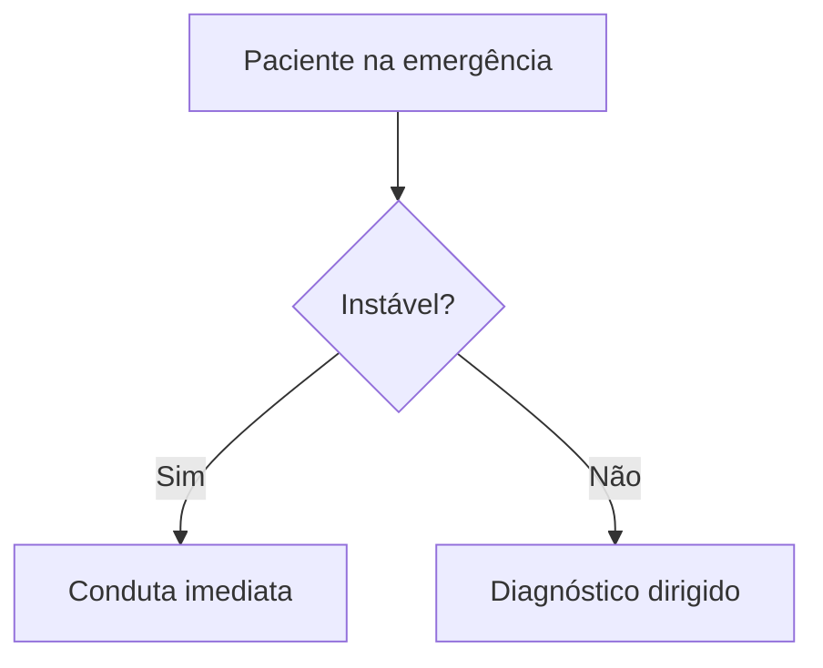

# NN - Nome Do Tema

## Leitura de 30 segundos

- Mensagem central 1.
- Mensagem central 2.
- Mensagem central 3.

## Por que cai

- Recorrência em provas/estações:
- O que a banca costuma testar:
- Como costuma aparecer:

## Abordagem prática

1. Passo inicial.
2. Intervenção que não pode atrasar.
3. Decisão crítica.
4. Reavaliação.

## Conceitos que sustentam a conduta

Explicação curta, apenas quando ajuda a entender a decisão.

## Fluxograma

## Doses, alvos e números

| Item | Número | observação TEME |
|---|---:|---|
| Exemplo | - | - |

## Pegadinhas TEME

- Pegadinha 1:
- Pegadinha 2:
- Pegadinha 3:

## Erros fatais na prática

- Erro 1:
- Erro 2:
- Erro 3:

## Para prova vs na prática

> **Para prova TEME:** resposta provável da banca.
>
> **Na prática clínica:** ajuste por contexto, diretriz atual ou protocolo local.

## Checklist de revisão

- [ ] Sei reconhecer indicação de conduta imediata.
- [ ] Sei as doses/alvos.
- [ ] Sei as contraindicações.
- [ ] Sei a pegadinha mais provável da banca.

## Questões e estações relacionadas

- TEME ano/questão:
- Estação prática:

## Referências

**Prova/TEME**

- Conteúdo programático TEME26.
- Referências bibliográficas TEME26.

**Material local**

- Aulas de cursinho:

**Atualização clínica**

- Diretriz/artigo:
