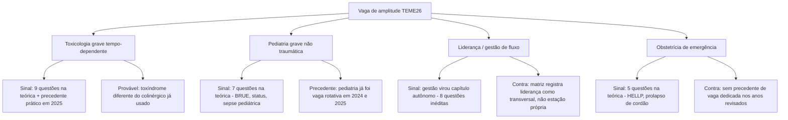

# Intensivo Claude

Aposta de estudo para a prova prática TEME26, montada a partir de três fontes do próprio projeto: o padrão histórico da banca, as estações reais de 2024-2025 e a distribuição temática da prova teórica TEME26. **Isto não é gabarito oficial.** É uma leitura de padrão para priorizar as próximas semanas, não uma garantia do que a ABRAMEDE vai aplicar.

> **Prova prática TEME26:** 27/09/2026, São Paulo/SP, das 9h às 20h (Edital TEME26). Formato: cenários clínicos e simulações, nota 0-100, aprovação com 70 pontos.

## Método da aposta

1. **Matriz da banca** ([praticas/MATRIZ_DA_BANCA.md](MATRIZ_DA_BANCA.md)): o padrão 2022-2025 mostra 3 eixos estruturais fixos (via aérea/VM, trauma, POCUS) e 2 vagas rotativas (cardio/pediatria e uma vaga de amplitude).
2. **Estações reais confirmadas** (checklists oficiais em `Praticas/Pratica 24`, `Praticas/Pratica 25`, `TEME24`, `TEME25`): validam que o formato é sempre 5 estações de 100 pontos cada, com checklist objetivo por tarefa.
3. **Distribuição temática da prova teórica TEME26** ([MAPA_DE_QUESTOES_TEME22-26.md](../MAPA_DE_QUESTOES_TEME22-26.md)): sinaliza onde a banca investiu peso novo neste ciclo — gestão (8 questões, capítulo autônomo pela primeira vez), APH/desastres (11 questões, o maior bloco temático), toxicologia (9), cardiologia eletroclínica e pediatria específica.

A aposta cruza os três: os eixos que **nunca falharam** viram apostas de confiança alta; os eixos que a teórica acabou de reforçar disputam as duas vagas que historicamente rodam.

## As 5 estações apostadas

| # | Estação | Aposta de conteúdo | Confiança |
|---|---|---|---|
| 1 | Via aérea/VM | Via aérea difícil/suja (SALAD), DSI/RSI em hipoxêmico ou leitura de curva com assincronia em VNI/PSV | Altíssima |
| 2 | Trauma/controle de danos | Hemorragia exsanguinante + torniquete/transfusão maciça, possivelmente com viés de incidente de múltiplas vítimas | Altíssima |
| 3 | POCUS | Aplicação à decisão: choque indiferenciado (RUSH), derrame pleural vs. pericárdico ou VExUS/fluido-tolerância | Altíssima |
| 4 | Cardiovascular/eletroclínica | ECG + decisão de marcapasso transcutâneo em BAVT instável, ou reconhecimento de complicação mecânica pós-IAM | Alta |
| 5 | Vaga de amplitude | Toxicologia grave tempo-dependente **ou** pediatria grave não traumática **ou** liderança/gestão de fluxo | Moderada (a mais incerta) |

## 1. Via aérea/ventilação mecânica

**Por que aposto nisso:** presente nas 4 provas práticas revisadas (2022-2025), sem exceção.

**O que dominar:**
- sequência verbal de via aérea difícil: predição, plano A-B-C-D declarado em voz alta, quem chama ajuda;
- SALAD/via aérea suja: sucção contínua antes de laringoscopia, não confiar em videolaringoscópio isolado;
- DSI vs. RSI: quando pré-oxigenar com sedação dissociativa em vez de bloqueio neuromuscular imediato;
- leitura de curva ventilatória: reconhecer auto-PEEP, assincronia e disparo/ciclagem inadequados, e verbalizar a correção (reduzir volume-minuto, ajustar sensibilidade).

**Estude a fundo em:** [temas/001 — Via aérea e ventilação mecânica](../temas/001_via-aerea_vm.md) e [praticas/TREINO_VISUAL.md](TREINO_VISUAL.md) (seção de curvas ventilatórias).

**Pegadinha provável:** insistir em dispositivo "heroico" quando o problema é sucção/contaminação, ou tratar auto-PEEP aumentando PEEP extrínseca em vez de reduzir volume-minuto.

## 2. Trauma/controle de danos

**Por que aposto nisso:** presente nas 4 provas revisadas; a teórica TEME26 teve o maior bloco temático em APH/regulação/desastres (11 questões), o que aumenta a chance de a estação de trauma incorporar cenário de múltiplas vítimas em vez de hemorragia isolada.

**O que dominar:**
- XABCDE com controle de hemorragia exsanguinante antes da via aérea quando indicado;
- torniquete: 5-7 cm proximal à lesão, nunca sobre articulação, horário registrado, sem afrouxar;
- protocolo de transfusão maciça 1:1:1, ácido tranexâmico, cálcio a cada 4 hemoderivados, aquecimento;
- se a estação pivotar para múltiplas vítimas: triagem por método local, zonas quente/morna/fria, EPI adequado e acionamento de comando de incidente antes de tratar individualmente.

**Estude a fundo em:** [temas/002 — Trauma hemorrágico e transfusão maciça](../temas/002_trauma-hemorragico.md) e [temas/013 — APH, regulação, IMV, desastres e transporte](../temas/013_aph-regulacao-imv-desastres-transporte.md).

**Pegadinha provável:** examinar/historiar antes de tratar a ameaça, ou tratar múltiplas vítimas como trauma individual sem triagem.

## 3. POCUS

**Por que aposto nisso:** presente nas 4 provas revisadas; a teórica TEME26 testou POCUS "integrado à decisão" (achado + limitação + conduta), não apenas reconhecimento de imagem isolado.

**O que dominar:**
- método de 4 frases: janela, qualidade, achado, conduta (ver ROTEIRO_5_MIN e TREINO_VISUAL);
- RUSH/choque indiferenciado: coração, VCI, pulmão, abdome e aorta integrados ao fenótipo clínico;
- diferenciar derrame pleural de derrame pericárdico na janela paraesternal;
- VExUS/fluido-tolerância: não confundir fluido-responsivo com fluido-tolerante;
- em procedimento guiado (acesso vascular, punção), a pergunta decisiva é sempre "onde está a ponta da agulha?".

**Estude a fundo em:** [temas/004 — POCUS](../temas/004_pocus.md) e [praticas/TREINO_VISUAL.md](TREINO_VISUAL.md).

**Pegadinha provável:** transformar achado positivo em etiologia única sem cruzar com o contexto clínico, ou confundir ausência de imagem com achado negativo.

## 4. Cardiovascular/eletroclínica

**Por que aposto nisso:** essa vaga ficou diluída em 2025 ("variável entre estações/casos"), mas a teórica TEME26 trouxe a maior carga eletroclínica das cinco provas — BAVT com indicação de marcapasso, ritmo de reperfusão pós-trombólise, HEART intermediário, dissecção, ruptura de parede livre pós-IAM. É o sinal mais forte de retorno desta vaga.

**O que dominar:**
- leitura de ECG na ordem fixa: frequência, ritmo, QRS, relação P-QRS, ST-T, diagnóstico, instabilidade;
- marcapasso transcutâneo: indicação em bradicardia instável refratária, aumentar corrente até captura elétrica **e** confirmar captura mecânica por pulso, não só espícula/QRS;
- reconhecer ritmo idioventricular acelerado pós-trombólise como sinal de reperfusão, não indicação de amiodarona;
- reconhecer sinais de complicação mecânica pós-IAM (nova insuficiência mitral, novo sopro, choque) e acionar avaliação cirúrgica/hemodinâmica.

**Estude a fundo em:** [temas/005 — SCA, arritmias e emergência hipertensiva](../temas/005_sca-arritmias-hipertensivas.md) e [praticas/PROCEDIMENTOS.md](PROCEDIMENTOS.md) (marcapasso transcutâneo e transvenoso).

**Pegadinha provável:** tratar ritmo de reperfusão como arritmia maligna, ou confirmar captura só pela espícula na tela sem checar pulso.

## 5. A vaga de amplitude

Esta é a estação historicamente mais variável — em cada ano revisado ela testou uma área clínica diferente (choque cardiogênico, sepse/CAD, morte encefálica, TCE/HIC com toxicologia pediátrica). Não há eixo único de confiança alta aqui; a aposta é distribuída entre quatro candidatos.

**Se for toxicologia grave:** revise antídotos tempo-dependentes e a dose/via/alvo de cada um — metanol (fomepizol/etanol + hemodiálise), antidepressivo tricíclico (bicarbonato de sódio para QRS alargado), paracetamol tardio (NAC mesmo após a janela clássica), flumazenil (risco de convulsão em uso crônico de benzodiazepínico). Estude em [temas/008 — Toxicologia e animais peçonhentos](../temas/008_toxicologia-animais-peconhentos.md).

**Se for pediatria grave:** revise sepse pediátrica (reconhecimento por perfusão/trabalho respiratório, não só PA), BRUE (critérios de baixo risco) e status epiléptico (sequência de drogas com dose por peso). Estude em [temas/010 — Emergências pediátricas](../temas/010_emergencias-pediatricas.md).

**Se for liderança/gestão de fluxo:** revise o huddle operacional curto (lotação, pacientes aguardando leito, riscos imediatos, responsável e prazo por ação) e a resposta imediata a evento adverso (cuidar do paciente, comunicar NSP, preservar registros, análise de causa raiz sem caça ao culpado). Estude em [temas/026 — Gestão do Departamento de Emergência](../temas/026_gestao-departamento-emergencia.md).

**Se for obstetrícia:** revise HELLP sem crise hipertensiva evidente e prolapso de cordão (posição genupeitoral, elevação manual da apresentação, cesárea de emergência). Sem tema dedicado no material atual — usar Tratado ABRAMEDE/HCFMUSP como referência complementar.

## Plano de estudo para os próximos 20 dias

| Período | Foco | Ação concreta |
|---|---|---|
| Hoje até 14/09 | Os 3 eixos de confiança altíssima (1, 2, 3) | Repetir cada estação no simulador, com cronômetro e narração, até fechar o checklist sem consultar o resumo |
| 15/09 a 21/09 | Eixo 4 (cardio) + os 4 candidatos da vaga 5 | Revisar os temas ligados de cada candidato; treinar o script verbal de marcapasso e de pelo menos 2 dos 4 cenários de amplitude |
| 22/09 a 26/09 | Simulado combinado + revisão de falhas | Rodar as 5 estações apostadas em sequência, cronometradas; revisar apenas os itens que ficaram ausentes ou incorretos |
| 27/09 | Prova prática | Chegar 1h antes; usar o [roteiro universal de 5 minutos](ROTEIRO_5_MIN.md) como estrutura de abertura em qualquer estação, prevista ou não |

## Se a aposta errar

Os eixos 1, 2 e 3 nunca faltaram em 4 anos — treiná-los não é desperdício mesmo se a vaga 4 ou 5 vier diferente do previsto. O [roteiro universal de 5 minutos](ROTEIRO_5_MIN.md) e os [procedimentos prioritários](PROCEDIMENTOS.md) foram desenhados para funcionar em qualquer estação, prevista ou não: segurança, ameaça, algoritmo, procedimento com confirmação, dose com alvo, reavaliação. Se a estação 5 for outro cenário — grande queimado, choque anafilático, agitação psicomotora grave —, a estrutura de verbalização continua valendo; falta só o conteúdo específico.

## Checklist antes de entrar na sala

- [ ] Treinei as 5 estações apostadas pelo menos uma vez cronometrado.
- [ ] Sei o script verbal de abertura de cor, sem precisar pensar na estrutura.
- [ ] Revisei os 4 candidatos da vaga de amplitude, mesmo sem saber qual vai cair.
- [ ] Sei confirmar sucesso de cada procedimento-chave (crico, torniquete, acesso guiado, marcapasso) sem depender do examinador para lembrar.
- [ ] Revisei minhas lacunas registradas em [Desempenho](DESEMPENHO.md).
- [ ] Sei que, se a aposta errar, o roteiro de 5 minutos resolve o resto.

## Referências

- [praticas/MATRIZ_DA_BANCA.md](MATRIZ_DA_BANCA.md) — padrão 2022-2025 usado como base da aposta.
- [MAPA_DE_QUESTOES_TEME22-26.md](../MAPA_DE_QUESTOES_TEME22-26.md) — distribuição temática da prova teórica TEME26.
- Checklists oficiais de estações reais: `Praticas/Pratica 24`, `Praticas/Pratica 25`, `TEME24`, `TEME25`.
- `TEME26/Edital TEME26.pdf` — data, formato e pontuação da prova prática (27/09/2026).
- Este capítulo é uma aposta gerada por IA (Claude) a partir do material do projeto, não uma fonte oficial da ABRAMEDE. Trate-o como hipótese de priorização de estudo, não como gabarito.
