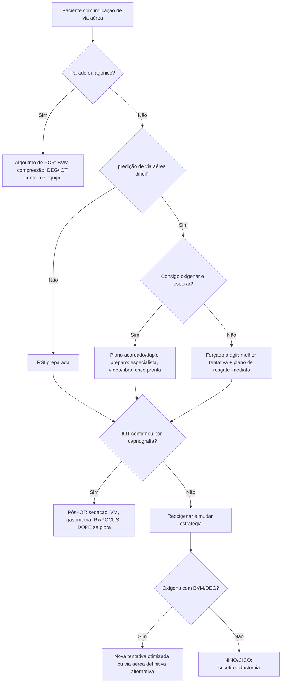
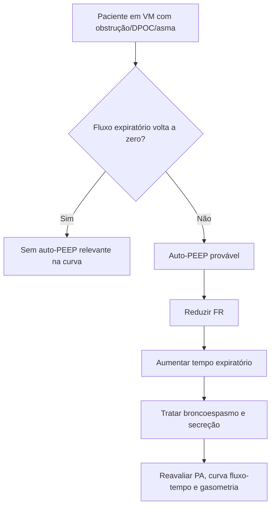

# Via Aérea e Ventilação Mecânica

## Leitura de 30 segundos

- Intubar não é "passar tubo": é **oxigenar, ventilar, proteger via aérea e sobreviver ao peri-intubação**.
- A banca ama a diferença entre via aérea difícil anatômica, via aérea difícil fisiológica e via aérea falha.
- Em paciente crítico, a melhor primeira tentativa é a que foi preparada: equipe, plano B, pré-oxigenação, ressuscitação, drogas, capnografia e sedação pós-IOT.
- Em VM, prova cobra o básico bem feito: VCV/PCV, volume corrente por peso predito, pressão de platô, driving pressure, gasometria, curva fluxo-tempo e auto-PEEP.

## Por que cai

Via aérea e VM aparecem todos os anos nas provas TEME22-26 e nas práticas. O padrão da banca é caso clínico com decisão sob pressão: intoxicado agitado, gestante eclâmptica, trauma, choque, DPOC/asma, TCE, PCR, falha de ventilação ou curva de ventilador.

Na prática, caiu de forma direta:

- 2022: BVM/dispositivo extraglótico, troubleshooting e trauma + POCUS.
- 2023: IOT com laringoscopia direta + bougie e suspeita de TRM.
- 2024: cricotireoidostomia cirúrgica ou por punção.
- 2025: modo VCV, gasometria, auto-PEEP na curva fluxo-tempo e correção por redução do volume minuto.

O que a banca costuma testar:

- Indicações de IOT: proteção de via aérea, falha de oxigenação/ventilação, curso clínico previsível.
- Pré-oxigenação adequada e apneic oxygenation.
- Escolha de droga em RSI conforme contexto fisiológico.
- Reconhecimento de via aérea falha e NINO/CICO.
- Capnografia e deterioração pós-IOT.
- Ajuste inicial do ventilador e interpretação de curvas.
- Dispositivos de oxigênio, VNI/CPAP/BiPAP e contraindicações.
- RCP, capnografia durante parada, pós-RCE e deterioração pós-transporte.
- POCUS pulmonar básico aplicado à dispneia e ao paciente ventilado.
- Cenários especiais: fumaça/CO/cianeto, corpo estranho, via aérea suja, Guillain-Barré, asma pediátrica e acidose extrema.

## Conceitos que sustentam a conduta

O erro cognitivo mais comum é tratar a intubação como procedimento isolado. Para a prova e para a sala vermelha, ela deve ser vista como uma sequência de risco: antes da laringoscopia vem oxigenação, hemodinâmica, acidose, preparo de resgate e plano de sedação; depois da passagem do tubo vem confirmação, ventilação e prevenção de colapso.

Via aérea difícil pode ser anatômica, fisiológica ou ambas. A anatômica dificulta ver ou acessar a glote. A fisiológica faz o paciente morrer durante uma tentativa tecnicamente perfeita: hipoxemia, choque, acidose metabólica grave, falência de VD, gestação e obesidade reduzem a margem de erro.

Em VM, a banca costuma cobrar a mecânica básica: volume corrente depende do peso predito, pressão de platô estima distensão alveolar no paciente passivo, driving pressure resume a relação entre volume entregue e complacência, e auto-PEEP aparece quando o fluxo expiratório não retorna a zero antes da próxima inspiração.

## Abordagem prática

### 1. Decida Se Precisa De Via aérea definitiva

Três indicações clássicas:

1. **Não protege via aérea:** coma, sangramento, vômitos, secreção, trauma facial, convulsão recorrente.
2. **Não oxigena ou não ventila:** hipoxemia refratária, hipercapnia com acidemia, fadiga, trabalho respiratório extremo.
3. **Vai piorar:** queimadura/inalação, angioedema, hematoma cervical, sepse/choque em exaustão, transporte inseguro, necessidade de procedimento/imagem.

Mensagem de prova: Glasgow baixo ajuda, mas não é a única indicação. Não espere o paciente "zerar" para assumir a via aérea.

### 2. Chame Ajuda E Prepare A Primeira Tentativa

Antes de induzir:

- Monitor: ECG, PA frequente, SpO2, capnografia pronta.
- Acesso venoso ou intraósseo funcionante.
- Aspiração ligada.
- BVM com PEEP, máscara adequada e técnica a quatro mãos se possível.
- Videolaringoscópio preferencialmente, quando disponível e com operador treinado; laringoscópio direto como alternativa, bougie, tubos testados, seringa e fixação.
- Dispositivo extraglótico de resgate.
- Kit de crico aberto ou imediatamente acessível.
- Vasopressor pronto se choque/risco de colapso.
- Sedação e analgesia pós-IOT prescritas antes do bloqueador.

### 3. Otimize Fisiologia Antes Da Laringoscopia

Via aérea fisiologicamente difícil mata antes da anatomia.

Use o mnemônico **CRASH**:

| Letra | Problema | O que fazer antes da indução |
|---|---|---|
| C | Consumo de O2 aumentado | pré-oxigenar melhor; reduzir tempo de apneia |
| R | Right ventricle/VD em risco | Evitar hipoxemia, hipercapnia e hipotensão |
| A | Acidose grave | Manter ventilação-minuto; não deixar apneia longa |
| S | Saturação baixa | VNI/HFNC/BVM com PEEP; rampa/cabeceira elevada |
| H | Hipotensão | Fluido se responsivo, sangue se hemorragia, vasopressor pronto |

Regra de sala vermelha: se dá para oxigenar por BVM/VNI, dá para ganhar tempo para preparar. Se não dá para oxigenar, é via aérea falha em evolução.

### 4. Faça RSI Quando A Primeira Tentativa Tem Boa Chance

Sequência prática:

1. preparação e plano verbalizado.
2. Pré-oxigenação por 3-5 min, com vedação e FiO2 adequadas. Oito respirações profundas são alternativa no cooperativo de baixo risco, não substituto confiável no crítico hipoxêmico.
3. Posicionamento: rampa/cabeceira elevada; estabilização manual em linha se trauma cervical.
4. Hipnótico ajustado à fisiologia, seguido de bloqueador em dose adequada para RSI. Reduzir hipnótico no choque não significa subdosar o bloqueador nem deixar paciente consciente e paralisado.
5. Laringoscopia com a melhor ferramenta disponível; bougie cedo se visão parcial.
6. Confirmar com capnografia em onda, ausculta e expansibilidade.
7. Fixar, sedar, analgesiar, ventilar e reavaliar hemodinâmica.

### 5. Se Falhou, Pare De Repetir O Mesmo Erro

Depois de tentativa ruim:

- Reoxigene.
- Melhore posição, aspiração, lâmina, operador e dispositivo.
- Use bougie se Cormack-Lehane II/III favorável.
- Use dispositivo extraglótico se ventilação por máscara está ruim ou tentativa nova não é segura.
- Declare via aérea falha cedo se não oxigena.

Os algoritmos não usam todos a mesma contagem: o modelo de Walls descreve falha após tentativas por operador experiente ou falha no paciente forçado a agir; o DAS 2025 limita a intubação a três tentativas, com uma adicional por profissional mais experiente quando apropriado. Isso é **teto, não meta**. Dessaturação ou ausência de oxigenação exige resgate antes desse limite. Não repita tentativa sem mudança relevante.

### 6. RSI, DSI Ou Intubação Acordada?

| Estratégia | Quando faz sentido | O que não pode faltar |
|---|---|---|
| RSI / sequência rápida | Precisa de IOT; pré-oxigenação viável; primeira tentativa com boa chance | Hipnótico + bloqueador, melhor operador, capnografia e resgate prontos |
| DSI / sequência prolongada | Agitação impede máscara/VNI e pré-oxigenação, mas há ventilação espontânea e tempo para otimizar | Dissociação para permitir oxigenação; depois decidir indução/bloqueio e IOT |
| Intubação acordada | Dificuldade prevista de intubação e de resgate, obstrução progressiva, ou risco importante de perder ventilação após indução | Especialista, anestesia tópica, oxigênio, sedação cautelosa e preservação da ventilação espontânea |

Na DSI, o Manual de Via Aérea 2026 descreve cetamina IV 0,5-1 mg/kg lentamente, em aproximadamente 60 s, com monitorização e resgate imediato. Permita pré-oxigenação, frequentemente com VNI/PEEP e FiO2 100%, por 3-5 min; reavalie PA e ventilação antes do bloqueador. A dose seguinte de hipnótico considera o que já foi administrado. **Cetamina não garante ventilação espontânea nem estabilidade pressórica.** DSI não resolve obstrução anatômica e não substitui intubação acordada.

No choque, corrija a causa e prepare vasopressor; um bolus de cristalóide para todos antes de IOT não demonstrou benefício. Na acidose metabólica grave, minimize apneia e preserve a ventilação compensatória; depois da IOT, gasometria precoce e ventilação-minuto compatível com a demanda, sem abandonar limites protetores. Na falência de VD, volume e PEEP excessivos também podem provocar colapso.

## Fluxograma

## Via aérea difícil: Mnemônicos Que Caem

| Mnemônico | Serve para prever | Itens-chave |
|---|---|---|
| LEMON | Laringoscopia difícil | Look, 3-3-2, Mallampati, obstrução, mobilidade cervical |
| ROMAN | BVM difícil | radiação/restrição, obesidade/obstrução, máscara com barba, idade avançada, no teeth |
| RODS | Dispositivo extraglótico difícil | Restrição abertura, obstrução, distorção, rigidez pulmonar/cervical |
| SMART | Crico difícil | Surgery, massa, acesso/anatomia, radiação, tumor/trauma |
| MACOCHA | IOT difícil em UTI/crítico | Mallampati, apneia, cervical, abertura oral, coma, hipoxemia, operador não anestesista |

Pegadinha: videolaringoscopia melhora visão, mas não garante passagem do tubo. Se a lâmina é hiperangulada, o tubo precisa de estilete bem moldado e trajetória adequada.

## Doses, alvos e números

### Drogas Da RSI

### Indutores

| Droga | Dose habitual adulto IV | Melhor uso | Cuidado de prova/prática |
|---|---:|---|---|
| Etomidato | 0,3 mg/kg | Instabilidade hemodinâmica, paciente crítico | Não analgesia; mioclonia; discussão sobre supressão adrenal |
| Cetamina | 1-2 mg/kg | Broncoespasmo, dor, hipotensão sem catecolamina esgotada | Pode aumentar FC/PA; em choque catecolamina-depletado também pode hipotensar |
| Propofol | 0,5-1,5 mg/kg no crítico | Convulsão, HIC selecionada, paciente estável | Hipotensão e vasodilatação; evitar dose cheia no choque |
| Midazolam | 0,1-0,3 mg/kg | Alternativa quando sem outros indutores | início mais lento; hipotensão; não é preferido para RSI moderna |
| Fentanil | 1-3 mcg/kg quando indicado como analgesia/pretratamento | Atenuar resposta simpática em casos selecionados | Não é pretratamento obrigatório; dose alta/rápida pode causar rigidez torácica e hipotensão, especialmente no choque |

### Bloqueadores Neuromusculares

| Droga | Dose RSI adulto IV | início/duração | Cuidado |
|---|---:|---|---|
| Succinilcolina | 1-1,5 mg/kg | Rápida, curta | Evitar em hiperK, queimadura/lesão muscular após 24-48 h, doença neuromuscular, hipertermia maligna, denervação |
| rocurônio | 1-1,2 mg/kg | Rápido, longo | Exige sedação pós-IOT impecável; paralisia longa máscara convulsão e desconforto |

> **Para prova TEME:** succinilcolina costuma aparecer como bloqueador clássico da RSI quando não há contraindicação. Rocurônio é alternativa forte quando há risco de hiperpotassemia, queimadura tardia, doença neuromuscular ou necessidade de evitar succinilcolina.
>
> **Na prática clínica:** a escolha entre etomidato/cetamina e succinilcolina/rocurônio depende do contexto, protocolo local, experiência e disponibilidade. Revisões e ensaios recentes sugerem mortalidade semelhante entre cetamina e etomidato, mas a cetamina pode ter mais instabilidade hemodinâmica peri-intubação em pacientes críticos; isso não transforma etomidato em resposta universal.

## Pré-oxigenação

Objetivo: aumentar reserva alveolar de O2 e prolongar tempo de apneia segura.

| situação | Estratégia |
|---|---|
| Cooperativo, baixo risco | máscara não reinalante bem vedada 3-5 min ou 8 respirações profundas |
| Hipoxêmico grave | VNI com PEEP/CPAP ou BVM com PEEP e vedação adequada |
| Obeso/gestante | Rampa, cabeceira elevada, PEEP, menor tolerância a apneia |
| DPOC/asma | Evitar hiperinsuflação; permitir expiração; considerar VNI se indicado |
| Durante apneia | Cateter nasal/HFNC se disponível para oxigenação apneica |

Pegadinhas:

- Saturação 100% não garante boa denitrogenação se a técnica foi ruim.
- máscara frouxa não pré-oxigena.
- Hipoxêmico shuntado pode não melhorar com máscara simples; precisa PEEP.
- Acidose grave não tolera apneia: o problema é ventilação-minuto, não só SpO2.

> **Atualização clínica:** o ensaio PREOXI, publicado em 2024, comparou VNI com máscara de oxigênio para pré-oxigenação antes de IOT em adultos críticos no DE/UTI e encontrou menos hipoxemia no grupo VNI. Para prova, continue marcando a técnica descrita como adequada pela referência TEME; para prática, VNI é uma opção forte quando há hipoxemia e não há contraindicação.

## Pós-IOT Imediato

Assim que o tubo passa:

1. Confirmar com capnografia em onda.
2. Fixar tubo e registrar profundidade.
3. Auscultar e observar expansão torácica.
4. Iniciar sedação e analgesia contínua.
5. Programar ventilador.
6. Reavaliar PA: hipotensão pós-IOT é comum.
7. Solicitar gasometria arterial e Rx/POCUS conforme contexto.

Se piorou depois de intubar, pense **DOPE**:

| Letra | Causa | Conduta |
|---|---|---|
| D | Deslocamento do tubo | Ver profundidade, capnografia, ausculta; reposicionar |
| O | Obstrução | Aspirar, checar dobra/mordida/rolha |
| P | Pneumotórax ou problema pulmonar | US pulmonar, descompressão se instável |
| E | Equipamento | Desconectar e ventilar com BVM; checar ventilador/circuito |

## Ventilação Mecânica Inicial

### Ajuste Geral De Partida

| Parâmetro | Valor inicial prático | observação |
|---|---:|---|
| Modo | A/C VCV ou PCV | VCV facilita prova e leitura de volume; PCV pode melhorar sincronia |
| VC | 6-8 mL/kg de peso predito | Em SDRA, mirar 6 mL/kg |
| FR | 16-20 irpm | Reduzir em asma/DPOC para evitar auto-PEEP |
| PEEP | 5 cmH2O | Aumentar conforme hipoxemia/recrutabilidade |
| FiO2 | 100% inicialmente se peri-IOT | Reduzir para alvo de SpO2 após estabilizar |
| Pressão de platô | <= 30 cmH2O | Medir em pausa inspiratória no VCV |
| Driving pressure | <= 15 cmH2O quando possível | Pplat - PEEP total, em paciente passivo; alvo fisiológico, não garantia isolada de proteção |

Peso predito, não peso real, guia o volume corrente. Obeso não recebe VC por peso total.

**Cálculo do peso predito para VM:** masculino = 50 + 0,91 x (altura em cm - 152,4); feminino = 45,5 + 0,91 x (altura em cm - 152,4). A altura de 170 cm corresponde a aproximadamente 66 kg e 61 kg, respectivamente. Na SDRA, 6 mL/kg desses pesos equivale a cerca de 396 e 366 mL, não ao volume calculado pelo peso da balança.

Meça platô por pausa inspiratória sem esforço do paciente; meça PEEP total por pausa expiratória em condições adequadas. Auto-PEEP = PEEP total - PEEP ajustada. Esforço ativo, vazamento e assincronia prejudicam essas medidas.

### SDRA: Reconhecer E Proteger

Pelo critério de Berlim, procure início em até uma semana, opacidades bilaterais não explicadas apenas por derrame/atelectasia e insuficiência respiratória não plenamente atribuível a edema hidrostático. Com PEEP/CPAP >= 5 cmH2O, PaO2/FiO2: leve > 200 até 300; moderada > 100 até 200; grave <= 100. A definição global também contempla pacientes em HFNC e uso de SpO2/FiO2 em condições específicas; identifique qual definição a questão utiliza.

- VC inicialmente 6 mL/kg de peso predito, ajustável entre 4-8 conforme platô, pH e sincronia; Pplat <= 30 cmH2O.
- Na SDRA moderada/grave, PEEP mais alta pode ajudar, mas exige reavaliação da hemodinâmica e da mecânica. Não fazer manobras prolongadas de recrutamento com alta pressão como rotina.
- PaO2/FiO2 persistentemente < 150 apesar de otimização: considerar prona precoce por sessões de pelo menos 16 h, conforme estratégia PROSEVA, com equipe preparada e avaliação de contraindicações. A recomendação geral ATS é mais de 12 h/dia na SDRA grave.
- Corticoide é recomendação condicional da ATS 2024; esquema e elegibilidade dependem do contexto. Bloqueio neuromuscular e ECMO são medidas selecionadas, não pacote obrigatório para todos.

Referências para essas decisões: [ATS 2024](https://doi.org/10.1164/rccm.202311-2011ST) e [definição global de SDRA](https://doi.org/10.1164/rccm.202303-0558WS).

### Alvos De Oxigenação E Ventilação

| Contexto | Alvo |
|---|---|
| Geral pós-IOT | SpO2 92-96% costuma ser razoável |
| DPOC/risco de hipercapnia | SpO2 88-92% |
| TCE grave sem herniação | Evitar hipoxemia; PaCO2 35-40 mmHg |
| Herniação cerebral iminente | Hiperventilação temporária como ponte, não rotina |
| SDRA | VC baixo, Pplat <= 30, permissão de hipercapnia se pH tolerável |

## Para prova vs na prática

> **Para prova TEME:** organize a resposta pela referência oficial mais recente: indicação clara de IOT, RSI quando apropriada, succinilcolina ou rocurônio conforme contraindicações, confirmação com capnografia, sedação pós-IOT e VM protetora.
>
> **Na prática clínica:** ajuste a técnica ao risco fisiológico e ao time disponível. Em paciente hipoxêmico, VNI/HFNC/BVM com PEEP podem ser melhores que máscara simples para pré-oxigenação. Em choque, ressuscitação e vasopressor pronto importam tanto quanto a lâmina. Em DPOC/asma, a prioridade ventilatória é evitar auto-PEEP, mesmo que o CO2 demore a normalizar.

## Tópicos Integradores De Prova E Plantão

Use esta parte como mapa de decisão rápido para cenários que a banca mistura com via aérea e ventilação.

### RCP, Capnografia E Pós-RCE

| Situação de prova | Como resolver | Pegadinha |
|---|---|---|
| PCR sem pulso | Compressão/desfibrilação vem antes da obsessão pelo tubo | Intubar antes de fazer RCP de qualidade |
| RCP com via aérea avançada | Não pausar compressão para ventilar; usar capnografia em onda | Ausculta isolada não confirma tubo |
| ETCO2 sobe abruptamente na RCP | Pense em RCE até prova em contrário | Achar que todo aumento é problema do ventilador |
| ETCO2 zera ou some após transporte | Pensar em extubação/deslocamento/desconexão | Procurar diagnóstico raro antes de checar circuito/tubo |
| FV refratária com ventilação efetiva | Depois de choques, adrenalina e antiarrítmico, pense em estratégia de desfibrilação conforme protocolo | Trocar uma via aérea que está ventilando bem |
| Pós-RCE pediátrico | Evitar hipóxia, hiperóxia, hipocapnia, hipercapnia e hipotensão | Deixar SpO2 100% e hiperventilar "por segurança" |

Frase de prova: **capnografia confirma ventilação e ajuda a detectar RCE, deslocamento do tubo e qualidade da RCP**.

### Oxigênio, VNI E POCUS Pulmonar

| Ferramenta | Serve para | Não confundir com |
|---|---|---|
| Cateter nasal comum | Baixo fluxo e conforto | Pré-oxigenação robusta no crítico |
| Máscara não reinalante | Alto fluxo/alta FiO2 se bem ajustada | PEEP ou ventilação |
| Venturi | FiO2 controlada, útil em risco de retenção de CO2 | Melhor dispositivo para shunt grave |
| HFNC | Alto fluxo aquecido/umidificado; pode ajudar na oxigenação apneica | Proteção contra aspiração ou garantia de ventilação na apneia |
| CPAP | Pressão contínua; edema agudo cardiogênico, hipoxemia selecionada | Ventilação em dois níveis |
| BiPAP/VNI dois níveis | Aumenta ventilação alveolar; DPOC hipercápnico acidótico | Paciente sem proteção de via aérea |

Contraindicações fortes à VNI: rebaixamento com secreção/vômitos, incapacidade de proteger via aérea, choque/instabilidade, trauma facial importante, pneumotórax não drenado, agitação sem cooperação e necessidade imediata de via aérea definitiva.

POCUS pulmonar que cai:

| Achado | Pense em |
|---|---|
| Linhas A + ausência de lung sliding + lung point | Pneumotórax |
| Linhas B difusas bilaterais | Síndrome intersticial: edema, SDRA, hemorragia alveolar, pneumonite |
| Consolidação com broncograma aéreo | Pneumonia/atelectasia conforme contexto |
| Derrame pleural | Líquido; no trauma pode ser hemotórax |
| Perfil B bilateral em LES hipoxêmico | Hemorragia alveolar entra no diferencial, mesmo sem hemoptise |

### Curvas, Mecânica E Gasometria Que Resolvem Questões

| Dado | Interpretação rápida | Conduta mental |
|---|---|---|
| Ppico alta com Pplat normal/menos alta | Resistência: broncoespasmo, secreção, tubo dobrado/mordido | Aspirar, broncodilatar, checar tubo/circuito |
| Ppico e Pplat altas | Complacência ruim: SDRA, edema, pneumotórax, abdome hipertenso | Reduzir VC, avaliar PEEP, procurar causa |
| Driving pressure alta | Complacência ruim para o volume entregue | Tentar menor driving pressure com oxigenação aceitável |
| Fluxo expiratório não volta a zero | Auto-PEEP/ar aprisionado | Reduzir FR/volume minuto e aumentar tempo expiratório |
| Capnograma em "barbatana" | Obstrução expiratória/broncoespasmo | Broncodilatador, tempo expiratório, checar tubo |
| VCV com FR fixa | Tempo total do ciclo = 60/FR | Mudar VC/fluxo altera tempo inspiratório, não o ciclo total |

Na titulação de PEEP, a prova tende a premiar **oxigenação suficiente com menor driving pressure e estabilidade hemodinâmica**, não SpO2 100% a qualquer custo.

### Via Aérea Suja, Corpo Estranho E APH

| Cenário | Resposta curta |
|---|---|
| Vômito/sangue/espuma na laringoscopia | Aspirador rígido pronto, aspiração contínua e técnica tipo SALAD; não insistir às cegas |
| Trauma facial sangrante | Pré-oxigenação, aspiração, melhor primeira tentativa e crico pronta |
| PAF cervical com sangue na boca + choque | Via aérea difícil + hemorragia; chamar cirurgia/trauma, controle de dano, plano cirúrgico de resgate |
| Extricação longa com acesso ruim | Priorizar oxigenação/ventilação simples possível no cenário; IOT pode não ser factível antes da retirada |
| Afogamento ou broncoaspiração | Hipóxia é o problema central: abrir via aérea, aspirar o que impede ventilação e ventilar |
| Adulto consciente com obstrução grave e tosse ineficaz | AHA 2025: alternar 5 golpes dorsais e 5 compressões abdominais; usar compressões torácicas na gestação avançada ou se não for possível envolver o abdome |
| Obstrução com perda de consciência | Iniciar RCP; ao abrir a via aérea, remover apenas objeto visível. Laringoscopia/Magill por equipe treinada e broncoscopia quando indicada; não fazer varredura digital cega nem empurrar objeto distalmente como conduta geral |

### Acidose Extrema, Choque E Intoxicações

| Situação | O que mata na intubação | Como pensar |
|---|---|---|
| Acidose metabólica grave | Perder ventilação-minuto durante apneia e pós-IOT | Pré-oxigenar sem parar ventilação; programar FR/VC que sustentem ventilação minuto inicial |
| TEP maciço/VD em falência | Hipotensão, hipoxemia e aumento de pressão intratorácica | Ressuscitar/tratar causa; se intubar, indução gentil e VM menos agressiva |
| Choque séptico hipoxêmico | Colapso peri-intubação | Vasopressor pronto, pré-oxigenação com PEEP, dose ajustada de indutor |
| Cocaína hipertermia/agitação | Hipertermia, acidose, rabdomiólise e catecolaminas | Benzodiazepínico, resfriamento, controle muscular e suporte |
| Tricíclico com choque/QRS largo | Arritmia e colapso | Bicarbonato e suporte hemodinâmico são prioridade junto do plano de via aérea |
| Fentanil rápido/alto | Rigidez torácica e dificuldade de ventilar | Usar com critério; se rigidez, suporte ventilatório e bloqueio neuromuscular |

### Situações Especiais Que A Banca Usa Como Atalho

| Cenário | Atalho de prova |
|---|---|
| Incêndio em ambiente fechado + cefaleia/vômitos | Intoxicação por CO: SpO2 pode ser falsamente normal; O2 100% e co-oximetria quando disponível |
| Incêndio + choque/lactato alto | Pensar em cianeto, além de CO e lesão térmica de via aérea |
| Fuligem, rouquidão, estridor, queimadura facial | Risco de edema de via aérea: intubação precoce se sinais progressivos |
| Guillain-Barré | Risco maior se progressão rápida, bulbar/autonômico, CVF caindo ou NIF fraco |
| Pediatria | Occipício/língua proporcionalmente maiores, laringe mais anterior/cefálica; dispositivo supraglótico pode ser resgate |
| Asma pediátrica que "ficou calma" | Pode ser fadiga/tórax silencioso, não melhora |
| Mergulho | Narcose por nitrogênio dá quadro neuropsíquico em profundidade; doença descompressiva é outro problema |

## Modos Ventilatórios Que Mais Caem

| Modo | O ventilador controla | O que varia | Pegadinha |
|---|---|---|---|
| VCV A/C | Volume e fluxo | Pressão | Se complacência piora, pressão sobe |
| PCV A/C | Pressão e tempo inspiratório | Volume | Se complacência piora, volume cai |
| PSV | Pressão de suporte nos ciclos espontâneos | Volume e FR dependem do paciente | Não usar como modo pleno em paciente profundamente sedado/paralisado |
| SIMV + PSV | Ciclos mandatórios + espontâneos assistidos | Misto | Mais complexo; pouco necessário no início |

Na estação prática 2025, o esperado era reconhecer **VCV** pelas curvas e identificar **auto-PEEP** na curva fluxo-tempo.

## Curvas E Auto-PEEP

Auto-PEEP = o paciente inicia a próxima inspiração antes de terminar a expiração. O ar fica preso, aumenta pressão intratorácica, piora retorno venoso, causa hipotensão e dificulta disparo.

Suspeite em:

- DPOC/asma.
- FR alta.
- Tempo expiratório curto.
- Fluxo expiratório que não volta a zero antes da próxima inspiração.
- Hipotensão ou piora respiratória após ventilação.

Como corrigir:

1. Reduzir volume minuto: principalmente diminuir FR.
2. Aumentar tempo expiratório: no VCV, maior fluxo inspiratório encurta a inspiração; no PCV, reduzir tempo inspiratório. Em PSV, aumentar o percentual de ciclagem pode corrigir ciclagem tardia.
3. Reduzir VC se seguro.
4. Broncodilatador é tratamento da obstrução.
5. Sedação/analgesia se assincronia.
6. Em colapso com suspeita de hiperinsuflação: desconectar brevemente para permitir expiração, avaliar DOPE e tratar a causa. Não prescrever compressão torácica manual como manobra rotineira; se não houver pulso, iniciar RCP.

## Cenário Especial: Asma/DPOC Intubado

Prioridade: evitar hiperinsuflação dinâmica.

| Parâmetro | Estratégia |
|---|---|
| VC | 6-8 mL/kg peso predito |
| FR | 8-12 irpm |
| Fluxo inspiratório | Alto para encurtar inspiração |
| I:E | Expiração prolongada |
| pH | Aceitar hipercapnia permissiva se perfusão e pH toleráveis |
| Pplat | Monitorar; se alta, avaliar hiperinsuflação |

Pegadinha TEME: a correção da auto-PEEP não é "aumentar FR para lavar CO2". Isso piora aprisionamento de ar.

## Cenário Especial: TCE/HIC

- Evitar hipoxemia sempre.
- Evitar hipotensão peri-intubação.
- Cabeceira elevada e cabeça neutra quando possível.
- PaCO2 alvo usual 35-40 mmHg.
- Hiperventilação só como medida temporária se sinais de herniação, enquanto terapia definitiva/hiperosmolar/neurocirurgia são acionadas.
- Sedação e analgesia evitam tosse, hipertensão e aumento de PIC.

Pegadinha: hiperventilar todo TCE grave por rotina pode reduzir fluxo cerebral e piorar isquemia.

## Cenário Especial: Gestante

- Dessatura rápido: menor reserva funcional e maior consumo de O2.
- Maior risco de aspiração.
- Via aérea edemaciada e sangrante.
- Deslocamento uterino para esquerda se gestação avançada.
- Eclampsia: sulfato de magnésio e controle pressor não devem ser esquecidos por causa da via aérea.

Para prova: gestante rebaixada, secreção, SpO2 baixa, eclampsia e risco de broncoaspiração tem indicação forte de IOT em sequência rápida com preparo cuidadoso.

## Cenário Especial: Angioedema/Infecção Cervical

Sinais ruins:

- Estridor.
- Voz abafada.
- Dificuldade de deglutir saliva.
- Edema de língua/lábios/pescoço.
- Trismo ou distorção anatômica.

Conduta: chamar ajuda cedo, preparar via aérea difícil e crico. Acordado pode ser melhor se ainda há tempo e cooperação. RSI em via aérea que vai fechar e anatomia distorcida pode transformar dificuldade em NINO.

## Pegadinhas TEME

- **"Cetamina absolutamente contraindicada"**: linguagem absoluta quase sempre é suspeita.
- **Cocaína/agitado/hipertérmico**: benzodiazepínico e controle de temperatura são centrais; beta-bloqueio isolado pode ser armadilha.
- **Succinilcolina no TCE agudo**: não é contraindicação automática; cuidado maior e hiperK em denervação/queimadura/lesão muscular tardia.
- **Fentanil na RSI**: não é proibido; dose alta/rápida causa rigidez torácica e hipotensão.
- **Pré-oxigenação por saturação apenas**: SpO2 boa não prova reserva segura.
- **Dispositivo extraglótico**: não é solução ideal se obstrução/distorção importante, vômito/sangue ou necessidade de altas pressões.
- **Capnografia alterada pós-transporte**: pense deslocamento/desconexão antes de diagnósticos raros.
- **ETCO2 sobe na RCP**: pense em RCE; confirme pulso/ritmo na pausa apropriada.
- **SpO2 normal no incêndio fechado**: não exclui CO, porque a oximetria comum pode enganar.
- **VNI**: DPOC acidótico é ótimo cenário; coma com secreção, choque ou pneumotórax não drenado é armadilha.
- **Corpo estranho não removível**: solicitar resgate especializado/broncoscopia; retirar apenas objeto visível e não deslocá-lo às cegas.
- **Guillain-Barré**: não espere hipoxemia; queda de força ventilatória e sinais bulbares/autonômicos vêm antes.
- **Auto-PEEP**: tratar reduzindo volume minuto e aumentando tempo expiratório.
- **VC no obeso**: usar peso predito, não peso real.
- **Hiperventilação no TCE**: ponte para herniação, não rotina.

## Erros fatais na prática

- Induzir antes de ter plano B e crico acessível.
- Tentar várias laringoscopias sem reoxigenar.
- Esquecer sedação pós-IOT após rocurônio.
- Não usar capnografia em onda para confirmar tubo.
- Intubar o choque sem vasopressor/sangue/ressuscitação preparados.
- Colocar FR alta em DPOC/asma e causar auto-PEEP com hipotensão.
- Tratar queda de saturação pós-IOT só aumentando FiO2, sem pensar DOPE.
- Não pedir gasometria depois de iniciar VM em paciente crítico.

## Pontos quentes TEME26

- **Paciente intubado inquieto/assincrônico:** não trate só aumentando midazolam. Reavalie dor, sedação, tubo, ventilador, assincronia e causas reversíveis; analgesia titulada vem antes de paralisia.
- **DSI vs RSI:** se o paciente não tolera pré-oxigenação, use cetamina para permitir VNI/PEEP e cabeceira elevada antes de bloquear. Se tolera VNI e anatomia é favorável, RSI bem preparada continua aceitável.
- **Preparação dupla:** em hipoxêmico/obeso, prepare a intubação e prepare resgate simultaneamente: PEEP, posição, sucção, vasopressor, dispositivo extraglótico e crico.
- **Via aérea suja:** sangue/vômito pede técnica tipo SALAD: sucção rígida contínua antes e durante a laringoscopia, posicionada na hipofaringe/proximal ao esôfago.
- **NINO/CICO:** falhou intubação e falhou ventilação com BVM/dispositivo extraglótico = cricotireoidostomia cirúrgica imediata, dedo-bisturi-bougie, com tubo adequado.
- **PSV em DPOC:** ciclagem tardia prolonga inspiração, piora auto-PEEP e assincronia; aumente critério de ciclagem quando o ventilador entrega tempo inspiratório maior que o esforço neural.

## Referências

**Prova/TEME**

- Conteúdo programático oficial TEME26: bloco "Vias aéreas, ventilação e oxigenação" e "Cuidados críticos".
- Referências bibliográficas TEME26: Tratado de Medicina de Emergência ABRAMEDE, Manual de Via aérea na Emergência, POCUS ABRAMEDE.
- Provas teóricas TEME22, TEME23, TEME24, TEME25 e estações práticas disponíveis no projeto.

**Material local**

- Aulas de cursinho: Aula 05 - Via aérea I.
- Aulas de cursinho: Aula 50 - Via aérea II.
- Aulas de cursinho: Aula 25 e 26 - Ventilação Mecânica I e II.
- `Emergency Talks/Resumo do Emergency.docx`.
- Medicina de Emergência HCFMUSP, 18ª edição: via aérea, insuficiência respiratória e ventilação mecânica.
- Manual de Via Aérea na Emergência, 2ª edição, 2026: dificuldade fisiológica, pré-oxigenação e sequência prolongada; Walls, 5ª edição: avaliação e resgate da via aérea.

**Atualização clínica**

- American Society of Anesthesiologists. 2022 Practice Guidelines for Management of the Difficult Airway. DOI: https://doi.org/10.1097/ALN.0000000000004002
- Difficult Airway Society. 2025 guidelines for management of unanticipated difficult tracheal intubation in adults. British Journal of Anaesthesia. DOI: https://doi.org/10.1016/j.bja.2025.10.006
- Difficult Airway Society. Guidelines for the management of tracheal intubation in critically ill adults. British Journal of Anaesthesia, 2018. DOI: https://doi.org/10.1016/j.bja.2017.10.021
- American Heart Association. 2025 Guidelines for CPR and Emergency Cardiovascular Care: https://cpr.heart.org/en/resuscitation-science/cpr-and-ecc-guidelines
- British Thoracic Society. Guideline for oxygen use in adults in healthcare and emergency settings: https://www.brit-thoracic.org.uk/clinical-resources/guidelines/emergency-oxygen/
- ATS/ESICM/SCCM. Mechanical ventilation in adult patients with ARDS: implementation tools and recommendations: https://www.thoracic.org/statements/guideline-implementation-tools/mechanical-ventilation-in-adults-with-ards.php
- Casey JD et al. Noninvasive Ventilation for Preoxygenation during Emergency Intubation. New England Journal of Medicine, 2024. DOI: https://doi.org/10.1056/NEJMoa2313680
- Casey JD et al. Ketamine or Etomidate for Tracheal Intubation of Critically Ill Adults. Ensaio randomizado, publicação online em dezembro de 2025: https://doi.org/10.1056/NEJMoa2511420
- Society of Critical Care Medicine. Rapid Sequence Intubation Guidelines, 2023: https://www.sccm.org/clinical-resources/guidelines/guidelines/guidelines-rapid-sequence-intubation
- American Thoracic Society. Update on Management of Adult ARDS, 2024: https://doi.org/10.1164/rccm.202311-2011ST
- Guérin C et al. PROSEVA: prone positioning in severe ARDS, 2013. https://doi.org/10.1056/NEJMoa1214103
- Zampieri FG et al. Induction agents for emergency tracheal intubation in critically ill adults: systematic review and network meta-analysis. Critical Care, 2026. DOI: https://doi.org/10.1186/s13054-026-06067-w
- NIH ARDSNet Ventilator Protocol: low tidal volume ventilation, plateau pressure and oxygenation targets.
