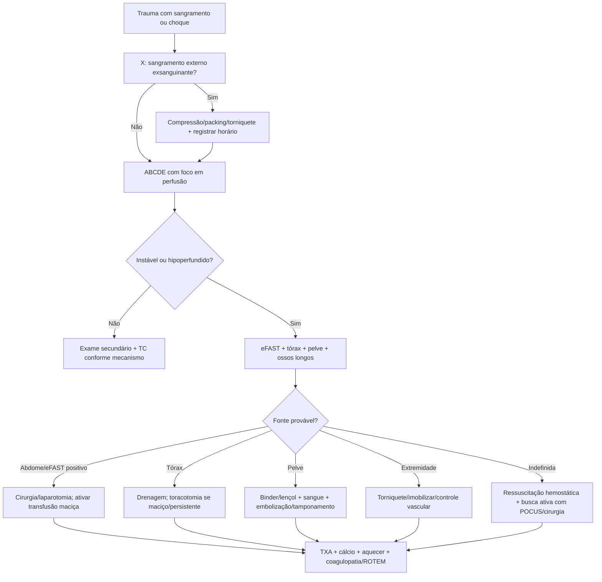

# Trauma Hemorrágico, Controle De Dano E Transfusão Maciça

## Leitura de 30 segundos

- Hemorragia é uma das principais causas evitáveis de morte no trauma: controle mecânico do sangramento vem antes de cristaloide bonito.
- No XABCDE, o **X** e hemorragia exsanguinante: compressão, packing, torniquete, estabilização pélvica e cirurgia/intervenção precoce.
- Choque hemorrágico não espera hipotensão: taquicardia, TEC lento, pele fria, confusão, lactato/base déficit e mecanismo grave já bastam para agir.
- Se precisa de transfusão maciça: aquecer, TXA precoce, sangue/componentes balanceados, cálcio, coagulopatia/ROTEM e controle definitivo do foco.
- A banca TEME gosta de torniquete, 1:1:1 ou sangue total, eFAST com instabilidade, pelve, hipotermia e armadilhas contra excesso de cristaloide.

## Por que cai

Trauma foi um dos blocos mais recorrentes nas provas TEME22-26 e aparece nas estações práticas. A estação de trauma de 2025 cobrou exatamente o que importa: XABCDE, identificar hemorragia exsanguinante, torniquete correto, horário do torniquete, choque hemorrágico, eFAST, pelve/ossos longos, protocolo de transfusão maciça, TXA, cálcio, aquecimento, exames de coagulopatia/ROTEM e avaliação cirúrgica.

O que a banca costuma testar:

- Controle imediato de sangramento externo antes de se perder em via aérea/TC.
- Trauma instável + eFAST positivo = cirurgia/controle de fonte, não tomografia.
- Amputação ou sangramento volumoso de extremidade = torniquete cedo, sem afrouxar a cada 15 min.
- Choque hemorrágico = sangue/componentes balanceados; cristaloide e ponte curta.
- TXA deve ser precoce, idealmente dentro de 3 horas.
- Hipotermia, acidose e coagulopatia formam a tríade letal; hoje muitos incluem hipocalcemia como quarto pilar.
- Fratura pélvica instável pode sangrar muito e precisa de estabilização mecânica imediata.

## Conceitos que sustentam a conduta

O trauma hemorrágico mata por perda de volume, perda de capacidade de transporte de oxigênio e coagulopatia induzida pelo trauma. Cristaloide em excesso dilui fatores, piora hipotermia, desfaz coágulo e aumenta sangramento. Por isso, a ressuscitação moderna é hemostática: controlar a fonte e repor sangue/componentes de forma balanceada.

O paciente pode estar em choque antes da PAS cair. Jovens compensam com taquicardia e vasoconstrição; gestantes e idosos podem enganar; betabloqueador máscara frequência. A avaliação é sindrômica: mecanismo, perfusão, estado mental, pele, pulso, lactato/base déficit, eFAST e resposta ao tratamento.

Controle de dano tem duas metades inseparaveis:

- **Controle anatômico:** torniquete, compressão, packing, binder pélvico, cirurgia, embolização, toracotomia/laparotomia quando indicado.
- **Ressuscitação fisiológica:** sangue, plasma, plaquetas, TXA, cálcio, fibrinogênio/crio quando indicado, aquecimento e permissão de PA menor até controlar sangramento, exceto situações especiais.

## Abordagem prática

### 1. XABCDE Sem Perder O X

1. **X:** hemorragia externa exsanguinante: compressão direta, packing, torniquete, curativo hemostático.
2. **A:** via aérea com restrição de movimento cervical; IOT se indicada, sem atrasar controle de sangramento.
3. **B:** procurar pneumotórax hipertensivo, Hemotórax maciço, tórax instável, tamponamento.
4. **C:** pulso, pele, TEC, PA, eFAST, pelve, ossos longos, acessos calibrosos/IO, sangue.
5. **D:** Glasgow, pupilas, glicemia se necessário; TCE muda alvo pressor.
6. **E:** expor tudo e aquecer agressivamente.

Mensagem de prova: se o sangramento e catastrofico, ele é tratado antes do A. Não existe intubação bonita em paciente que está exsanguinando sem controle.

### 2. Controle Hemorragia Externa

| situação | Conduta |
|---|---|
| Sangramento compressível | Compressão direta forte e contínua |
| Ferida profunda/juncional compressível | Packing com gaze, preferir hemostática se disponível, mais pressão; não tamponar às cegas cavidades torácica/abdominal |
| Extremidade com sangramento grave | Torniquete proximal, apertar até parar sangramento e pulso distal |
| Torniquete insuficiente | Revisar posição/aperto e colocar segundo torniquete acima |
| Depois de controlar | Curativo compressivo, registrar horário, não afrouxar no atendimento inicial |

Torniquete:

- Usar preferencialmente torniquete comercial.
- Colocar 5-7 cm acima da ferida quando o local e claro; em Cenário confuso, alto e apertado no membro.
- Não colocar sobre articulação.
- Apertar até cessar sangramento.
- Registrar horário.
- Não afrouxar periodicamente.

### 3. Suspeite Das Quatro Fontes De Sangue Oculto

No politrauma instável, procure sangramento em:

| Fonte | Como suspeitar | Controle inicial |
|---|---|---|
| Tórax | MV reduzido, macicez, choque, eFAST pleural | Drenagem; cirurgia se maciço/persistente |
| Abdome | eFAST positivo, dor, distensão, mecanismo | Laparotomia se instável |
| Pelve/retroperitônio | dor/instabilidade pélvica, mecanismo, choque | Binder/lençol; sangue; embolização/tamponamento/cirurgia |
| Ossos longos/externo | deformidade, fratura femur, amputação, sangramento | Imobilização, tração se indicada, torniquete/compressão |

Regra de prova: paciente instável não vai passear na tomografia para "definir melhor" uma hemorragia que já está matando.

### 4. Ative Transfusão Maciça Cedo

Ative se houver:

- Choque com suspeita de hemorragia.
- Sangramento ativo importante.
- Necessidade prevista de múltiplos hemocomponentes.
- Trauma penetrante ou contuso grave com instabilidade.
- eFAST positivo + instabilidade.
- Pelve instável + choque.
- Shock index elevado, lactato/base déficit importantes ou piora progressiva.

**ABC score:** um ponto para cada item: mecanismo penetrante, PAS <= 90 mmHg, FC >= 120/min e FAST positivo. Escore >= 2 apoia ativação precoce do protocolo, mas não é obrigatório para reconhecer hemorragia grave. Não espere atingir a definição retrospectiva de 10 CH em 24 h. Hemoglobina inicialmente normal não exclui perda importante; lactato e déficit de bases ajudam a seguir resposta, não devem atrasar controle da fonte.

Conduta da primeira hora:

1. Acionar cirurgia/trauma/intervenção imediatamente.
2. Dois acessos calibrosos ou intraosseo.
3. Aquecer paciente, sala, fluidos e sangue.
4. Enviar tipagem, provas, hemograma, gasometria, lactato, coagulograma, fibrinogênio, cálcio iônico, ROTEM/TEG se disponível.
5. Transfusão balanceada 1:1:1 ou sangue total se protocolo local.
6. TXA se dentro da janela e sangramento/risco de sangramento importante.
7. Cálcio durante transfusão.
8. Reavaliar fonte: tórax, abdome, pelve, ossos longos, externo.

## Fluxograma

## Doses, alvos e números

### Ressuscitação Hemostática

| Item | Número | observação TEME |
|---|---:|---|
| TXA trauma | 1 g EV em 10 min + 1 g EV em 8 h | Referência clássica CRASH-2; administrar até 3 h do trauma |
| Transfusão maciça | CH:PFC:Plaquetas 1:1:1 | Sangue total também aceito se disponível/protocolo |
| Cristaloide | Apenas ponte se sangue não estiver imediatamente disponível; pequenos bolus, por exemplo 250 mL no adulto, com reavaliação | Não há cota obrigatória de 1-1,5 L antes de sangue; evitar diluição e atraso |
| Cálcio durante transfusão importante | CaCl2 10%: 1 g = 10 mL; alternativa: gluconato de cálcio 10%: 3 g = 30 mL | Doses aproximadamente equivalentes em cálcio elementar; não equivalem grama por grama |
| Temperatura | evitar < 35-36 C | Hipotermia piora coagulopatia |
| Fibrinogênio | Repor se <= 150 mg/dL ou déficit funcional no viscoelástico; dose inicial de concentrado 3-4 g no adulto | Crioprecipitado conforme conteúdo/protocolo; reavaliar para manter pelo menos 150-200 mg/dL |
| Plaquetas | alvo > 50.000; no TCE/hemorragia SNC mirar > 100.000 | Prova pode cobrar alvo maior no neurotrauma |
| PAS em hemorragia sem TCE | alvo aproximado 80-90 mmHg até controle | Hipotensão permissiva não vale para TCE grave |
| PAS em TCE grave | >= 110 mmHg entre 15-49 anos e acima de 70; >= 100 entre 50-69 | BTF; diretriz europeia propõe PAM >= 80 mmHg no TCE grave. Individualizar perfusão cerebral |

**Cálcio sem ambiguidade:** monitorar cálcio iônico, buscando faixa normal, aproximadamente 1,1-1,3 mmol/L; corrigir hipocalcemia prontamente, sobretudo se < 0,9 mmol/L. O JTS recomenda reposição no início da ressuscitação e após cada quatro unidades de produtos sanguíneos, enquanto se organizam medidas seriadas. Cloreto é mais lesivo se extravasar; preferir acesso seguro, geralmente central, ou gluconato em acesso periférico monitorado. Conferir apresentação, via e protocolo; "uma ampola" não define uma dose universal.

**Hipotensão permissiva tem prazo e exceções:** PAS 80-90 mmHg é ponte para controle da hemorragia em adulto selecionado sem lesão cerebral. Não aplicar automaticamente em TCE, lesão medular, gestante, criança ou paciente com perfusão coronariana/cerebral vulnerável. Vasopressor pode ser adjuvante em hipotensão extrema, mas não substitui sangue e hemostasia.

**Transfusão dirigida:** 1:1:1 é estratégia empírica inicial, com dose terapêutica de plaquetas conforme o banco de sangue, não uma bolsa qualquer de cada produto. Quando chegam exames/TEG/ROTEM, tratar o déficit identificado. Reavaliar necessidade do protocolo após controle da fonte; transfusão maciça não é infusão automática até esgotar os kits.

### Perdas Em Fraturas

| Lesão | Perda estimada |
|---|---:|
| Radio/ulna | 150-250 mL |
| Umero | ~250 mL |
| Tibia/fibula | ~500 mL |
| Femur | ~1.000 mL |
| Pelve | 1.500-3.000 mL ou mais |

### Hemotórax

| Achado | Conduta |
|---|---|
| Hemotórax com instabilidade | Drenagem imediata + sangue + cirurgia conforme resposta |
| Drenagem inicial > 1.500 mL | Toracotomia/avaliação cirúrgica urgente |
| Sangramento > 200 mL/h por 3 h | Toracotomia/avaliação cirúrgica |

Os números são gatilhos, não autorização para esperar três horas em paciente deteriorando. Choque, necessidade transfusional e suspeita de lesão vascular também determinam intervenção.

### Ameaças Torácicas E PCR Traumática

| Situação | Reconhecimento e ação imediata |
|---|---|
| Pneumotórax hipertensivo | Choque/deterioração respiratória no contexto compatível: descompressão imediata, sem esperar Rx ou US; toracostomia digital por equipe habilitada ou agulha conforme recurso, seguida de drenagem |
| Ferida torácica aberta | Selo ventilado quando disponível e vigilância; se deteriorar, avaliar tensão, retirar/abrir selo e descomprimir conforme achados |
| Hemotórax maciço | Dreno, sangue aquecido e cirurgia; volume drenado não substitui avaliação de perfusão |
| Tamponamento penetrante | Cirurgia urgente; pericardiocentese pode falhar por sangue coagulado e não é tratamento definitivo habitual |

Na PCR traumática, corrija **HOTT** em paralelo: **H**ipovolemia/hemorragia, **O**xigenação, pneumotórax sob **T**ensão e **T**amponamento. Controle sangramento, transfunda, ventile e considere descompressão torácica bilateral quando indicada, especialmente na PCR com trauma torácico. Não deixe compressões/medicação atrasarem essas medidas; se a parada pode ter causa clínica antecedendo o trauma, mantenha também o algoritmo convencional.

Toracotomia ressuscitativa depende de mecanismo, sinais de vida, tempo de PCR, equipe e estrutura; não é indicada para toda parada traumática. eFAST pode ajudar, mas não deve consumir o tempo da intervenção salvadora.

### Trauma Pediátrico

| Item | Número |
|---|---:|
| Hemorragia com choque | Priorizar sangue cedo, aquecido e conforme protocolo pediátrico |
| Concentrado de hemácias | Bolus usual 10 mL/kg, reavaliar e repetir conforme resposta/perda |
| Cristaloide como ponte | 10-20 mL/kg somente quando indicado e sangue indisponível; evitar bolus repetidos antes de hemostasia |
| Limite inferior de PAS | Lactente: 70 mmHg; 1-10 anos: 70 + 2 x idade; acima de 10: 90 mmHg. No neonato, 60 mmHg |

Esses limites identificam hipotensão, **não são metas de ressuscitação**. Perfusão ruim com PA ainda normal já pode representar choque.

## eFAST No Choque Hemorrágico

O eFAST responde Perguntas objetivas:

- Tem líquido livre abdominal?
- Tem tamponamento?
- Tem pneumotórax?
- Tem Hemotórax?

Intérprete pelo contexto:

| Cenário | Conduta provável |
|---|---|
| Instável + FAST abdominal positivo | Laparotomia/controle cirúrgico |
| Instável + janela pericardica positiva | Tamponamento: cirurgia/toracotomia/pericardiocentese como ponte |
| Instável + pneumotórax | Descompressão imediata |
| estável + mecanismo abdominal | TC com contraste, mesmo se FAST negativo |
| FAST negativo + choque | Procurar pelve, tórax, retroperitônio, ossos longos e choque não hemorrágico |

Pegadinha: eFAST negativo não exclui lesão abdominal em paciente estável, nem sangramento retroperitoneal/pélvico.

## Pelve E Retroperitônio

Quando suspeitar:

- Mecanismo de alta energia.
- Dor pélvica, instabilidade, encurtamento/rotação de membro.
- Equimose perineal/escrotal, sangue em meato uretral.
- Choque sem outra fonte clara.

Conduta inicial:

1. Não "testar" pelve repetidamente.
2. Binder pélvico ou lençol no nível dos grandes trocanteres, não na cintura.
3. Evitar sondagem vesical se sangue no meato, equimose perineal ou suspeita de lesão uretral; fazer uretrografia retrógrada.
4. Transfusão hemostática.
5. Acionar ortopedia/cirurgia/intervenção: fixação, tamponamento pré-peritoneal e/ou embolização conforme serviço.

## Trauma Abdominal

| Cenário | Conduta |
|---|---|
| Instável + peritonite/evisceração/FAST positivo | Laparotomia imediata |
| estável + trauma contuso | TC com contraste |
| Lesão esplênica/hepática em estável | Manejo não operatório pode ser possível em centro com suporte |
| Trauma penetrante anterior estável sem peritonite | exploração local/TC/observação conforme protocolo |
| Peritonite, pneumoperitônio, evisceração importante | Cirurgia |

Pegadinha: lesão esplênica grau alto na TC não é indicação automática de laparotomia se o paciente está estável e em centro capaz de monitorar/embolizar.

## Situações Especiais No Trauma

Além do controle de hemorragia, a banca costuma misturar trauma com cinemática, triagem, via aérea, neurologia e lesões torácicas específicas.

| Tema cobrado | Como pensar na prova | Pegadinha |
|---|---|---|
| Cinemática | mecanismo antecipa lesão oculta: colisão lateral, ejeção, alta energia, cavitação | não desenhar o trajeto do projétil como linha reta simples |
| Lesão aórtica traumática | desaceleração + diferença pressórica/pulso entre membros | tratar como tamponamento sem evidência |
| Crush/esmagamento | hidratar antes da liberação; pensar em rabdomiólise, hipercalemia e IRA | usar hipotensão permissiva como se fosse hemorragia não controlada |
| Explosão | primária = onda de pressão; secundária = fragmentos; terciária = corpo lançado; quaternária = queimadura/inalação/esmagamento | ruptura timpânica é primária |
| START | anda? respira? perfusão? obedece comandos? | dor/fratura exposta não é automaticamente vermelho se perfusão e mental estão bons |
| TCE leve | TC se critério de risco; perda de consciência breve isolada não é critério clássico da regra canadense | anticoagulado, vômitos e idade avançada baixam limiar |
| Restrição de coluna | penetrante isolado com choque geralmente não ganha com colar/prancha | colar pode atrapalhar via aérea e controle de sangramento cervical |
| Pescoço penetrante | instável ou hard signs = controle imediato; estável pode ir para angioTC e manejo seletivo | zona II não é mais cirurgia obrigatória para todos |
| Ferida soprante de tórax | curativo oclusivo/ventilado e vigilância; descomprimir se deteriorar | curativo em três pontos não é resposta universal |
| PCR traumática | corrigir causa reversível mecânica: hipovolemia, pneumotórax, tamponamento, hipóxia | compressão isolada sem tratar causa tem pouco valor |
| Traqueostomia com sangramento pulsátil | fístula traqueoinominada até prova em contrário | hiperinsuflar cuff e chamar cirurgia imediatamente |
| Trauma pediátrico | hipotensão é tardia; FAST negativo não libera criança com sinais de hipoperfusão | aquecer, tratar fonte e priorizar sangue na hemorragia; não repetir cristalóide automaticamente |

### Regras De Decisão Rápida

- **Cinto pélvico/lençol:** fica nos grandes trocanteres. Se a alternativa fala cintura ou espinha ilíaca, desconfie.
- **FAST negativo:** não exclui retroperitônio, pelve, víscera oca nem lesão em criança.
- **Paciente estável com trauma de tronco:** TC com contraste costuma ser o exame que define lesão.
- **Paciente instável com FAST positivo:** controle de fonte, não "tomografia para entender melhor".
- **Ferida abdominal por arma branca:** sem instabilidade/peritonite pode haver manejo seletivo com exame seriado e/ou TC conforme recurso.
- **Fratura exposta:** antibiótico precoce, sem esperar centro cirúrgico; cefazolina é opção para I-II. No tipo III, escolher cobertura pelo protocolo e exposição, não prescrever gentamicina obrigatoriamente.
- **Shock index:** FC/PAS. Valor > 1 em trauma deve acender transfusão/controle de fonte cedo.

## Extremidades

### Fratura Exposta

1. Controlar sangramento.
2. Avaliar neurovascular antes e depois.
3. Remover contaminação grosseira.
4. Cobrir com curativo esteril.
5. Imobilizar.
6. Antibiótico precoce.
7. Profilaxia tetanica.
8. Cirurgia/ortopedia.

| Gustilo-Anderson | Antibiótico inicial típico |
|---|---|
| I-II sem contaminação grosseira | Cefazolina |
| III | Conforme protocolo: AAST 2024 recomenda Gram-positivo + Gram-negativo, com opções como ceftriaxona, piperacilina-tazobactam ou cefazolina + aminoglicosídeo |
| Solo/fezes/água ou contaminação importante | Ampliar cobertura conforme exposição/protocolo |

Há divergência: a SIS 2022 recomenda não ampliar rotineiramente além de Gram-positivos no tipo III. Registre a referência adotada pelo serviço/banca, função renal e tipo de contaminação. A prioridade comum é antibiótico precoce, desbridamento e estabilização; não prolongar profilaxia automaticamente até cicatrização. [AAST 2024](https://doi.org/10.1136/tsaco-2023-001304) e [SIS 2022](https://pubmed.ncbi.nlm.nih.gov/36350736/).

### Síndrome Compartimental

Sinais precoces:

- Dor desproporcional.
- Dor ao estiramento passivo.
- Parestesia.
- Compartimento tenso.

Pulso ausente, palidez e paralisia são tardios. Conduta: retirar constrições e chamar cirurgia para fasciotomia.

## Populações Especiais

### Gestante

- Prioridade e salvar a mãe.
- Sinais maternos podem subestimar perda: aumento de volume plasmático máscara choque.
- Deslocar útero para esquerda se gestação avançada.
- Oxigenar e evitar hipotensão.
- Monitor fetal se viável e disponível, sem atrasar cuidado materno.
- Rh negativo + trauma: imunoglobulina anti-D conforme protocolo.

### Idoso

- Menor reserva e maior mortalidade com lesões aparentemente pequenas.
- Betabloqueador e marcapasso mascaram taquicardia.
- Anticoagulantes mudam risco é conduta.
- Limiar menor para imagem, observação e reversão de coagulopatia quando indicado.

### Criança

- Hipotensão e tardia.
- Taquicardia, TEC lento, palidez e letargia são sinais precoces.
- FAST tem menor sensibilidade que em adulto; não use para "liberar" criança instável.
- Aquecimento e glicemia importam.

## Para prova vs na prática

> **Para prova TEME:** se o caso descreve choque hemorrágico, responda com controle de fonte, cirurgia precoce, transfusão 1:1:1 ou sangue total, TXA 1 g + 1 g dentro de 3 horas, cálcio a cada 4 hemoderivados, aquecimento e coleta de coagulopatia/ROTEM.
>
> **Na prática clínica:** protocolos atuais valorizam sangue total de baixo titulo quando disponível, reposição guiada por viscoelásticos, cálcio iônico monitorado, fibrinogênio/crio precoces quando baixo e métricas de desempenho. O mais importante contínua sendo não atrasar transporte/centro cirúrgico/intervenção por medidas adjuntas.

## Pegadinhas TEME

- **Afrouxar torniquete a cada 15 min:** errado.
- **Mais cristaloide para choque hemorrágico persistente:** geralmente errado; precisa sangue e controle de fonte.
- **FAST negativo exclui trauma abdominal:** errado.
- **Instável vai para TC:** errado, salvo exceções muito selecionadas e com equipe adequada.
- **Hipotensão permissiva em TCE grave:** errado; TCE precisa evitar hipotensão.
- **Binder pélvico na cintura:** errado; fica nos trocanteres.
- **Sondar paciente com sangue no meato:** errado; fazer uretrografia retrógrada.
- **Plaqueta cai cedo na coagulopatia do trauma:** nem sempre; fibrinogênio pode cair precocemente.
- **TXA depois de 3 horas como rotina:** evitar; benefício é precoce.
- **Fratura exposta sem contaminação pode esperar antibiótico no centro cirúrgico:** errado; antibiótico precoce.

## Erros fatais na prática

- Não olhar dorso, axila, virilha e períneo.
- Controlar via aérea e esquecer hemorragia compressível.
- Não registrar horário do torniquete.
- Repetir palpação pélvica e desorganizar coágulo.
- Mandar instável para TC sem controle de fonte.
- Deixar o paciente hipotérmico na sala vermelha.
- Transfundir muito sem cálcio.
- Não acionar cirurgia/intervenção cedo.
- Não reavaliar resposta: pulso, pele, consciência, lactato, base déficit, eFAST e sangramento.

## Referências

**Prova/TEME**

- Conteúdo programático oficial TEME26: trauma e causas externas; medicina pré-hospitalar; cuidados críticos.
- Referências bibliográficas TEME26: Tratado de Medicina de Emergência ABRAMEDE; Atendimento pré-hospitalar ABRAMEDE; diretriz europeia de sangramento no trauma; POCUS ABRAMEDE.
- Provas teóricas TEME22, TEME23, TEME24, TEME25 e estações práticas disponíveis no projeto.

**Material local**

- Medicina de Emergência HCFMUSP, 18ª edição: capítulo 67, trauma hemorrágico, e abordagem do politrauma.
- Tratado de Medicina de Emergência ABRAMEDE, 1ª edição: choque, trauma e lesões torácicas.

- Aulas de cursinho: Aula 04 - Avaliação inicial do politraumatizado.
- Aulas de cursinho: Aula 10 - Trauma torácico.
- Aulas de cursinho: Aula 13 - Choque.
- Aulas de cursinho: Aula 17 - Trauma abdominopelvico.
- Aulas de cursinho: Aula 18 - POCUS no trauma, vascular e neuro.
- Aulas de cursinho: Aula 39 - Trauma de extremidades.
- Aulas de cursinho: Aula 45 - Trauma cranioencefálico.
- Aulas de cursinho: Aula 46 - Trauma em populações especiais I.
- Aulas de cursinho: Aula 49 - Trauma em populações especiais II.

**Atualização clínica**

- Rossaint R et al. The European guideline on management of major bleeding and coagulopathy following trauma: sixth edition. Critical Care, 2023. DOI: https://doi.org/10.1186/s13054-023-04327-7
- ACS. ATLS 11, lançado em 2025: avaliação inicial xABCDE. https://www.facs.org/quality-programs/trauma/education/advanced-trauma-life-support/atls-11/
- WSES-AAST. Thoracic trauma guidelines, 2025. https://doi.org/10.1186/s13017-025-00651-1
- Joint Trauma System. Damage Control Resuscitation Clinical Practice Guideline, 2019/atualizado no portal JTS. https://jts.health.mil/assets/docs/cpgs/Damage_Control_Resuscitation_12_Jul_2019_ID18.pdf
- American College of Surgeons. ACS TQIP Massive Transfusion in Trauma Guidelines. https://www.facs.org/media/zcjdtrd1/transfusion_guildelines.pdf
- Brain Trauma Foundation. Guidelines for the Management of Severe TBI, 4th Edition. https://braintrauma.org/coma/guidelines/severe-tbi
- American Association for the Surgery of Trauma/American College of Surgeons Committee on Trauma. Clinical protocol for damage-control resuscitation for the adult trauma patient. Journal of Trauma and Acute Care Surgery, 2024. DOI: https://doi.org/10.1097/TA.0000000000003555
- American Heart Association/American Red Cross. 2024 First Aid Guidelines: external bleeding control. https://cpr.heart.org/en/resuscitation-science/2024-first-aid-guidelines
