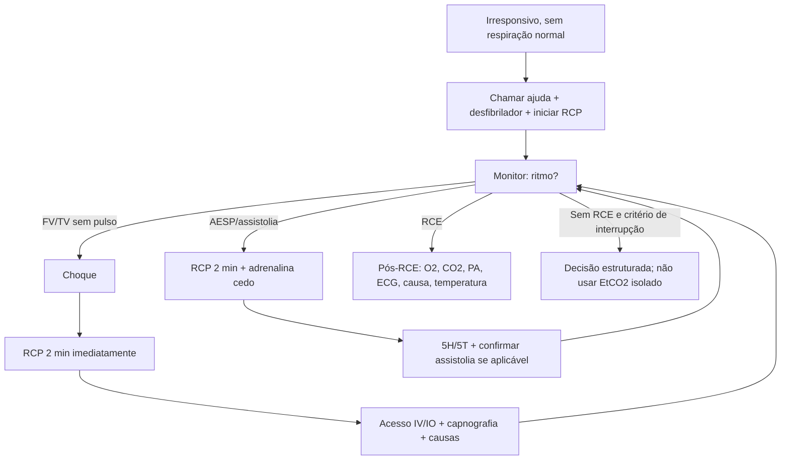
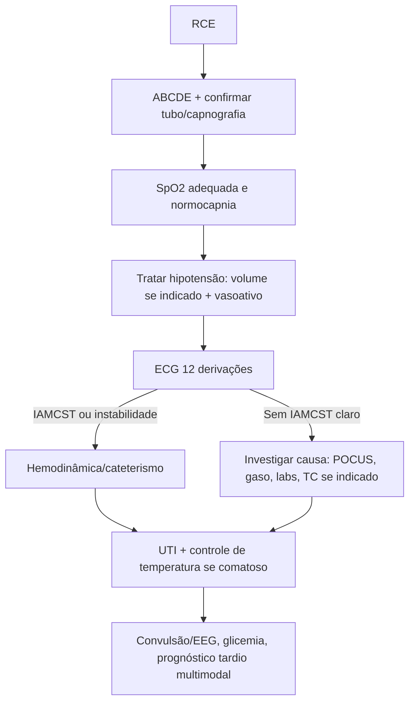

# Reanimação/PCR Adulto, Pediátrica E Pós-RCE

## Leitura de 30 segundos

- PCR e prova de prioridade: reconhecer, chamar ajuda, compressão de alta qualidade e desfibrilação precoce salvam mais do que tubo e droga.
- Separe rápido: **FV/TV sem pulso = choque**; **AESP/assistolia = RCP + adrenalina precoce + causa reversível**.
- Em ritmo chocável, não pare para medicação antes de tentar desfibrilar. Em ritmo não chocável, adrenalina entra assim que possível.
- Via aérea avançada ajuda se for feita sem pausa longa; capnografia confirma tubo, mede qualidade e ajuda a reconhecer RCE.
- POCUS só presta se couber na pausa de pulso. Se vira "aula de ultrassom" durante PCR, virou dano.
- Pós-RCE é outra emergência: ECG, oxigenação/ventilação, pressão, temperatura, causa da PCR, convulsão e UTI.

## Por que cai

Reanimação aparece de forma repetida nas provas TEME22-26 e nas estações práticas. O padrão é muito consistente: a banca quer ver prioridade, algoritmo, doses básicas, ritmos, causas reversíveis e segurança operacional.

O que já apareceu ou foi fortemente sugerido nas provas/estações:

- TEME22: compressão 100-120/min, prioridade da RCP, FV/TV sem pulso, adrenalina/amiodarona, POCUS/CASA e bradicardia.
- TEME23: PCR em gestante, afogamento, metas pós-RCE, capnografia, POCUS em PCR e tamponamento.
- TEME24: PCR em gestante, torsades de pointes, tamponamento, pós-RCE com IAMCST e estação prática com BAVT evoluindo para FV.
- TEME25: FV refratária, bradicardia instável/marca-passo, regulação frente a PCR, pós-RCE pediátrico e decisão de não iniciar/interromper em contexto de futilidade.
- Práticas 2022-24: RCP de alta qualidade, tamponamento/pneumopericárdio, PCR pediátrica com TSV, bradicardia instável, IAMCST, marca-passo e desfibrilação.
- Pontos transversais: afogamento, PCR traumática, POCUS/CASA, capnografia, morte encefálica pós-RCE e fluxo médico-legal após óbito.

Tradução para prova: se a alternativa atrasa compressão, atrasa choque, hiperventila, ignora causa reversível ou usa POCUS prolongando pausa, provavelmente está errada.

## Abordagem prática

### 1. Primeiros 30 Segundos

1. Checar responsividade e respiração normal.
2. Chamar ajuda, acionar time/código, pedir desfibrilador, carrinho, capnografia e acesso IV/IO.
3. Checar pulso central em até 10 segundos. Se dúvida, tratar como PCR.
4. Iniciar compressão torácica imediatamente.
5. Monitor/desfibrilador assim que chegar: definir ritmo chocável ou não chocável.

Frase de estação: "Paciente irresponsivo, sem respiração normal e sem pulso central em até 10 segundos. início RCP de alta qualidade, solicito desfibrilador, monitor, acesso IV/IO, adrenalina e capnografia."

### 2. RCP De Alta Qualidade

- frequência: 100-120/min.
- Profundidade adulto: 5-6 cm.
- Retorno completo do torax.
- Pausas menores que 10 segundos.
- Trocar compressor a cada 2 minutos ou antes se fadiga.
- Evitar ventilação excessiva.
- Usar feedback, metronomo, capnografia e liderança fechada quando disponível.

O alvo não é "parecer organizado"; é gerar pressão de perfusão coronariana e cerebral.

### 3. Ritmo Chocavel: FV/TV Sem Pulso

Conduta mental:

1. Choque assim que identificado.
2. RCP por 2 minutos imediatamente depois do choque.
3. Reavaliar ritmo em pausa curta.
4. Se persiste FV/TVsp: novo choque, RCP e adrenalina.
5. Se persiste: choque, RCP, amiodarona ou lidocaina, causas reversíveis.

Mensagem TEME: choque primeiro. Droga sem desfibrilação precoce em FV e atraso.

### 4. Ritmo Não Chocavel: AESP/Assistolia

Conduta mental:

1. RCP de alta qualidade.
2. Adrenalina 1 mg IV/IO assim que possível e depois a cada 3-5 minutos.
3. Confirmar cabos/ganho/derivação se assistolia.
4. Procurar e tratar 5H/5T.
5. Reavaliar ritmo a cada 2 minutos.

Mensagem TEME: AESP não é diagnóstico final; é ritmo de PCR que obriga procurar causa tratável.

### 5. Via aérea Durante PCR

Sem via aérea avançada:

- Adulto: 30 compressões para 2 ventilações.
- Pediatria: 30:2 se um socorrista; 15:2 se dois profissionais.

Com via aérea avançada:

- Adulto: compressões continuas + 1 ventilação a cada 6 segundos, cerca de 10/min.
- Pediatria: compressões continuas + ventilação 20-30/min, cerca de 1 a cada 2-3 segundos.
- Confirmar tubo com capnografia em onda, ausculta e expansibilidade.

Se a tentativa de IOT causa pausa longa, dessaturação ou perda de compressão, prefira BVM bem feita ou supraglótico e volte ao algoritmo.

### 6. POCUS/CASA Na PCR

Use POCUS para procurar causa reversível sem atrapalhar:

- Tamponamento.
- TEP maciço/sobrecarga de VD.
- Pneumotórax hipertensivo.
- Hipovolemia grave.
- Pseudo-AESP: atividade mecânica com pulso muito fraco/não percebido.

Regra operacional: probe posicionado durante compressões, imagem adquirida na pausa, decisão em até 10 segundos. Não usar ausência de movimento cardíaco isoladamente para encerrar RCP.

VD dilatado durante PCR não confirma TEP: pode dilatar pela própria parada. Na pseudo-AESP, contração no US **não autoriza suspender compressões** sem evidência de circulação efetiva. Grave o clipe e interprete após reiniciar RCP.

### 7. Pós-RCE Imediato

Depois que voltou pulso, não comemore e abandone: o paciente ainda está morrendo.

1. Confirmar pulso, PA e capnografia.
2. Titular O2: evitar hipoxemia; reduzir FiO2 quando SpO2 confiável estiver adequada.
3. Ventilar para normocapnia.
4. Tratar hipotensão: cristaloide se indicado, noradrenalina/adrenalina/dobutamina conforme fenótipo.
5. ECG de 12 derivações rapidamente.
6. IAMCST, choque cardiogênico ou instabilidade elétrica: discutir hemodinâmica/cateterismo.
7. Procurar causa: história, exame, POCUS, gaso, eletrólitos, lactato, tóxico, TEP, tamponamento, pneumotórax, sangramento.
8. Se comatoso: estratégia protocolizada de temperatura e prevenção de febre.
9. Tratar convulsão e considerar EEG quando disponível.
10. Não prognosticar cedo, especialmente sob sedação, hipotermia, choque ou distúrbios metabólicos.

## Conceitos que sustentam a conduta

### RCP Funciona Por Pressão, Não Por Coreografia

O objetivo da compressão é gerar fluxo mínimo para coronárias e cérebro. Toda pausa derruba a pressão de perfusão coronariana; depois de reiniciar compressão, leva tempo para recuperar. Por isso, as pausas para pulso, ritmo, IOT, POCUS e passagem de caso devem ser curtas e planejadas.

A desfibrilação encerra circuitos elétricos caóticos, mas só funciona bem quando vem cedo e acompanhada de RCP de qualidade. Em FV/TV sem pulso, o miocárdio fica menos responsivo com o passar do tempo; atrasar choque para obter acesso, intubar ou discutir causa e erro clássico.

### Adrenalina: Ajuda RCE, Mas Não Substitui O Básico

Adrenalina aumenta pressão de perfusão coronariana e chance de RCE. O ganho neurológico é mais incerto, então ela não deve virar desculpa para compressão ruim ou choque atrasado.

- Ritmo não chocável: dar cedo.
- Ritmo chocável: priorizar RCP/desfibrilação inicial; dar quando choques iniciais falham.
- Dose alta de adrenalina não é rotina.
- Vasopressina não substitui adrenalina com vantagem.

### Capnografia

Capnografia em onda durante PCR serve para:

- Confirmar e vigiar tubo.
- Detectar deslocamento/obstrução do tubo.
- Monitorar qualidade da RCP.
- Sugerir RCE quando há aumento abrupto e sustentado do EtCO2.

EtCO2 muito baixo após RCP adequada sugere mau prognóstico, mas não deve ser usado sozinho para decidir interrupção.

### 5H/5T

| 5H | 5T |
|---|---|
| Hipovolemia | Trombose coronariana |
| Hipoxia | Trombose pulmonar |
| H+ / acidose | Tamponamento cardíaco |
| Hipo/hipercalemia e distúrbios metabólicos | Tóxicos |
| Hipotermia | Tension pneumothorax |

Pense nas causas que você consegue tratar durante a PCR: choque, agulha/drenagem, pericardiocentese, cálcio, glicose/insulina, antídoto, trombólise quando TEP altamente provável, controle de hemorragia.

### Situações Especiais De Prova E Plantão

**TEP com PCR:** suspeite em dispneia/síncope prévia, hipoxemia, fatores de risco, VD dilatado no POCUS. Trombólise pode ser considerada durante RCP quando TEP e altamente provável ou confirmado. Depois, a RCP costuma precisar ser prolongada.

**SCA com PCR:** desfibrilar/RCP e, após RCE, ECG e hemodinâmica se IAMCST ou forte suspeita. Trombólise sistêmica durante PCR por SCA não é rotina quando angioplastia e possível.

**Gestante:** compressões na posição habitual, na metade inferior do esterno, em decúbito dorsal; deslocamento uterino manual para esquerda se fundo uterino no nível/acima do umbigo. Acione obstetrícia/neonatologia e prepare parto ressuscitativo desde o reconhecimento da PCR, buscando completá-lo até 5 minutos se não houver RCE. Não aguarde quatro minutos para começar o preparo nem transfira para centro cirúrgico atrasando RCP. A finalidade inicial é melhorar a ressuscitação materna.

**Afogamento:** hipóxia é o motor. Ventilação precoce é importante, mas se sem pulso, não atrasar compressões. Aquecer e tratar hipoxemia.

**Hipercalemia:** com pulso e toxicidade elétrica, cálcio estabiliza membrana; insulina + glicose redistribui K, e a remoção definitiva pode exigir diálise. Durante PCR suspeita por hiperK, essas intervenções são dirigidas à causa e ao protocolo: AHA 2025 considera incerta a efetividade de cálcio, bicarbonato e insulina/glicose especificamente na parada. Não dar cálcio/bicarbonato a toda AESP nem atrasar RCP. Beta-agonista inalatório não é recomendado durante a PCR por hiperK.

**Hipotermia:** reaquecer ativamente; em hipotermia grave, a avaliação de morte e resposta a drogas/choques muda. Evite declarar óbito cedo sem reaquecimento adequado, salvo lesões incompatíveis com vida.

**Opioide:** se há pulso e depressão respiratória, ventilar e usar naloxona. Se sem pulso, RCP/desfibrilador primeiro; naloxona não substitui RCP.

**Torsades de pointes:** TV polimórfica com QT longo: sulfato de magnésio e corrigir K/Mg, suspender drogas que prolongam QT; se sem pulso, desfibrilar.

## Decisões Rápidas Que Resolvem Questões

| Cenário | Resposta de prova | Pegadinha |
|---|---|---|
| PCR sem pulso | Compressões 100-120/min e desfibrilador | IOT ou adrenalina antes de compressão |
| FV/TV sem pulso | Choque precoce, RCP imediata pós-choque | Medicação antes do primeiro choque |
| FV persistente | Rever energia, contato/posição das pás, RCP, antiarrítmico e causas; troca de vetor/duplo choque não têm benefício estabelecido na AHA 2025 | Não tratar estratégia alternativa como passo obrigatório nem atrasar choque convencional |
| AESP/assistolia | RCP + adrenalina precoce + 5H/5T | Tratar AESP como diagnóstico final |
| Capnografia sobe abruptamente na RCP | Pensar em RCE | Achar que compressão pior aumenta ETCO2 |
| Capnografia some após transporte | Deslocamento/extubação/desconexão até prova em contrário | Aumentar ventilador antes de checar tubo/circuito |
| POCUS/CASA | Tamponamento, VD/TEP, atividade cardíaca/pseudo-AESP em pausa curta | Parar RCP por ausência isolada de atividade cardíaca |
| VD dilatado em AESP | Integrar história pré-PCR, fatores de risco e TVP; trombólise pode ser considerada se TEP provável/confirmado | VD dilatado isolado durante PCR não diagnostica TEP |
| Gestante com útero grande em PCR | Deslocamento uterino + RCP; preparar imediatamente parto ressuscitativo, meta completar em até 5 min sem RCE | Esperar BCF, transporte ou obstetra para começar preparo |
| Afogamento | RCP com ventilações precoces; ERC utiliza 5 ventilações iniciais. Seguir algoritmo adotado sem atrasar ressuscitação | Heimlich/cabeça baixa para retirar água |
| Lactente com hipóxia + FC &lt; 60 e pulso | VPP com O2; se má perfusão persiste, compressões | Atropina antes de corrigir ventilação |
| Pós-RCE pediátrico | AHA 2025: manter PAS e PAM acima do percentil 10 para idade, com reavaliação de perfusão | Confundir limite de hipotensão com alvo individual ideal ou usar FiO2 100% indefinidamente |
| TdP adquirida recorrente | Magnésio, corrigir K/Mg e considerar overdrive pacing 100-120 | Procainamida/propafenona ou sincronizar se sem pulso |
| Tamponamento traumático | Baixa voltagem é compatível; trauma penetrante com tamponamento pode pedir toracotomia | JVD confirma; pericardiocentese resolve PCR traumática |
| Óbito com queda/lesões | Possível causa externa: constatar, registrar e encaminhar ao IML | Encaminhar ao SVO ou emitir DO natural |

### Fluxo Médico-Legal Após Óbito Na Emergência

| Situação | Caminho prático |
|---|---|
| Morte natural com causa conhecida e assistência | Médico assistente pode emitir Declaração de Óbito, conforme contexto local |
| Morte natural sem causa definida | SVO quando disponível |
| Suspeita de causa externa: queda, trauma, violência, acidente, intoxicação | IML |
| Lesões antigas/novas ou cena incompatível com morte natural | Não preencher como causa clínica presumida; documentar e acionar fluxo médico-legal |

Para a prova: **se não dá para excluir causa externa, não é caso de SVO nem de DO natural pelo plantonista.**

### Morte Encefálica E Prognóstico Pós-RCE

No pós-RCE, não confunda mau exame neurológico inicial com morte encefálica. Sedação, hipotermia, choque, distúrbios metabólicos e tempo curto invalidam conclusões apressadas.

| Achado inicial | Como interpretar |
|---|---|
| Glasgow 3 sob sedação recente | Não prognosticar |
| Pupilas fixas logo após RCE | Sinal ruim, mas não fecha ME isoladamente |
| Mioclonia precoce | Não define prognóstico sozinha |
| Temperatura baixa | Corrigir antes de avaliação formal |
| Suspeita de ME | Cumprir pré-requisitos legais, neuroimagem compatível quando exigida, observação e exames conforme norma |

## Fluxograma

### PCR Adulto

### Pós-RCE

## Doses, alvos e números

### Adulto - PCR

| Item | Número/conduta |
|---|---|
| Compressões | 100-120/min |
| Profundidade | 5-6 cm |
| Pausa | Menor que 10 s |
| Troca de compressor | A cada 2 min ou se fadiga |
| Sem via aérea avançada | 30:2 |
| Com via aérea avançada | Compressões continuas + 10 ventilações/min |
| Desfibrilacao bifásica | 120-200 J conforme aparelho; se desconhecido, energia maxima |
| Desfibrilacao monofasica | 360 J |
| Adrenalina | 1 mg IV/IO a cada 3-5 min |
| Amiodarona FV/TVsp refratária | 300 mg IV/IO; segunda dose 150 mg |
| Lidocaina alternativa | 1-1,5 mg/kg; repetir 0,5-0,75 mg/kg; max 3 mg/kg |
| Sulfato de magnésio TdP | 1-2 g IV/IO |
| Bicarbonato | Não rotineiro; indicado em intoxicações selecionadas por bloqueio de canal de sódio; hiperK na PCR tem evidência incerta. Acidose da própria PCR não basta para indicar |
| Cálcio | Não rotineiro; causas específicas incluem hipocalcemia e intoxicações selecionadas; benefício na PCR por hiperK permanece incerto |

Preferir acesso IV inicialmente no adulto; IO se IV não for rapidamente viável. Conferir **mg e concentração**: adrenalina adulta 1 mg corresponde a 10 mL da solução 0,1 mg/mL, não a 10 mL da apresentação 1 mg/mL.

### Adulto - Peri-PCR

| situação | Conduta chave |
|---|---|
| Bradicardia instável | Atropina 1 mg IV a cada 3-5 min, max 3 mg |
| Bradicardia refratária | Marcapasso transcutaneo; adrenalina 2-10 mcg/min ou dopamina 5-20 mcg/kg/min; preparar transvenoso |
| Taquicardia instável com pulso | Cardioversao sincronizada |
| QRS estreito regular estável | Vagal; adenosina 6 mg, depois 12 mg |
| QRS largo regular estável | Antiarritmico conforme protocolo; considerar cardioversão se piora |
| QRS largo irregular | Pensar FA pré-excitada ou TdP; evitar bloqueadores AV se pré-excitacao |

### Pediatria - PCR

| Item | Número/conduta |
|---|---|
| Compressões | 100-120/min |
| Profundidade lactente | Cerca de 4 cm ou 1/3 do diâmetro AP |
| Técnica no lactente | AHA 2025: dois polegares envolvendo o tórax ou base de uma mão; técnica de dois dedos deixou de ser recomendada |
| Profundidade criança | Cerca de 5 cm ou 1/3 do diâmetro AP |
| Sem via aérea avançada | 30:2 um socorrista; 15:2 dois profissionais |
| Com via aérea avançada | 20-30 ventilações/min |
| Desfibrilacao | 2 J/kg; depois 4 J/kg; subsequentes pelo menos 4 J/kg, max 10 J/kg ou dose adulta |
| Adrenalina IV/IO | 0,01 mg/kg a cada 3-5 min, máximo 1 mg; equivale a 0,1 mL/kg da solução 0,1 mg/mL |
| Via da adrenalina | Priorizar IV/IO; absorção traqueal é menos previsível e não deve atrasar acesso. Não extrapolar dose neonatal para PALS |
| Amiodarona | 5 mg/kg IV/IO para FV/TVsp refratária |
| Lidocaina | 1 mg/kg IV/IO alternativa |
| Bradicardia com pulso | Se FC menor que 60 + má perfusão apesar de O2/ventilação: iniciar RCP |
| Atropina pediátrica | 0,02 mg/kg se vagal/BAV primário; mínimo 0,1 mg, máximo por dose 0,5 mg; pode repetir uma vez |

### Neonatal - Sala De Parto

| Item | Número/conduta |
|---|---|
| Prioridade | Ventilação efetiva |
| Indicar VPP | Apneia/gasping ou FC menor que 100/min |
| VPP antes das compressões | AHA 2025: 30-60 insuflações/min; comprovar expansão e resposta da FC, corrigindo vedação/posição/obstrução |
| Compressões | Se FC menor que 60/min após 30 s de VPP efetiva |
| Relação compressão:ventilação | 3:1 |
| Total de eventos | 90 compressões + 30 ventilações/min |
| Oxigênio durante compressões | 100%, titular depois |
| Adrenalina intravascular neonatal | Se FC <60 após 60 s de compressões + ventilação efetiva: 0,01-0,03 mg/kg a cada 3-5 min; preferir veia umbilical, IO como alternativa |
| expansão volume | 10-20 mL/kg de SF 0,9% ou sangue se hipovolemia/perda suspeita e resposta inadequada; infusão e repetição conforme avaliação |

### Pós-RCE

| Alvo | Conduta prática |
|---|---|
| SpO2 | Adulto AHA 2025: 90-98%, PaO2 60-105 mmHg, após medida confiável; antes, O2 100%. Pediatria: 94-99% ou alvo específico da doença |
| CO2 | Normocapnia; geralmente PaCO2 35-45 mmHg |
| Pressão | Adulto: PAM >= 65 mmHg, individualizar pela perfusão. Criança: PAS e PAM acima do percentil 10 para idade |
| Temperatura adulto comatoso | Controle protocolizado 32-37,5 C; evitar febre; manter pelo menos 36 h em adultos que não obedecem comandos |
| Temperatura pediátrica comatosa | TTM 32-34 C seguido de 36-37,5 C ou apenas 36-37,5 C por até 5 dias, conforme protocolo |
| ECG | 12 derivações assim que possível |
| Glicemia | Evitar hipo e hiperglicemia; usar alvo institucional |
| Convulsão | Tratar crise clínica; considerar EEG |
| Prognóstico neurológico | Multimodal; consolidar em geral >= 72 h após normotermia e suspensão de sedativos, considerando depuração e demais confundidores |

Sem supra de ST, choque, isquemia persistente ou instabilidade elétrica, cateterismo imediato não é rotina para todo pós-RCE comatoso. Investigue a causa e planeje angiografia conforme suspeita cardíaca. EEG ajuda a reconhecer crises sem expressão motora; mioclonia isolada não define prognóstico, e anticonvulsivante profilático não é rotina.

## Pegadinhas TEME

- **"Intubar primeiro" em PCR:** errado se atrasa compressão/choque. Primeiro RCP e desfibrilador.
- **"Checar pulso por 30 segundos":** errado. Até 10 segundos.
- **"FV refratária = adrenalina antes do primeiro choque":** errado. Choque precoce vem primeiro.
- **"AESP = não tem o que fazer além de adrenalina":** errado. Procurar causa reversível é o centro da conduta.
- **"Atropina na PCR":** não é droga de PCR. Atropina e para bradicardia sintomática com pulso.
- **"EtCO2 baixo encerra RCP":** não sozinho. Pode ajudar prognóstico, mas não decide isoladamente.
- **"POCUS em PCR sempre ajuda":** só se não prolongar pausa. POCUS mal usado piora sobrevida.
- **"RCE = acabou":** errado. Pós-RCE tem mortalidade alta e exige pacote imediato.
- **"Hipotermia 32-34 obrigatória para todo mundo":** cuidado. Atualização fala em controle de temperatura protocolizado, com faixa adulta 32-37,5 C em comatosos.
- **"Criança com FC 50 e perfusão ruim: só observar porque tem pulso":** errado. Se FC menor que 60 com má perfusão apesar de oxigenação/ventilação, iniciar RCP.
- **"PCR gestante: esperar obstetra chegar":** errado. RCP imediata, deslocamento uterino e decisão precoce de histerotomia se indicado.
- **"Trombolisar toda PCR por dor torácica":** errado. TEP altamente provável/confirmado pode justificar; SCA deve ir para angioplastia após RCE quando possível.
- **"FV refratária = trocar tubo":** cuidado. Se a ventilação está adequada, revise desfibrilação/RCP/causas; troca de vetor e duplo choque não são passos obrigatórios na AHA 2025.
- **"Afogamento = tirar água do pulmão":** errado. O foco é ventilação e oxigenação.
- **"POCUS mostra VD grande, então sempre é TEP":** errado. O contexto define; VD isolado não é especificidade absoluta.
- **"Pós-RCE com Glasgow 3 = morte encefálica":** errado. Corrigir confundidores e cumprir critérios formais.
- **"Óbito idoso com Alzheimer = morte natural":** errado se há queda, ferimentos ou causa externa possível.

## Erros fatais na prática

- Não assumir liderança e deixar compressões descoordenadas.
- Pausa longa para laringoscopia, ultrassom, pulso ou discussão.
- Desfibrilador carregado sem aviso claro ou choque sem segurança.
- Esquecer de reiniciar RCP imediatamente após choque.
- Hiperventilar com BVM e reduzir retorno venoso.
- Não trocar compressor fatigado.
- Não confirmar tubo com capnografia.
- Não tratar causa obvia: pneumotórax hipertensivo, tamponamento, hipercalemia, hipovolemia, TEP.
- Dar alta cognitiva após RCE: esquecer ECG, vasopressor, temperatura, ventilação e destino.
- Prognosticar cedo por pupila, mioclonia ou Glasgow sob sedação/choque/hipotermia.

## Para prova vs na prática

| Tema | Resposta TEME | Atualização/Prática |
|---|---|---|
| Prioridade inicial | RCP de alta qualidade + desfibrilação precoce | Treinar equipe, feedback, cronometrista e pausas planejadas melhoram mais do que "decorar droga" |
| Adrenalina | 1 mg IV/IO a cada 3-5 min | Não chocável: cedo. Chocavel: após falha de desfibrilação inicial. Evitar dose alta rotineira |
| Via aérea | Não interromper compressões para intubar | Em equipe experiente, IOT/supraglótico com capnografia; em equipe limitada, BVM bem feita e segura |
| POCUS | CASA/causas reversíveis em pausa curta | POCUS só com operador treinado e decisão pré-planejada; não transformar pausa em exame completo |
| Temperatura pós-RCE | Controle de temperatura em comatoso; evitar febre | AHA 2025 aceita estratégia protocolizada entre 32-37,5 C em adultos que não obedecem comandos, por pelo menos 36 h |
| Pós-RCE com IAMCST | ECG e hemodinâmica | Sem IAMCST, cateterismo seletivo conforme choque, instabilidade elétrica e suspeita coronariana |
| Interrupção de RCP | Decisão estruturada, tempo/ritmo/contexto/causa | EtCO2, POCUS é tempo ajudam, mas nenhum deve ser usado isoladamente |

## Referências

- Conteúdo programático TEME26 e referências oficiais do edital.
- Provas teóricas TEME22-TEME26 e checklists práticos disponíveis no projeto, incluindo TEME26.
- Aulas de cursinho: Aula 01 - Reanimação; Aula 30 - Emergências pediátricas; Aula 34 - Síncope e Arritmias.
- `Emergency Talks/Resumo do Emergency.docx`, arquivo do usuário.
- Medicina de Emergência HCFMUSP, 18ª edição: suporte básico/avançado, PCR pediátrica e cuidado pós-PCR; Tratado ABRAMEDE, 1ª edição: ressuscitação e situações especiais.
- AHA 2025. [Pediatric Advanced Life Support](https://cpr.heart.org/en/resuscitation-science/cpr-and-ecc-guidelines/pediatric-advanced-life-support), [Pediatric Basic Life Support](https://cpr.heart.org/en/resuscitation-science/cpr-and-ecc-guidelines/pediatric-basic-life-support) e [Neonatal Resuscitation](https://cpr.heart.org/en/resuscitation-science/cpr-and-ecc-guidelines/neonatal-resuscitation).
- AHA 2025. [Post-Cardiac Arrest Care](https://cpr.heart.org/en/resuscitation-science/cpr-and-ecc-guidelines/post-cardiac-arrest-care) e [Special Circumstances](https://cpr.heart.org/en/resuscitation-science/cpr-and-ecc-guidelines/adult-and-pediatric-special-circumstances-of-resuscitation).
- Ministério da Saúde. Manual de vigilância do óbito de causa natural inespecífica, 2024: [emissão de DO e distinção de causas naturais/externas](https://www.gov.br/saude/pt-br/centrais-de-conteudo/publicacoes/guias-e-manuais/2024/manual-vigilancia-do-obito-de-causa-natural-inespecifica-no-brasil.pdf/@@download/file).
- American Heart Association. 2025 Guidelines for CPR and ECC: https://cpr.heart.org/en/resuscitation-science/cpr-and-ecc-guidelines
- American Heart Association. Part 9: Adult Advanced Life Support, 2025: https://www.ahajournals.org/doi/10.1161/CIR.0000000000001376
- American Heart Association. Part 7: Adult Basic Life Support, 2025: https://www.ahajournals.org/doi/10.1161/CIR.0000000000001369
- European Resuscitation Council Guidelines 2025: https://www.erc.edu/science-research/guidelines/guidelines-2025/guidelines-2025-english/
- International Liaison Committee on Resuscitation. 2025 CoSTR summary: https://professional.heart.org/en/science-news/2025-international-consensus-on-cardiopulmonary-resuscitation-and-ecc-science-treatment
