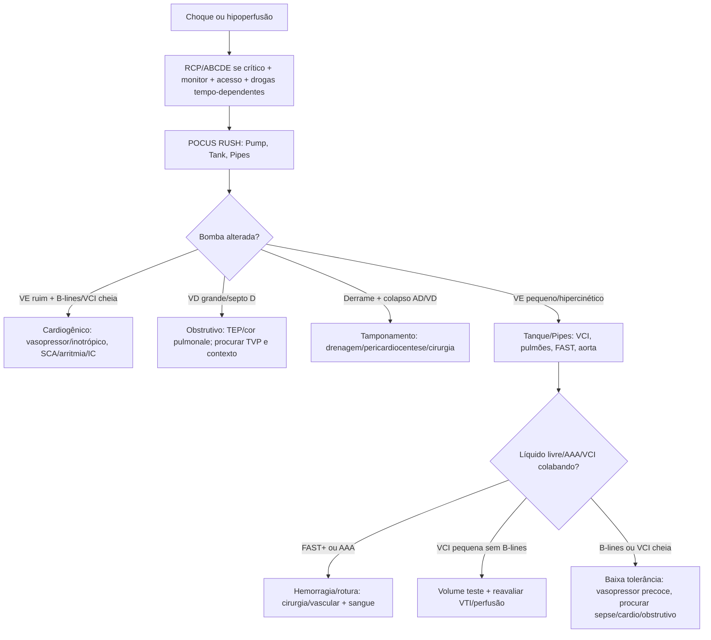
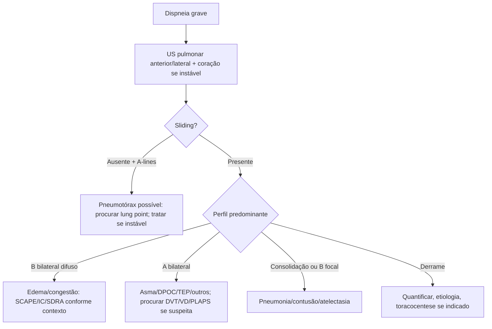
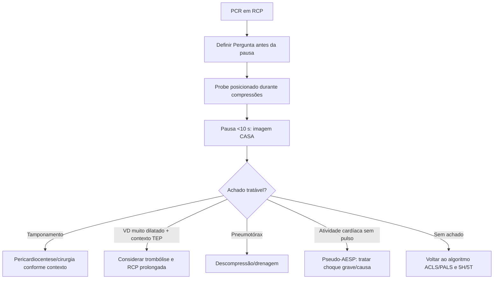

# POCUS no Choque, Trauma, PCR e Dispneia

## Leitura de 30 segundos

- POCUS não é "fazer ultrassom"; é responder uma Pergunta clínica imediatamente: tem pneumotórax? tem tamponamento? tem líquido livre? o VE está ruim? o VD está grande? cabe volume?
- Na prova TEME, os quatro trilhos são: **BLUE** na dispneia, **RUSH** no choque, **eFAST** no trauma e **CASA** na PCR.
- Lung sliding presente reduz muito a chance de pneumotórax naquele ponto; ausente não fecha diagnóstico sozinho.
- Linhas B difusas bilaterais com sliding = congestão/edema pulmonar até prova em contrário; no contexto hipertensivo, pense em SCAPE.
- Choque + VE hipercinético/cavidades pequenas/VCI colabando = hipovolemia provável; choque + VE ruim/B-lines/VCI cheia = cardiogênico ou intolerância a volume.
- FAST negativo não libera paciente instável nem exclui retroperitônio, pelve, lesão de órgão sólido ou trauma abdominal em paciente estável.
- Na PCR, POCUS só entra se a pausa couber em até 10 segundos. Se atrasou compressão ou choque, virou problema.

## Por que cai

POCUS virou tema de prova e estação porque traduz raciocínio de emergência: ver rápido, decidir rápido, sem terceirizar a decisão crítica. A banca TEME cobrou POCUS em prova teórica, em estação de 2024 e em estação de 2025.

O que já apareceu no padrão TEME:

- POCUS pulmonar: pleura e artefatos ar-tecido, linhas A/B, lung sliding, lung point e pneumotórax.
- Dispneia: perfil de SCAPE/EAP hipertensivo com linhas B difusas é função de VE preservada/hipertrofia.
- Choque: RUSH, VCI, VTI, fluido-responsividade versus fluido-tolerância, iniciar noradrenalina sem esperar CVC quando necessário.
- Trauma: eFAST, Morison, pericárdio, pneumotórax, FAST positivo + instabilidade e FAST negativo que não exclui lesão.
- PCR: CASA, tamponamento, VD dilatado/TEP, pseudo-AESP versus AESP verdadeira.
- Física e artefatos: frequência/comprimento de onda, impedância acústica, reforço posterior e imagem em espelho.
- Aplicações "fora do óbvio": hidronefrose infectada, bloqueios regionais, apendicite, ocular e trombo mural em aneurisma de aorta.
- Prática 2025: aorta abdominal aneurismática/trombo mural, PLAX, subxifoide, Morison, VCI colabando, coração hipercinético/kissing walls e punção guiada por US.

Mensagem de prova: POCUS é extensão do exame físico na emergência, mas não substitui conduta tempo-dependente nem exame definitivo quando o paciente está estável e precisa de TC/eco formal.

## Abordagem prática

### 1. Comece Pela Pergunta Certa

Antes de encostar o probe, formule a Pergunta:

| Contexto | Pergunta POCUS |
|---|---|
| Dispneia grave | Edema pulmonar, pneumotórax, pneumonia/consolidação, derrame, sinais indiretos de TEP? |
| Choque indiferenciado | Bomba, tanque ou tubo? Cardiogênico, hipovolêmico, obstrutivo ou distributivo? |
| Trauma instável | Tem hemoperitônio, tamponamento, pneumotórax ou Hemotórax? |
| PCR/AESP | Tem tamponamento, VD muito dilatado/TEP, pneumotórax ou atividade cardíaca? |
| Procedimento | Onde está o vaso/líquido/agulha? A ponta da agulha está visível? |

Se o resultado não muda a conduta agora, provavelmente não é POCUS prioritário naquele minuto.

### 2. Escolha O Transdutor Sem Sofrer

| Transdutor | Melhor uso | Pegadinha |
|---|---|---|
| Linear alta frequência | Pleura/lung sliding, vascular, acesso, nervo, ocular, partes moles | Imagem superficial bonita, mas baixa penetração |
| Curvilíneo/convexo | Abdome, FAST, aorta, pelve, pulmão profundo/derrame | Bom "coringa" quando o paciente é grande |
| Setorial/phased array | Cardio, subxifoide, janelas entre costelas, PCR | Menor resolução superficial; exige orientação espacial |

Em estação prática, verbalize: "Escolho o probe conforme profundidade e janela: setorial para coração, curvilíneo para FAST/aorta e linear para vaso/procedimento/pleura superficial."

### 3. Física Que Vira Questão

POCUS não exige decorar física profunda, mas a banca gosta de cobrar o vocabulário que explica a imagem.

| Conceito | Como resolver na prova |
|---|---|
| Frequência alta | Melhor resolução e menor penetração; típico do transdutor linear |
| Frequência baixa | Maior penetração e menor resolução; útil em abdome/coração |
| Comprimento de onda | Relação inversa com frequência |
| Impedância acústica | Diferença entre tecidos; quanto maior a diferença, maior reflexão |
| Osso/ar | Grande barreira ao feixe; geram sombra/reverberação e limitam janela |
| Reforço acústico posterior | Região mais brilhante atrás de líquido/estrutura pouco atenuante |
| Imagem em espelho | Artefato de reflexão, clássico próximo ao diafragma |
| Sombra acústica | Escurecimento atrás de cálculo, osso ou gás |

Frase curta de prova: "no pulmão, eu interpreto artefatos; no abdome/coração, eu procuro estruturas e movimento."

### 4. Dispneia: POCUS Pulmonar/BLUE

Sequência curta:

1. Identificar linha pleural entre sombras costais: sinal do morcego.
2. Ver lung sliding.
3. Procurar linhas A ou B.
4. Procurar consolidação/derrame em pontos posteriores/laterais.
5. Integrar com coração e veias se choque ou suspeita de TEP.

O que fazer com o achado:

| Achado | interpretação prática |
|---|---|
| Linhas A + sliding bilateral | pulmão aerado: asma/DPOC, TEP, hipovolemia ou quadro não pulmonar |
| Linhas A + sem sliding | Pneumotórax possível; procure lung point e correlacione com clínica |
| Linhas B difusas bilaterais + sliding | Síndrome intersticial/congestão; em hipertenso dispneico, SCAPE |
| Linhas B focais/assimetria | Pneumonia, contusão, atelectasia, lesão focal |
| Consolidação/hepatização + broncograma | Pneumonia se febre/infecção; contusão no trauma |
| Derrame pleural anecoico + spine sign | Derrame; avaliar volume, septações e segurança de punção |

Regra TEME: POCUS pulmonar avalia principalmente **pleura e artefatos**, não "olha o parênquima todo" como TC.

### 5. Choque: RUSH Em Linguagem De Plantão

RUSH = **Pump, Tank, Pipes**.

**Pump - bomba/coração**

- VE hipercontrátil e cavidade pequena: hipovolemia/distributivo inicial.
- VE hipocontrátil: choque cardiogênico, miocardite, IAM, cardiomiopatia.
- VD maior que VE, septo em D, TAPSE baixo: sobrecarga de VD/TEP/cor pulmonale.
- Derrame pericárdico + colapso de câmaras direitas + VCI cheia: tamponamento.
- Tamponamento no eco: colapso diastólico do VD, colapso sistólico do AD, VCI dilatada e pouca colapsibilidade. Nenhum sinal isolado substitui o contexto.
- TEP/cor pulmonale agudo: VD dilatado, septo em D, hipocinesia de VD, VCI cheia e, quando descrito, VD fino (< 5 mm) sugerindo processo agudo. O sinal de McConnell é mais específico que sensível; não use sozinho para "fechar" TEP.

**Tank - tanque/volume e congestão**

- VCI pequena e colabável: sugere baixo retorno venoso/hipovolemia.
- VCI dilatada e pouco variável: sugere pressão atrial direita alta; cuidado com volume.
- Linhas B difusas: baixa tolerância a volume/congestão.
- FAST positivo: sangue/líquido livre no contexto certo.

**Pipes - tubos/vasos**

- Aorta abdominal maior que 3 cm = aneurisma.
- Hipotensão/dor abdominal/dorso + AAA no POCUS = chamar cirurgia/vascular; não medir só a luz verdadeira se houver trombo.
- Veia femoral/poplitea não compressível = TVP; com choque/VD dilatado, aumenta suspeita de TEP.

Quando houver choque séptico ou distributivo com hipoperfusão após volume inicial e baixa tolerância a mais cristalóide, não espere CVC para iniciar noradrenalina se houver acesso periférico adequado e monitorização. A lógica é corrigir perfusão agora e organizar acesso central em paralelo.

### 6. Trauma: eFAST

Janelas obrigatórias:

| Janela | O que procurar |
|---|---|
| QSD/Morison | Líquido entre fígado e rim; borda caudal do fígado |
| QSE/esplenorrenal | Líquido entre baço e rim, subdiafragmático |
| Pelve/suprapúbica | Líquido livre em fundo de saco/reto-vesical |
| Subxifoide/pericárdio | Derrame/tamponamento |
| pulmão anterior/lateral | Pneumotórax: sliding ausente, estratosfera, lung point |
| Base torácica | Hemotórax/derrame: spine sign acima do diafragma |

Conduta:

- Instável + FAST abdominal positivo = controle cirúrgico/hemorrágico, não TC.
- Instável + pericárdio positivo = tamponamento traumático; cirurgia/toracotomia/pericardiocentese como ponte conforme contexto.
- Instável + pneumotórax = descompressão/drenagem imediata.
- FAST negativo + choque = continue procurando: pelve, retroperitônio, tórax, ossos longos, neurogênico, obstrutivo e causas não traumáticas.
- estável + mecanismo relevante = TC com contraste pode ser indicada mesmo com FAST negativo.
- Ascite em cirrótico, diálise peritoneal e líquido pélvico fisiológico podem confundir FAST. Em trauma estável com ferimento toracoabdominal, o caminho costuma ser TC de tórax/abdome com contraste, não exploração "às cegas".

### 7. PCR: CASA Sem Roubar Tempo

Durante compressões:

- Escolha janela e posicione o probe antes da pausa.
- Combine a Pergunta da próxima pausa.
- Adquira imagem em até 10 segundos.
- Volte para compressões.

Perguntas do CASA:

1. Tem derrame pericárdico/tamponamento?
2. Tem VD muito dilatado sugerindo TEP maciço?
3. Existe atividade cardíaca organizada ou cardiac standstill?
4. Há pneumotórax/hipovolemia evidente se protocolo local incluir pulmão/VCI?

Uso inteligente:

- Pseudo-AESP: sem pulso palpável, mas com contratilidade no POCUS; trate como choque gravíssimo, procure causa e otimize vasopressor/volume/inotrópico conforme fenótipo.
- Cardiac standstill tem prognóstico ruim, mas não deve ser o único critério de interrupção.
- POCUS nunca deve atrasar desfibrilação, adrenalina indicada ou compressões.

### 8. Procedimentos: O Que A Estação Quer Ver

Para punção/acesso guiado por US:

1. Escolher probe linear.
2. Identificar vaso em eixo curto/transversal e/ou eixo longo/longitudinal.
3. Diferenciar veia e artéria por compressibilidade, pulsatilidade e Doppler quando necessário.
4. Planejar trajeto da agulha.
5. Visualizar ponta da agulha, não apenas "alguma coisa brilhando".
6. Confirmar fio/cateter conforme procedimento; em CVC, considerar bubble test e avaliar pneumotórax.

Frase de prova: "A técnica pode ser eixo curto, eixo longo ou oblíqua; o ponto crítico é manter a ponta da agulha visível e não transfixar estrutura profunda."

### 9. Aplicações Que A Banca Já Usou

| Cenário | Achado-chave | Conduta de prova |
|---|---|---|
| Pielonefrite obstrutiva | Hidronefrose importante + infecção/sinais sistêmicos | Antibiótico, analgesia e urologia para desobstrução |
| Fratura de tornozelo/maléolo lateral | Dor distal no território ciático | Bloqueio ciático poplíteo pode ser útil |
| Fratura proximal de fêmur/quadril | Dor anterior/proximal | Bloqueio femoral ou fáscia ilíaca |
| Apendicite | Estrutura em alvo, não compressível, > 6 mm, gordura hiperecogênica | Em hospital rural, acelera cirurgia/regulação |
| Ocular | Alta miopia + flashes/escotoma/perda visual indolor | POCUS ocular pode apoiar diagnóstico de descolamento de retina |
| AAA com trombo mural | Aorta > 3 cm medindo parede externa a parede externa | Não medir só a luz; dor/choque exige vascular/cirurgia |

## Conceitos que sustentam a conduta

### POCUS É Integração, Não Laudo

POCUS é feito pelo médico assistente para integrar imagem, exame físico e fisiologia em tempo real. Ele deve responder Perguntas binárias ou semiquantitativas. Quando você tenta fazer laudo completo de órgão, perde a vantagem do método e aumenta erro.

Bons exemplos:

- "Há derrame pericárdico com sinais de tamponamento?"
- "Há linhas B difusas em paciente com dispneia hipertensiva?"
- "Há líquido livre em Morison no politrauma instável?"
- "O VE está grosseiramente deprimido ou hiperdinâmico?"
- "A VCI e os pulmões sugerem que este paciente tolera mais volume?"

Maus exemplos:

- "Qual é a fração de ejeção exata?"
- "Posso excluir TEP com POCUS normal?"
- "FAST negativo exclui lesão abdominal?"
- "VCI sozinha decide todo volume?"

### Fluido-Responsividade Vs Fluido-tolerância

Esse par cai porque evita dois erros opostos: deixar chocado seco ou afogar o cardiogênico.

- **Fluido-responsivo:** o débito cardíaco sobe se eu der volume.
- **Fluido-tolerante:** o paciente consegue receber volume sem congestionar/piorar VD/VE/pulmão.

VCI colabando sugere responsividade, mas não é verdade universal. Ventilação mecânica, pressão intra-abdominal, disfunção de VD, PEEP, DPOC e esforço respiratório bagunçam a leitura.

Melhor raciocínio:

- Perfusão ruim + sem B-lines + VE pequeno/hipercinético + VCI pequena = volume provavelmente faz sentido.
- Perfusão ruim + B-lines difusas + VE ruim ou VD ruim + VCI cheia = cuidado com volume; vasopressor/inotrópico/causa.
- Se houver tempo e janela boa: use teste dinâmico, como passive leg raise com VTI. Aumento de VTI/VS em torno de 10-15% sugere fluido-responsividade.

### O Que O pulmão Mostra

O ultrassom pulmonar vê a interface pleura-ar e artefatos. Por isso ele é excelente para síndromes:

- Muito ar: linhas A.
- Água/interstício: linhas B.
- Ar ausente no alvéolo: consolidação.
- Ar onde não deveria na pleura: pneumotórax.
- Líquido pleural: derrame.

Ele não substitui TC quando a Pergunta exige anatomia detalhada, mas na dispneia grave a pergunta geralmente é sindrômica e tempo-dependente.

### O Que O Coração Mostra

No emergencista, o ecocardio focado não precisa ser perfeito para ser salvador. Ele precisa reconhecer extremos:

- VE muito ruim.
- VE hiperdinâmico/kissing walls.
- VD muito dilatado.
- Derrame pericárdico/tamponamento.
- Ausência ou presença de atividade cardíaca na PCR.

Depois, se o paciente estabiliza, eco formal e cardiologia entram para quantificar e refinar.

## Fluxograma

### Choque Indiferenciado

### Dispneia Aguda

### PCR/AESP

## Doses, alvos e números

| Item | Número/achado | observação TEME |
|---|---:|---|
| Pausa para POCUS na PCR | < 10 s | Probe já deve estar posicionado |
| Linhas B | >= 3 por espaço ou múltiplas zonas | Difusas bilaterais sugerem congestão/interstício |
| VCI respiração espontânea | Colapso > 50% | Sugere baixo RAP/responsividade, mas isolado e fraco |
| VCI plethorica | > 2,1 cm e colapso < 50% | Sugere RAP alta/baixa tolerância a volume |
| VTI LVOT | 16-22 cm normal aproximado | Baixo VTI sugere baixo volume sistólico |
| PLR/mini-bolus | Delta VTI/VS 10-15% | Sugere fluido-responsividade |
| Mini-fluid challenge | 100 mL com delta DC > 6% | Limiar cobrado em prova TEME |
| EPSS | > 7 mm | Sugere disfunção sistólica do VE |
| TAPSE | > 17 mm normal | Reduzido sugere disfunção de VD |
| Relação VD:VE | VD > VE | Sugere sobrecarga de VD se agudo/contexto compatível |
| VD agudo/cor pulmonale | Parede VD < 5 mm | Ajuda a diferenciar agudo de crônico na prova |
| Tamponamento | Colapso diastólico VD + sistólico AD | VCI cheia reforça fisiologia |
| Aorta abdominal | > 3 cm | Aneurisma; medir parede externa a parede externa |
| AAA alto risco | > 5-5,5 cm ou sintomático | Dor/choque + AAA = vascular/cirurgia |
| FAST positivo + instabilidade | Conduta imediata | Cirurgia/controle de fonte, não TC |
| Bainha nervo óptico | > 5 mm no curso; > 6 mm apareceu em prova | Sugere HIC; não substitui TC quando disponível |
| Apêndice | > 6 mm, não compressível | Sugere apendicite no contexto certo |
| Vesicula | parede > 3 mm + Murphy/líquido | Sugere colecistite no contexto certo |

## Pegadinhas TEME

- **POCUS pulmonar avalia parênquima inteiro:** errado. Ele avalia principalmente pleura, artefatos e achados subpleurais.
- **Lung sliding ausente = pneumotórax:** cuidado. Também ocorre em atelectasia, intubação seletiva, apneia, aderências, pleurodese e baixa ventilação.
- **Lung sliding presente exclui pneumotórax em todo tórax:** errado. Exclui no ponto examinado.
- **Linhas B difusas = pneumonia:** geralmente não. Difusas bilaterais com sliding sugerem congestão/interstício; pneumonia costuma ser focal/assimétrica/consolidativa.
- **FAST negativo libera o politrauma:** errado. FAST não avalia bem retroperitônio, pelve, intestino e lesão de órgão sólido sem líquido.
- **Paciente instável + FAST positivo vai para TC:** errado. Vai para controle de fonte/cirurgia conforme contexto.
- **VCI decide volume sozinha:** errado. VCI é uma peca do quebra-cabeça.
- **B-lines impedem qualquer volume:** não exatamente. Elas indicam baixa tolerância e pedem dose pequena/reavaliação; choque hemorrágico ainda precisa sangue.
- **VD dilatado fecha TEP:** não. Sugere sobrecarga de VD; precisa contexto e excluir crônico/cor pulmonale.
- **Cirurgia recente contraindica trombólise em TEP instável de forma absoluta:** cuidado. Contraindicações são ponderadas contra risco de morte; a prova tende a punir "nunca/sempre" em instabilidade.
- **McConnell é triagem perfeita de TEP:** errado. É sugestivo, mais específico que sensível, e depende do contexto.
- **Ascite no FAST = hemoperitônio:** errado. Ascite pode simular líquido livre traumático; integre história e estabilidade.
- **Hidronefrose infectada é só ITU complicada ambulatorial:** errado. Obstrução + infecção exige antibiótico e avaliação urológica para desobstrução.
- **Descolamento de retina precisa dor intensa:** errado. Pode ser indolor, com flashes, moscas volantes, sombra/escotoma.
- **POCUS na PCR melhora tudo sempre:** só se não aumentar pausa. POCUS mal cronometrado piora RCP.
- **Aorta com luz normal exclui aneurisma:** errado se houver trombo mural. Medir diâmetro externo.
- **Procedimento guiado = olhar a tela uma vez:** errado. Deve acompanhar ponta da agulha.

## Erros fatais na prática

- Fazer ultrassom enquanto compressões param por tempo prolongado.
- Usar POCUS para atrasar toracostomia/descompressão em pneumotórax hipertensivo clínico.
- Dar volume repetido em choque com VE ruim, VCI cheia e B-lines difusas sem reavaliar.
- Não reconhecer tamponamento em choque com turgência jugular/derrame/colapso de câmaras direitas.
- Tranquilizar trauma instável por FAST negativo.
- Confundir derrame pleural com pericárdico na PLAX; use a aorta descendente como referência.
- Medir só a luz verdadeira da aorta e ignorar trombo mural.
- Punção guiada sem visualizar ponta da agulha.
- Usar Doppler/medidas complexas quando o paciente precisa de decisão simples e imediata.
- Não salvar/documentar imagens relevantes quando o sistema permite.

## Para prova vs na prática

| Tema | Resposta TEME | Atualização/Prática |
|---|---|---|
| Papel do POCUS | Ferramenta beira-leito para decisões imediatas | ACEP considera POCUS competência central da emergência, com aplicações diagnósticas, ressuscitativas, procedimentais e de monitoramento |
| Dispneia | BLUE/perfis pulmonares e integração com clínica | Use em conjunto com ECG, gaso, Rx/TC quando necessário; POCUS acelera síndrome, não esgota diagnóstico |
| Choque | RUSH: pump/tank/pipes | SSC 2026 favorece medidas dinâmicas para fluido; VCI isolada é insuficiente |
| Trauma | eFAST positivo + instabilidade muda conduta | eFAST negativo não exclui lesão; em estáveis, TC segue sendo exame anatômico principal |
| PCR | CASA em pausas <10 s | Cardiac standstill tem mau prognóstico, mas não deve ser critério isolado para encerrar |
| Procedimentos | Probe linear, eixo curto/longo, visualizar agulha | POCUS reduz complicações quando operador é treinado e imagem é integrada ao procedimento |

## Checklist de revisão

- [ ] Sei escolher probe: linear, curvilíneo ou setorial.
- [ ] Sei o básico de frequência, penetração, impedância, sombra, reforço posterior e espelho.
- [ ] Sei reconhecer linhas A, linhas B, lung sliding, lung point e estratosfera.
- [ ] Sei interpretar perfil B difuso em SCAPE/EAP hipertensivo.
- [ ] Sei montar BLUE em dispneia sem decorar demais.
- [ ] Sei fazer RUSH: pump, tank, pipes.
- [ ] Sei diferenciar choque hipovolêmico, cardiogênico e obstrutivo pelos extremos ultrassonográficos.
- [ ] Sei os sinais de tamponamento: colapso diastólico do VD, colapso sistólico do AD e VCI cheia.
- [ ] Sei que VD dilatado sugere TEP/cor pulmonale, mas não fecha sozinho.
- [ ] Sei que VCI sozinha não decide volume.
- [ ] Sei usar VTI/PLR quando houver tempo e janela.
- [ ] Sei janelas do eFAST: QSD, QSE, pelve, pericárdio e pleura.
- [ ] Sei que FAST negativo não exclui trauma abdominal.
- [ ] Sei usar CASA sem prolongar pausa na PCR.
- [ ] Sei reconhecer hidronefrose infectada, apendicite, descolamento de retina e indicações básicas de bloqueio regional.
- [ ] Sei pontos da prática: PLAX, subxifoide, Morison, VCI, aorta, punção guiada e ponta da agulha.

## Questões e estações relacionadas

- **TEME22:** Q9, Q17, Q24, Q29, Q39, Q50, Q57, Q84, Q86, Q105, Q115.
- **TEME23:** Q5, Q38, Q62, Q66, Q75.
- **TEME24:** Q17, Q40, Q41, Q53.
- **TEME25:** Q5, Q50, Q70, Q77.
- **Estações práticas:** TEME24 com probe setorial, janelas cardíacas e pulmão; TEME25 com aorta aneurismática/trombo mural, choque hipovolêmico/hemorrágico, PLAX, subxifoide, Morison, VCI colabando e punção guiada por US.
- **Aulas de cursinho:** Aula 09 POCUS pulmonar; Aula 13 Choque; Aula 18 POCUS trauma/vascular/neuro; Aula 29 POCUS cardíaco; Aula 35 POCUS procedimentos.

## Referências

- Conteúdo programático TEME26 e referências oficiais do edital.
- Livro POCUS ABRAMEDE disponível no projeto.
- Provas teóricas TEME22, TEME23, TEME24 e TEME25 disponíveis no projeto.
- Estações práticas TEME24 e TEME25 disponíveis no projeto.
- Aulas de cursinho: Aula 09 - POCUS Pulmonar; Aula 13 - Choque; Aula 18 - POCUS Trauma, Vascular e Neuro; Aula 29 - POCUS Cardíaco; Aula 35 - POCUS Procedimentos.
- Resumo do cursinho.docx, arquivo do usuário.
- American College of Emergency Physicians. 2023: [Ultrasound Guidelines: Emergency, Point-of-care, and Clinical Ultrasound Guidelines in Medicine](https://www.annemergmed.com/article/S0196-0644(23)00432-8/fulltext).
- ACEP. 2023: [Point-of-Care Ultrasound Guidelines PDF](https://www.acep.org/siteassets/sites/acep/media/ultrasound/pointofcareultrasound-guidelines.pdf).
- EFSUMB. 2022/2023: [Clinical Practice Guidelines for Point-of-Care Ultrasound: common heart and pulmonary applications](https://pubmed.ncbi.nlm.nih.gov/36228631/).
- Society of Critical Care Medicine/ESICM. 2026: [Surviving Sepsis Campaign Guidelines](https://www.sccm.org/clinical-resources/guidelines/guidelines/surviving-sepsis-campaign-international-guidelines-for-management-of-sepsis-and-septic-shock-2026).
- American Heart Association. 2025: [Adult Advanced Life Support](https://cpr.heart.org/en/resuscitation-science/cpr-and-ecc-guidelines/adult-advanced-life-support).
