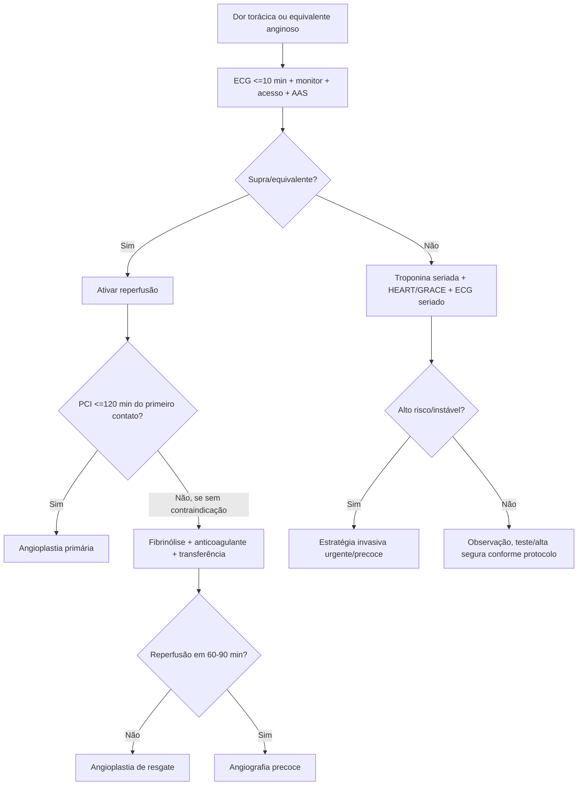
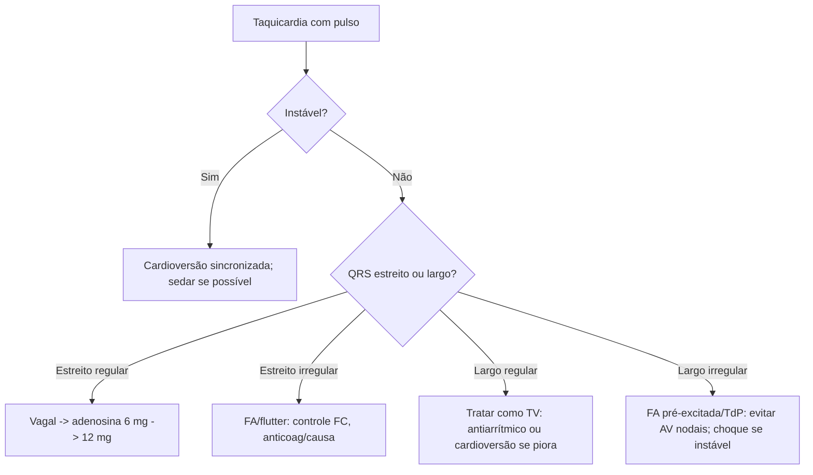
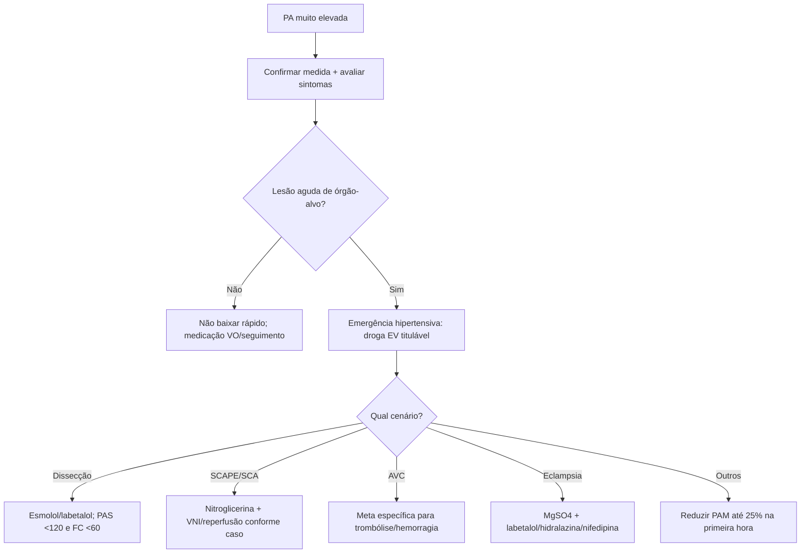

# SCA, Arritmias e Emergências Hipertensivas

## Leitura de 30 segundos

- Dor torácica suspeita de SCA = ECG em até 10 min, monitor, acesso, AAS, troponina seriada e decisão de reperfusão se supra/equivalente.
- IAM com supra é tempo para angioplastia > 120 min = pensar fibrinólise se dentro da janela e sem contraindicação.
- Oxigênio no IAM não é rotina se SatO2 está boa; use se hipoxemia, desconforto respiratório ou choque.
- Taquiarritmia com instabilidade = cardioversão sincronizada. Bradicardia instável = atropina, marcapasso e/ou catecolamina.
- QRS largo irregular ou FA pré-excitada: não bloqueie nodo AV.
- PA muito alta sem lesão aguda de órgão-alvo não é emergência hipertensiva. Lesão aguda muda tudo.
- SCAPE/EAP hipertensivo = VNI + nitrato EV cedo; diurético entra, mas não pode ser a única resposta.

## Por que cai

Cardio cai porque mistura tempo-dependência, ECG, droga e priorização. A banca TEME gosta de situações em que a conduta certa é simples, mas a alternativa tenta seduzir com uma etapa atrasada.

O que já apareceu no padrão TEME:

- STEMI/IAMCST no APH e no DE: destino para hemodinâmica, fibrinólise quando angioplastia atrasa, AAS/P2Y12/enoxaparina/tenecteplase.
- Bradicardia instável/BAVT: atropina, marcapasso transcutâneo/transvenoso, dopamina/adrenalina.
- Taquicardia instável: cardioversão sincronizada; TV monomórfica, FA, TSV, torsades.
- Choque cardiogênico e pós-IAM: SCAI, hipotensão, congestão, lactato e hemodinâmica.
- Emergências hipertensivas: eclampsia/pós-parto, SCAPE/EAP hipertensivo, AVC e dissecção.
- Padrões de ECG de prova: hipotermia/onda J, bradicardia/BAV, Wellens, IAM inferior/VD, TV polimórfica/torsades.
- Situações transversais: IRA pós-PCI, marcapasso transvenoso mal posicionado, IC terminal/paliativos e tempestade tireotóxica.
- Estação prática 2024: BAVT instável + IAMCST + marcapasso + evolução para FV.

Mensagem de prova: primeiro reconheça instabilidade e doença tempo-dependente. Depois escolha a droga.

## Abordagem prática

### 1. Dor torácica/suspeita de SCA

Conduta inicial:

1. Sala monitorada, desfibrilador próximo, acesso IV, sinais vitais.
2. ECG de 12 derivações em até 10 minutos.
3. Se dor inferior, fazer V3R-V4R. Se suspeita posterior, V7-V9.
4. AAS mastigado se não houver alergia verdadeira.
5. Troponina de alta sensibilidade seriada se sem supra/equivalente.
6. Procurar equivalentes de supra: posterior, VD, de Winter, Wellens, Sgarbossa/Smith em BRE/marcapasso quando aplicável.
7. Definir: reperfusão imediata, estratégia invasiva precoce ou observação/alta segura.

Se IAMCST/equivalente:

- Angioplastia primária é preferida se tempo porta-balão/sistema permite.
- Se não consegue PCI em até 120 min do primeiro contato médico e sintomas geralmente < 12 h: fibrinólise se sem contraindicação.
- Após fibrinólise: avaliar sucesso em 60-90 min. Se falha, angioplastia de resgate. Se sucesso, angiografia precoce.

Se SCA sem supra:

- Estratifique risco: HEART para dor torácica na emergência; GRACE/TIMI para SCASEST confirmada.
- Instabilidade, dor refratária, arritmia grave, IC/choque, alteração dinâmica de ST/T ou troponina muito elevada = estratégia invasiva urgente/precoce.
- Baixo risco com ECG sem isquemia e troponina seriada negativa pode ir para alta orientada/seguimento conforme protocolo.

### 2. Padrões de ECG que mudam conduta

Esses padrões caem porque parecem "sem supra clássico", mas não são casos tranquilos. Na dúvida, trate como SCA de alto risco e discuta hemodinâmica cedo.

| Padrão | Como reconhecer | O que significa | Pegadinha |
|---|---|---|---|
| **Wellens** | Dor anginosa recente que melhorou; T bifásica ou profundamente invertida em V2-V3, podendo ir até V1-V6; pouco ou nenhum supra; sem Q patológica anterior | Estenose crítica/reperfusão da DA proximal | Não fazer teste ergométrico; pode precipitar IAM extenso |
| **de Winter** | Infradesnível ascendente do ST no ponto J em V1-V6, T altas/simétricas nas precordiais, muitas vezes supra discreto em aVR | Oclusão proximal de DA, equivalente de IAMCST | Não esperar supra aparecer para chamar hemodinâmica |
| **Sgarbossa original** | Em BRE ou ritmo de marcapasso: supra concordante >=1 mm; infra concordante em V1-V3 >=1 mm; supra discordante >=5 mm | Ajuda a detectar oclusão com QRS largo | Muito específico, mas pouco sensível; negativo não exclui |
| **Smith-Sgarbossa modificado** | Substitui o critério de discordância absoluta por proporção: supra discordante excessivo, ST/S <= -0,25 | Melhor para BRE e ritmo de marcapasso ventricular | Use no contexto clínico; se positivo, pense em OMI/hemodinâmica |

**Como pensar em prova:** Wellens e de Winter apontam para DA e não toleram "alta/teste". Sgarbossa ajuda quando o QRS largo atrapalha a leitura do ST. O erro da alternativa costuma ser chamar de "alteração inespecífica" ou pedir troponina seriada como se o ECG não mudasse a conduta.

### 3. Escores: HEART, GRACE e TIMI

| Escore | Melhor uso | Componentes úteis para lembrar | Como a banca tenta confundir |
|---|---|---|---|
| **HEART** | Dor torácica indiferenciada no DE, especialmente para baixo risco/alta segura | História, ECG, idade, fatores de risco e troponina | Usar HEART para paciente instável ou com ECG de alto risco |
| **GRACE** | SCASEST confirmada/suspeita para risco de morte/IAM e decisão invasiva | Idade, FC, PAS, creatinina, Killip, PCR na admissão, desvio de ST, troponina | Ignorar que GRACE alto, especialmente >140, puxa estratégia invasiva precoce |
| **TIMI UA/NSTEMI** | Estratificação simples e rápida de SCASEST | Idade >=65, >=3 fatores de risco, DAC conhecida, AAS recente, angina recorrente, desvio de ST, marcador positivo | Achar que TIMI substitui julgamento clínico ou GRACE |

Regra prática:

- **Baixo risco real:** sem instabilidade, ECG sem isquemia dinâmica e troponina seriada negativa.
- **Alto risco:** dor recorrente/refratária, alteração dinâmica de ST/T, troponina positiva, IC, choque, arritmia grave, instabilidade elétrica ou hemodinâmica.
- **GRACE >140:** é número de prova para não deixar o paciente "só em observação"; pense em estratégia invasiva precoce.

### 4. Pacote inicial de SCA

Pense em **AAS + P2Y12 + anticoagulante + estatina + reperfusão/estratificação**, e use anti-isquêmicos conforme contexto.

| Medida | Quando usar | Cuidado |
|---|---|---|
| AAS | Praticamente toda SCA sem alergia verdadeira | Mastigar ataque |
| P2Y12 | IAMCST/fibrinólise/PCI/SCASEST conforme estratégia | Escolha varia por fibrinólise, idade e PCI |
| Heparina/enoxaparina | Anticoagulação na SCA | Ajustar renal/idade/peso |
| Estatina alta intensidade | Precoce | Atorvastatina 80 ou rosuvastatina 20-40 |
| Nitrato | Dor persistente, congestão, hipertensão | Evitar hipotensão, infarto de VD, uso de PDE5 |
| Beta-bloqueador | Se hipertenso/taquicardico sem contraindicação | Evitar choque, IC aguda, BAV, bradi, broncoespasmo grave |
| Oxigênio | SatO2 baixa, desconforto, choque | Não é rotina se SatO2 normal |
| Morfina | Dor refratária | Pode atrasar absorção de P2Y12; uso restrito |

### 5. Bradicardia instável

Instabilidade: hipotensão, choque, dor isquêmica, edema agudo de pulmão, síncope/rebaixamento.

Conduta:

1. Monitor, acesso IV, ECG, O2 se hipoxemia.
2. Procurar causa: IAM inferior, hiperK, intoxicação por beta-bloqueador/bloqueador de canal de cálcio/digoxina, hipotermia, hipóxia.
3. Atropina 1 mg IV, repetir a cada 3-5 min até 3 mg.
4. Se falha ou BAV alto grau com instabilidade importante: marcapasso transcutâneo.
5. Ponte/alternativa: adrenalina 2-10 mcg/min ou dopamina 5-20 mcg/kg/min.
6. Preparar marcapasso transvenoso se BAVT/Mobitz II/instabilidade persistente.

Pegada TEME: Mobitz II, BAV avançado e BAVT não são lugar para "esperar a atropina fazer milagre".

Complicação de marcapasso transvenoso que já apareceu: soluços ou contração diafragmática após passagem do cabo sugerem estimulação frênica/diafragmática por mau posicionamento, perfuração ou migração. Na prova, reconheça como cabo mal posicionado; na prática, avalie dependência, captura, Rx/US/fluoroscopia conforme contexto e reposicione/retire em ambiente seguro.

### 6. Marcapasso transvenoso temporário

Pense nele como ponte: ou até a causa reverter, ou até implantar marcapasso definitivo, ou até levar o paciente para hemodinâmica/UTI.

**Indicações que a prova gosta:**

- BAVT, Mobitz II ou BAV avançado com instabilidade.
- Bradicardia instável que não respondeu a atropina e precisa de suporte além do transcutâneo.
- IAM inferior/VD com BAVT persistente e choque.
- Overdrive pacing em torsades recorrente/pausa-dependente quando magnésio e correção eletrolítica não bastam.
- Falha, intolerância ou necessidade prolongada de marcapasso transcutâneo.

**Antes de inserir:**

1. Monitor, desfibrilador, acesso, analgesia/sedação se possível e equipe para via aérea.
2. Corrigir causas tratáveis em paralelo: hipercalemia, hipóxia, intoxicação por beta-bloqueador/bloqueador de canal de cálcio/digoxina, hipotermia e IAM.
3. Preferir inserção com técnica estéril e ultrassom para acesso venoso quando disponível.

**Acesso e inserção, em linguagem de estação:**

- Acesso comum: jugular interna direita. Femoral pode ser mais rápido em emergência; subclávia exige maior cuidado por pneumotórax e compressão difícil.
- Técnica: punção venosa central, introdutor, cabo-eletrodo com balão quando disponível, avanço até VD com monitorização eletrocardiográfica/fluoroscopia/US conforme recurso.
- Sinais de posição/captura: espícula seguida de QRS largo e pulso correspondente. Captura elétrica sem pulso não basta; confirme captura mecânica.
- Se houver captura intermitente, perda de captura, arritmia ventricular, dor torácica nova, hipotensão, soluços ou contração diafragmática: suspeite posição ruim, migração, perfuração ou estimulação extracardíaca.

**Modos e ajustes que bastam para prova:**

| Item | O que significa | Padrão inicial prático |
|---|---|---|
| **VVI** | Estimula ventrículo, sente ventrículo e inibe se detectar QRS próprio | Modo mais comum no temporário de emergência |
| **VOO/assíncrono** | Estimula ventrículo sem respeitar QRS próprio | Evitar como rotina; pode competir com ritmo próprio e gerar R sobre T |
| **Frequência** | Quantos estímulos/min se o paciente não bater sozinho | 60-80 bpm; pode subir em choque/TdP conforme objetivo |
| **Output/corrente** | Energia para capturar miocárdio | Comece alto; reduza até limiar de captura e deixe margem de segurança 2-3x |
| **Sensibilidade** | Capacidade de enxergar QRS próprio | Ajustar para evitar undersensing e oversensing |
| **Overdrive** | Estimular mais rápido que o ritmo do paciente | TdP pausa-dependente: alvo comum 100-120 bpm |

**Troubleshooting rápido:**

- **Sem espícula:** cheque cabo/conexões, bateria/gerador, modo, frequência programada e oversensing.
- **Espícula sem QRS:** perda de captura. Aumente output, corrija hipercalemia/acidemia/hipóxia e reposicione o cabo se necessário.
- **Espícula competindo com QRS próprio:** undersensing. Ajuste sensibilidade e posição do cabo.
- **QRS capturado sem pulso:** captura elétrica não garante débito. Trate choque/causa mecânica em paralelo.

**Complicações para decorar:** punção arterial, hematoma, pneumotórax, arritmia, perfuração/tamponamento, infecção, trombose, deslocamento do cabo, falha de captura, undersensing/oversensing e estimulação frênica/diafragmática.

### 7. Taquicardia com pulso

Primeira pergunta: está instável por causa da taquicardia?

- Instável: cardioversão sincronizada imediata, sedar se der tempo.
- Sem pulso: algoritmo de PCR, desfibrilação se ritmo chocável.
- Estável: classificar QRS estreito/largo e regular/irregular.

Conduta por padrão:

| ECG | Diagnósticos prováveis | Conduta |
|---|---|---|
| Estreito regular | TSV, flutter 2:1, sinusal | Vagal, adenosina; cardioversão se instável |
| Estreito irregular | FA, flutter variável, MAT | Controle de frequência se estável; tratar causa |
| Largo regular | TV até prova em contrário | Cardioversão se instável; antiarrítmico se estável |
| Largo irregular | FA pré-excitada, TV polimórfica/TdP | Evitar AV nodais; cardioversão/desfibrilação se instável |

FA pré-excitada/WPW:

- Suspeite se FA irregular muito rápida, QRS largo variável, FC muito alta.
- Evite adenosina, beta-bloqueador, diltiazem/verapamil, digoxina e amiodarona IV.
- Se instável: cardioversão.
- Se estável: procainamida ou ibutilida conforme disponibilidade/protocolo.

Torsades:

- Sulfato de magnésio 2 g IV.
- Corrigir K/Mg, suspender droga que prolonga QT.
- Se instável/sem pulso: choque não sincronizado/desfibrilação.
- Se recorrente com bradicardia: overdrive pacing/isoproterenol em contexto selecionado.

### 8. PA muito alta: é emergência?

Não trate número isolado. Procure lesão aguda de órgão-alvo:

- Neurológico: encefalopatia, AVCi/AVCh, HSA, convulsão.
- Cardiovascular: SCA, dissecção de aorta, EAP/SCAPE.
- Renal: IRA/oligúria/hematúria.
- Obstétrico: pré-eclampsia grave/eclampsia/HELLP.
- Retina: papiledema/retinopatia grave, se disponível.

Se não há lesão aguda:

- Repetir PA com técnica correta, analgesia/ansiedade/retenção urinária.
- Ajuste VO e seguimento; redução agressiva EV faz mal.

Se há emergência hipertensiva:

- Preferir EV titulável.
- Regra geral: reduzir PA média até 25% na primeira hora; depois perto de 160/100 em 2-6 h; depois gradual em 24-48 h.
- Exceções têm metas próprias.

### 9. Situações hipertensivas que a banca gosta

| situação | Meta/conduta |
|---|---|
| Dissecção de aorta | FC < 60 e PAS < 120 rapidamente; beta-bloqueador antes do vasodilatador |
| SCAPE/EAP hipertensivo | VNI + nitroglicerina EV; diurético se congestão/hipervolemia |
| SCA + hipertensão | Nitroglicerina, analgesia, antitrombóticos/reperfusão; evitar queda brusca |
| AVCi candidato a trombólise | PA < 185/110 antes; manter < 180/105 depois |
| AVCi sem reperfusão | Geralmente tratar se > 220/120; reduzir cerca de 15% em 24 h |
| Hemorragia intracraniana | redução controlada; alvo comum PAS 140-160, evitando hipotensão |
| Eclampsia/pré-eclampsia grave | Sulfato de magnésio + labetalol/hidralazina/nifedipina; obstetrícia |
| Encefalopatia hipertensiva | Reduzir PA média até 25% na primeira hora |

SCAPE/EAP hipertensivo:

1. Sentar o paciente.
2. VNI precoce se desconforto/hipoxemia.
3. Nitroglicerina EV titulada; em SCAPE grave, muitos protocolos usam doses altas/bolus.
4. Furosemida se congesto/hipervolêmico, mas não espere a diurese para melhorar pós-carga.
5. Procurar SCA, valvopatia, arritmia, falha renal.

### 10. ECGs e situações que resolveram questões

| Padrão | Como reconhecer | Conduta/pegadinha |
|---|---|---|
| Hipotermia | Bradicardia, lentificação e onda J/Osborn | Reaquecimento e tratar H/T; arritmias podem ser refratárias até aquecer |
| Wellens | Dor que melhorou + T bifásica/invertida em V2-V3 | Lesão crítica de DA proximal; não mandar para teste ergométrico |
| de Winter | Infra ascendente em V1-V6 + T altas/simétricas | Equivalente de IAMCST por DA; hemodinâmica |
| Sgarbossa/Smith | Critérios de ST em BRE/marcapasso | Se positivo no contexto certo, tratar como oclusão até prova em contrário |
| IAM inferior/VD | Supra inferior, hipotensão/bradicardia, pulmão sem congestão | Evitar nitrato; volume cauteloso, vasopressor se choque e reperfusão |
| TdP/TV polimórfica | QRS largo variando amplitude/eixo, QT longo ou contexto | Instável = desfibrilação; magnésio 2 g; evitar amiodarona se TdP |
| TSV pediátrica instável | Regular, rápida, má perfusão | Cardioversão sincronizada 0,5-1 J/kg |
| STEMI no APH | ECG diagnóstico antes do hospital | Antiagregação conforme protocolo e destino direto para hemodinâmica |

### 11. Fora da cardiologia pura, mas caiu no bloco

- **Creatinina alta 6 horas após PCI:** contraste costuma subir creatinina depois de 24-48 h; pense em DRC prévia e hipoperfusão do choque/IAM.
- **Morte encefálica pós-PCR:** não abrir protocolo com hipotermia, sedação recente e sem tempo mínimo; corrija confundidores e respeite protocolo local.
- **IC terminal/PPS 20:** se fase ativa de morte, a prioridade é conforto. Dispneia terminal responde a opioide em baixa dose; VNI/vasodilatador/diurético só fazem sentido se alinhados aos objetivos.
- **Tempestade tireotóxica:** febre, taquicardia, alteração mental, vômitos e disfunção hepática = tratar clinicamente. Antitireoidiano + beta-bloqueador + corticoide; iodeto depois do antitireoidiano. Com lesão hepática, metimazol tende a ser preferível ao PTU.

## Conceitos que sustentam a conduta

### SCA: tempo e miocárdio

No IAMCST, a pergunta principal não é "qual troponina?", é "como reperfundir?". Troponina pode confirmar necrose, mas não deve atrasar hemodinâmica ou fibrinólise quando o ECG e o contexto fecham IAMCST/equivalente.

No SCASEST, o risco manda. Um paciente com dor recorrente, instabilidade, IC, choque, arritmia grave, alteração dinâmica de ST/T ou troponina alta não é "dor torácica para observar no corredor".

### Arritmia: instabilidade vem antes do nome bonito

Taquicardia instável é elétrica até prova em contrário: cardioversão sincronizada. Bradicardia instável precisa aumentar frequência/perfusão: atropina pode ajudar, mas marcapasso e catecolamina devem estar prontos.

QRS largo em emergência deve ser tratado como TV até prova em contrário. O erro fatal é bloquear nodo AV em FA pré-excitada ou tentar "amiodarona para tudo".

### Emergência hipertensiva: lesão de órgão-alvo

PA alta crônica pode ser assustadora, mas a urgência real é a lesão aguda. Reduzir PA agressivamente em paciente sem LOA pode causar AVC, IAM, síncope e lesão renal. Em contraste, dissecção, eclampsia, SCAPE e encefalopatia pedem tratamento imediato.

## Fluxograma

### Dor torácica/SCA

### Taquicardia com pulso

### PA Elevada

## Doses, alvos e números

### SCA

| Item | Dose/alvo |
|---|---|
| ECG | Até 10 min da chegada/primeiro contato |
| AAS ataque | 162-325 mg VO mastigado |
| AAS manutenção | 75-100 mg/dia |
| Ticagrelor ataque | 180 mg VO; manutenção 90 mg 12/12 h |
| Clopidogrel ataque PCI | 600 mg VO comum em PCI |
| Clopidogrel fibrinólise | 300 mg se <75 anos; sem ataque se >=75 anos em muitos protocolos |
| Tenecteplase no idoso | >=75 anos: metade da dose em muitos protocolos |
| HNF | 60 U/kg IV max 4000; depois 12 U/kg/h max 1000 U/h |
| Enoxaparina | 1 mg/kg SC 12/12 h; ajustar se ClCr <30 |
| Enoxaparina no IAMCST/fibrinólise | <75 anos: 30 mg IV bolus e 1 mg/kg SC 12/12 h; >=75 anos: sem bolus e 0,75 mg/kg SC 12/12 h |
| Atorvastatina | 80 mg VO precoce |
| Nitroglicerina SL | 0,4 mg ou isordil 5 mg SL, repetir até 3 doses se PA permite |
| Nitroglicerina EV | 5-10 mcg/min, titular; curso usa 10 mcg/min inicial |
| Oxigênio | Usar se SatO2 <90%, desconforto respiratório ou choque |
| PCI preferencial | Se disponível em até 120 min do primeiro contato |
| Fibrinólise | Ideal porta-agulha até 30 min quando PCI atrasada |
| Sucesso lítico | Dor melhora + supra reduz >50% em 60-90 min |

### Arritmias

| situação | Dose/energia |
|---|---|
| Atropina bradicardia | 1 mg IV a cada 3-5 min, max 3 mg |
| Adrenalina bradicardia | 2-10 mcg/min |
| Dopamina bradicardia | 5-20 mcg/kg/min |
| Marcapasso transvenoso | Modo VVI em demanda; frequência inicial 60-80 bpm |
| Output do marcapasso | Iniciar alto; achar limiar de captura e manter margem 2-3x |
| Sensibilidade do marcapasso | Ajustar para detectar QRS próprio sem inibir por artefato |
| Adenosina TSV | 6 mg IV rápido; depois 12 mg |
| Cardioversão estreita regular | 50-100 J sincronizado |
| Cardioversão estreita irregular | 120-200 J bifásico sincronizado |
| Cardioversão larga regular | 100 J sincronizado |
| Cardioversão pediátrica TSV instável | 0,5-1 J/kg; depois 2 J/kg |
| Desfibrilação TdP/TV polimórfica instável | 200 J bifásico ou carga recomendada pelo aparelho |
| TV estável amiodarona | 150 mg IV em 10 min, repetir se necessário; depois infusão |
| Torsades | MgSO4 2 g IV |
| Overdrive pacing na TdP | FC 100-120 se recorrente/pausa-dependente |
| FA pré-excitada estável | Procainamida/ibutilida se disponível; cardioversão se instável |

### Emergências Hipertensivas/IC

| situação/fármaco | Dose/alvo |
|---|---|
| Regra geral | Reduzir PAM até 25% na 1ª hora |
| Dissecção aórtica | PAS <120 e FC <60 em cerca de 20 min |
| AVCi trombólise | <185/110 antes; <180/105 após |
| AVCi sem trombólise | Tratar se >220/120; reduzir ~15% em 24 h |
| Nitroglicerina EV | 5-200 mcg/min, titular |
| Nitroprussiato | 0,3-10 mcg/kg/min; monitorização rigorosa |
| Esmolol | 500 mcg/kg bolus; 50-300 mcg/kg/min |
| Labetalol | 10-20 mg IV, repetir/titular conforme protocolo |
| Hidralazina gestação | 5-10 mg IV, repetir a cada 20-30 min |
| Nifedipina gestação | 10 mg VO, repetir conforme protocolo |
| MgSO4 eclampsia | Ataque 4-6 g IV; manutenção 1-2 g/h |
| Furosemida ICA | 20-40 mg IV se virgem ou 1-2x dose VO usual; curso usa 1 mg/kg |
| Dobutamina | 2,5-20 mcg/kg/min |
| Noradrenalina | 0,05-1 mcg/kg/min, titular |
| Morfina para dispneia terminal | 2,5 mg VO/SC/EV em baixa dose, titulando e monitorando |

## Pegadinhas TEME

- **Troponina antes da hemodinâmica no IAMCST claro:** errado se atrasa reperfusão.
- **Oxigênio para todo IAM:** errado. Se SatO2 normal, não é rotina.
- **Nitrato em infarto de VD/hipotensão/PDE5:** perigoso.
- **Morfina como pilar obrigatório da SCA:** hoje uso restrito para dor refratária.
- **Angioplastia vai demorar >120 min e não pensar trombólise:** pegadinha clássica.
- **Bradicardia instável: ficar repetindo atropina sem preparar marcapasso:** erro de estação.
- **BAV Mobitz II/BAVT como se fosse vasovagal:** errado.
- **Toda taquicardia larga = amiodarona lenta:** se instável, choque sincronizado.
- **FA pré-excitada + diltiazem/verapamil/beta-bloqueador/digoxina/adenosina:** pode degenerar para FV.
- **TdP = amiodarona:** errado. Pense em magnésio, choque se instável, corrigir K/Mg e aumentar frequência se recorrente.
- **Wellens melhorou, então pode testar:** perigoso. Não faça teste ergométrico; é lesão crítica de DA até prova em contrário.
- **de Winter sem supra clássico = esperar troponina:** errado. É equivalente de oclusão de DA; chame hemodinâmica.
- **Sgarbossa negativo exclui IAM em BRE/marcapasso:** errado. Critério positivo ajuda muito; negativo não zera probabilidade.
- **HEART, GRACE e TIMI como se fossem iguais:** errado. HEART ajuda dor torácica indiferenciada; GRACE/TIMI entram melhor na SCASEST.
- **Creatinina subiu 6 h após contraste = contraste:** cuidado com tempo. Em poucas horas, pense em DRC e hipoperfusão.
- **Soluços com marcapasso transvenoso = só reduzir output:** errado na prova. Sugere cabo mal posicionado/estimulação diafragmática.
- **PA 220/120 assintomática = nitroprussiato:** errado sem lesão de órgão-alvo.
- **Emergência hipertensiva = baixar PA para normal:** errado, salvo exceções; evite hipoperfusão.
- **Eclampsia = benzodiazepínico como primeira linha:** errado. Sulfato de magnésio.
- **SCAPE = esperar furosemida:** errado. VNI e vasodilatação mudam o jogo.

## Erros fatais na prática

- Não fazer ECG em até 10 minutos em dor torácica.
- Não reconhecer equivalentes de supra ou deixar de fazer derivações direitas/posteriores.
- Fibrinolisar paciente com contraindicação absoluta sem checar sangramento/AVCh/dissecção.
- Mandar IAMCST para hospital sem hemodinâmica sem estratégia de rede.
- Cardioverter sem sincronizar uma taquicardia com pulso organizada.
- Tentar sedar longamente paciente instável antes do choque.
- Dar bloqueador AV em FA pré-excitada.
- Ignorar hipercalemia/intoxicação em bradicardia grave.
- Reduzir PA de forma abrupta em AVCi ou PA elevada sem LOA.
- Tratar SCAPE só com diurético e oxigênio, sem VNI/nitrato quando PA permite.

## Para prova vs na prática

| Tema | Resposta TEME | Atualização/Prática |
|---|---|---|
| SCA inicial | ECG <=10 min, AAS, monitor, troponina e reperfusão se supra | Troponina de alta sensibilidade e protocolos 0/1h ou 0/2h ajudam alta segura em baixo risco |
| Oxigênio no IAM | Usar se hipoxemia/dispneia/choque | AHA/ACC 2025 não recomenda rotina se oxigenação normal |
| Fibrinólise | Se PCI >120 min e sem contraindicação | Rede local manda; após lítico, resgate se falha e angiografia precoce se sucesso |
| P2Y12 | Clopidogrel no lítico; ticagrelor/prasugrel comuns em PCI | Ajustar por idade, sangramento, anticoagulação, AVC prévio e estratégia invasiva |
| FA aguda | Instável = cardioversão | Se pré-excitada, evite AV nodais; se >48 h/tempo incerto, anticoag/TEE se não emergencial |
| Bradicardia | Atropina 1 mg; marcapasso/catecolamina se falhar | Em BAV alto grau, prepare marcapasso cedo |
| PA alta | Emergência só com LOA aguda | Termo "urgência hipertensiva" vem perdendo valor; evitar redução EV em assintomáticos |
| SCAPE | VNI + nitrato + diurético | Nitrato em dose alta/bolus pode ser usado por protocolos experientes; monitorar hipotensão |

## Checklist de revisão

- [ ] Sei fazer abordagem inicial da dor torácica em até 10 min.
- [ ] Sei quando IAMCST vai para PCI e quando considerar fibrinólise.
- [ ] Sei doses de AAS, Clopidogrel/ticagrelor, heparina/enoxaparina e nitrato.
- [ ] Sei que oxigênio não é rotina no IAM com SatO2 normal.
- [ ] Sei contraindicações críticas de nitrato e fibrinólise.
- [ ] Sei o ajuste de fibrinólise/anticoagulação no idoso >=75 anos.
- [ ] Sei reconhecer Wellens, de Winter, Sgarbossa/Smith, hipotermia/Osborn, IAM inferior/VD e TdP.
- [ ] Sei usar HEART, GRACE e TIMI no contexto correto.
- [ ] Sei tratar bradicardia instável e quando preparar marcapasso.
- [ ] Sei o básico do marcapasso transvenoso: indicação, acesso, VVI, frequência, output e sensibilidade.
- [ ] Sei reconhecer complicação de marcapasso transvenoso com soluços/estimulação diafragmática.
- [ ] Sei classificar taquicardia por instabilidade, QRS e regularidade.
- [ ] Sei que FA pré-excitada não recebe bloqueador nodal.
- [ ] Sei reconhecer emergência hipertensiva por lesão de órgão-alvo.
- [ ] Sei metas de PA em dissecção, AVCi trombólise, AVCi sem trombólise, eclampsia e SCAPE.
- [ ] Sei que SCAPE precisa VNI + nitrato precoce se PA permite.
- [ ] Sei diferenciar IC terminal/fase ativa de morte de descompensação reversível.
- [ ] Sei a sequência inicial da tempestade tireotóxica.

## Questões e estações relacionadas

- **TEME22:** Q22, Q44, Q68, Q93, Q111.
- **TEME23:** Q8, Q9, Q15, Q90.
- **TEME24:** Q25, Q26, Q55, Q63, Q76, Q98, Q99.
- **TEME25:** Q30, Q35, Q57, Q89, Q90, Q97.
- **Estações práticas:** TEME24 com BAVT instável, IAMCST, marcapasso e FV.
- **Aulas de cursinho:** Aula 34 - Síncope e Arritmias; Aula 36 - Síndrome Coronariana Aguda; Aula 47 - Emergências hipertensivas e IC Aguda; Aula 48 - Pericardite, Miocardite e Endocardite.

## Referências

- Conteúdo programático TEME26 e referências oficiais do edital.
- Provas teóricas TEME22, TEME23, TEME24 e TEME25 disponíveis no projeto.
- Estações práticas TEME22-25 disponíveis no projeto.
- Aulas de cursinho: Aula 34 - Síncope e Arritmias; Aula 36 - Síndrome Coronariana Aguda; Aula 47 - Emergências hipertensivas e IC Aguda; Aula 48 - Pericardite, Miocardite e Endocardite.
- Resumo do cursinho.docx, arquivo do usuário.
- ACC/AHA/ACEP/NAEMSP/SCAI. 2025: [Guideline for the Management of Patients With Acute Coronary Syndromes](https://www.ahajournals.org/doi/10.1161/CIR.0000000000001309).
- European Society of Cardiology. 2023: [Guidelines for the management of acute coronary syndromes](https://pubmed.ncbi.nlm.nih.gov/37622654/).
- American Heart Association. 2025: [Adult Advanced Life Support](https://www.ahajournals.org/doi/10.1161/CIR.0000000000001376).
- American Heart Association. 2025: [Adult Bradycardia With a Pulse Algorithm](https://cpr.heart.org/-/media/CPR-Files/CPR-Guidelines-Files/2025-Algorithms/Algorithm-ACLS-Bradycardia-250514.pdf?sc_lang=en).
- ACC/AHA/ACCP/HRS. 2023: [Guideline for the Diagnosis and Management of Atrial Fibrillation](https://pmc.ncbi.nlm.nih.gov/articles/PMC11104284/).
- Wellens syndrome: [StatPearls/NCBI Bookshelf](https://www.ncbi.nlm.nih.gov/books/NBK482490/).
- de Winter ECG pattern: [StatPearls/NCBI Bookshelf](https://www.ncbi.nlm.nih.gov/books/NBK557573/).
- Sgarbossa et al.: [Electrocardiographic diagnosis of evolving acute myocardial infarction in the presence of left bundle-branch block](https://pubmed.ncbi.nlm.nih.gov/8559200/).
- Smith et al.: [Modified Sgarbossa rule](https://pubmed.ncbi.nlm.nih.gov/22939607/).
- European Society of Cardiology. 2024: [Guidelines for the management of elevated blood pressure and hypertension](https://www.escardio.org/guidelines/clinical-practice-guidelines/all-esc-practice-guidelines/elevated-blood-pressure-and-hypertension/).
- American Heart Association. 2024: [The Management of Elevated Blood Pressure in the Acute Care Setting](https://www.ahajournals.org/doi/10.1161/HYP.0000000000000238).
