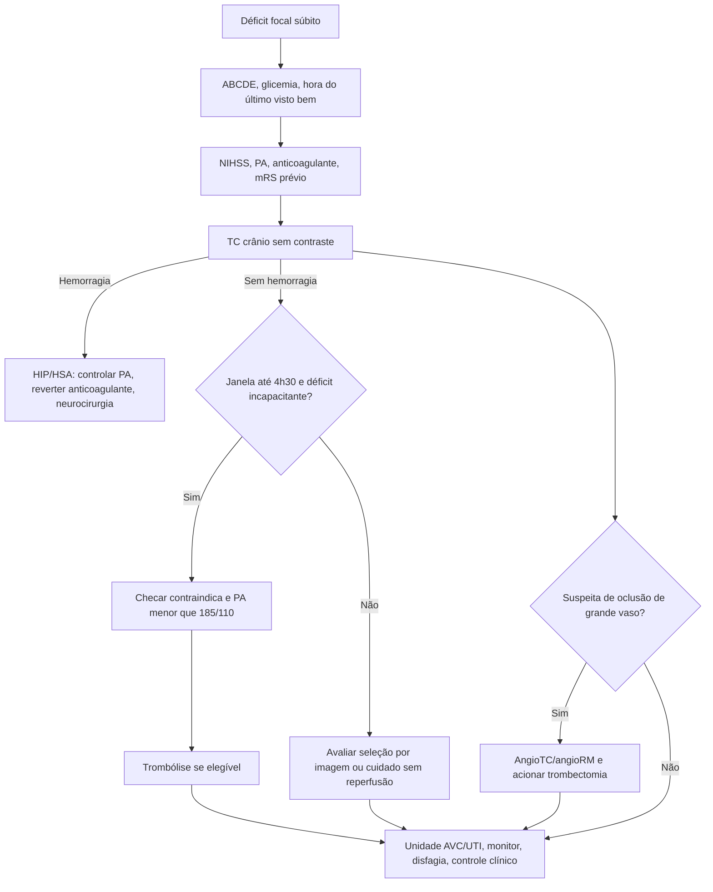
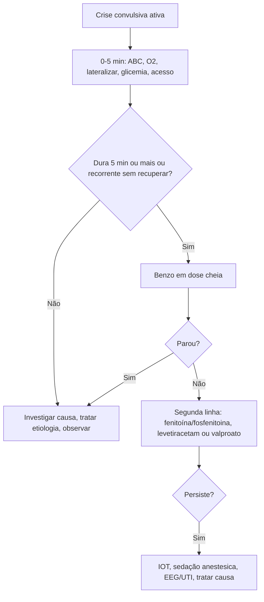
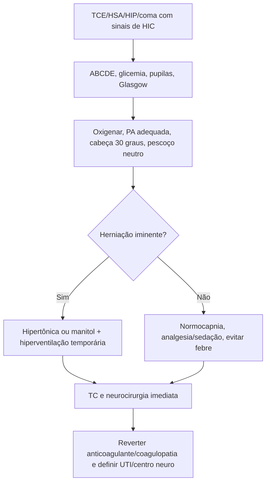

# Emergências neurológicas: AVC, Crise Convulsiva, HIC E TCE

## Leitura de 30 segundos

- Em neuro, a banca cobra decisão tempo-dependente: glicemia, hora do último visto bem, TC sem contraste, indicação de reperfusão, PA-alvo e o que não pode atrasar.
- Status epilepticus e crise no box são prova de método: ABC, glicemia, benzodiazepínico em dose cheia, segunda linha cedo e IOT/anestésico se refratário.
- HIC/TCE e estação prática cobram alvos: oxigenação, ventilação, PA, sedação/analgesia, cabeça a 30 graus, solução hiperosmolar, reversão de coagulopatia e neurocirurgia.
- Morte encefálica não é "paciente com Glasgow 3": precisa causa conhecida irreversível, coma aperceptivo, ausência de reflexos de tronco, apneia persistente e ausência de confundidores.

## Por que cai

- **Recorrência em provas/estações:** AVCi/trombólise/trombectomia, HSA/HIP, convulsão/eclampsia, coma, ONSD/HIC, TCE grave e morte encefálica aparecem de forma repetida entre TEME22-26.
- **O que a banca costuma testar:** primeiro exame, janela, critérios de inclusao/exclusao, dose de alteplase/tenecteplase, PA antes/depois de trombólise, NIHSS/ASPECTS, conduta no status, manitol/hipertônica, hiperventilação, alvos em TCE e impeditivos do protocolo de ME.
- **Como costuma aparecer:** caso clínico com muitos distratores. Exemplo clássico: "convulsão" que era síncope, "AVC leve" mas incapacitante, TCE com hipoxemia/hipotermia em que não se pode abrir ME, ou cefaleia explosiva com TC negativa em que a suspeita de HSA segue viva.

## Abordagem prática

### 1. Neurológico grave no primeiro minuto

1. **ABCDE antes do diagnóstico fino:** via aérea, SpO2, capnografia se intubado, circulação, temperatura e glicemia capilar.
2. **Defina a síndrome:** déficit focal súbito, crise convulsiva, cefaleia explosiva, rebaixamento, trauma ou infecção.
3. **Procure mímicos reversíveis:** hipoglicemia, hiponatremia, hipercapnia, hipoxemia, intoxicação, abstinência, sepse, eclampsia, pós-ictal.
4. **Chame ajuda cedo:** neurologia/teleAVC, neurocirurgia, hemodinâmica/trombectomia, UTI e transporte regulado quando necessário.
5. **Não sedar a prova neurológica sem motivo:** se precisa intubar, documente Glasgow, pupilas, déficit focal e drogas usadas antes.

### 2. Déficit focal agudo: pensar AVC até prova em contrário

1. **Hora zero:** último visto bem, uso de anticoagulante, cirurgia/sangramento recente, PA, glicemia, NIHSS e status funcional prévio.
2. **TC sem contraste imediata:** objetivo inicial é excluir hemorragia. Não espere laboratório se não há suspeita de anticoagulação/coagulopatia relevante.
3. **Se TC sem sangramento e janela até 4h30:** avaliar trombólise, corrigindo PA para menos de 185/110 se necessário.
4. **Se suspeita de oclusão de grande vaso:** angioTC/angioRM e acionar trombectomia em paralelo, sem esperar resposta ao lítico. Até 24 h em selecionados; os critérios atuais não se resumem a ASPECTS >=6.
5. **Depois da decisão de reperfusão:** unidade de AVC, avaliação de deglutição antes de VO, controle de fatores e investigação etiológica. Após trombólise, em regra aguardar 24 h e imagem de controle antes de antitrombóticos; sem lítico, antiagregação após excluir hemorragia conforme indicação.

> **Resposta de prova TEME:** déficit focal súbito + TC sem contraste sem sangramento + janela elegível = trombólise se sem contraindicação; se LVO/NIHSS alto/ASPECTS adequado = trombectomia.
>
> **Atualização AHA/ASA 2026:** alteplase ou tenecteplase são opções na janela de 4h30; déficit incapacitante pode justificar trombólise mesmo com NIHSS baixo. Há seleção por imagem para início desconhecido ou 4h30-9 h. Não extrapole doses do IAM para AVC.
>
> **Brasil:** o PCDT disponível na página do Ministério da Saúde (Portaria 29/2023; página atualizada em 2025) preconiza alteplase. A recomendação internacional não equivale a incorporação ao SUS ou autorização regulatória brasileira: confirmar protocolo, bula vigente e disponibilidade com a equipe de AVC.

### 3. Crise convulsiva e status epilepticus

1. **Se convulsão ativa:** lateralizar/proteger, aspirar se necessário, O2, acesso, glicemia, temperatura, monitor e procurar causa.
2. **Status convulsivo: >=5 min ou crises repetidas sem recuperação:** não espere 30 min para tratar.
3. **Benzodiazepínico em dose cheia:** midazolam IM/IN se sem acesso; lorazepam/diazepam IV se acesso. Repetir uma vez se necessário.
4. **Se persiste após benzo:** segunda linha sem demora: fenitoína/fosfenitoina, levetiracetam ou valproato conforme disponibilidade e contraindicações.
5. **Refratário:** IOT, analgesia/sedação, anestésico contínuo, EEG quando disponível e UTI. Corrija etiologia em paralelo.

**Após cessar os movimentos:** se não recupera consciência como esperado, considerar status não convulsivo e solicitar EEG urgente. Bloqueio neuromuscular pode ocultar crises, não tratá-las.

> **Eclampsia:** crise convulsiva em gestante/puérpera é sulfato de magnésio, não fenitoína como primeira linha. Pense também em AVC/HSA/TVC se déficit focal, cefaleia explosiva ou rebaixamento persistente.

### 4. Cefaleia grave, HSA, HIP e TVC

1. **Cefaleia explosiva/pior da vida:** TC sem contraste. TC negativa nas primeiras 6 h só permite excluir HSA em contexto selecionado, exame neurológico normal e interpretação qualificada. Após 6 h ou com déficit novo e suspeita persistente, investigar, em geral com punção lombar após avaliar segurança; angioTC pode ser alternativa em fluxo acordado, mas aneurisma incidental não prova sangramento.
2. **HSA aneurismática provável:** analgesia, antiemético, PA controlada, nimodipina, neurocirurgia/intervenção para clipagem ou embolização.
3. **Hemorragia intraparenquimatosa:** PA com controle contínuo e suave, suspender/reverter anticoagulante, corrigir coagulopatia, avaliar HIC e neurocirurgia.
4. **Trombose venosa cerebral:** jovem, puerpério, anticoncepcional, trombofilia, cefaleia subaguda, crise ou déficit; pedir angioTC/venoRM. Anticoagulação com heparina pode ser indicada mesmo com hemorragia venosa, salvo contraindicação.
5. **Meningite/encefalite:** se febre + cefaleia + rigidez/RNC, não atrase antibiótico/aciclovir por LP quando há indicação de TC antes.

### 4.1. Cefaleias que a banca gosta de diferenciar

- **Cefaleia em salvas:** dor periorbitária unilateral, fortíssima, em crises de 15-180 min, com lacrimejamento, hiperemia conjuntival, rinorreia, ptose ou miose ipsilateral; álcool pode precipitar. Tratamento abortivo: oxigênio alto fluxo e triptano.
- **Migrânea típica recorrente:** náuseas, fotofobia/fonofobia, padrão semelhante prévio e exame neurológico normal. Metoclopramida EV, dipirona/AINE e hidratação conforme necessidade; evite opioide como primeira linha.
- **HSA:** cefaleia súbita máxima no início, síncope, rigidez de nuca, déficit ou vômitos. Ottawa ajuda a rastrear; TC precoce é mais sensível nas primeiras horas, mas suspeita alta não morre com TC negativa tardia.
- **PRES:** cefaleia, convulsão, alteração visual e hipertensão grave, com edema vasogênico parieto-occipital. Pense em DRC, eclampsia/puerpério, imunossupressor e doença autoimune. Tratamento é controle pressórico cuidadoso e causa de base.
- **Altitude:** ataxia e confusão em altitude = edema cerebral de alta altitude até prova em contrário. Descida, oxigênio e dexametasona; não observar parado na mesma altitude.

### 5. HIC e herniação iminente

Suspeite se cefaleia progressiva, vômitos em jato, rebaixamento, papiledema, VI par, anisocoria, Cushing, postura anormal, TCE grave, HSA/HIP volumosa ou tumor/abscesso.

Conduta de ponte:

1. Cabeceira 30 graus e cabeça neutra.
2. Oxigenar e evitar hipoxemia; se intubado, capnografia.
3. PaCO2 35-40 mmHg como regra; hiperventilar temporariamente se herniação enquanto faz terapia definitiva.
4. Sedação/analgesia se agitado ou intubado.
5. Manitol ou salina hipertônica conforme volemia, sódio, pressão e disponibilidade.
6. TC, neurocirurgia e destino definitivo.

> **ONSD/POCUS:** bainha do nervo óptico aumentada sugere HIC e pode acelerar decisão quando o paciente está instável ou a TC vai demorar. Não substitui TC se ela está disponível.

### 6. TCE grave

1. **Prioridade e evitar lesão secundária:** hipoxemia e hipotensão matam neurônio recuperável.
2. **IOT se Glasgow <=8, perda de reflexos protetores, hipoxemia, agitação que impede cuidado ou necessidade de transporte/TC segura.**
3. **Antes/depois da TC:** sedação contínua, analgesia, ventilação protetora, capnografia, PA-alvo, solução isotônica, evitar febre e corrigir coagulopatia.
4. **Neurocirurgia imediata:** hematoma extradural/subdural volumoso, desvio de linha media, deterioração, anisocoria, fratura afundada complexa, contusão expansiva ou HIC refratária.
5. **Não usar corticoide para TCE.** Profilaxia anticonvulsivante pode ser considerada nos primeiros 7 dias em TCE grave/lesão cortical, conforme protocolo local.

### 6.1. Regras de imagem no TCE leve e pediátrico

- **Canadian CT Head Rule:** destaque de prova por manter alta sensibilidade com especificidade melhor que New Orleans. Lembre: idade >=65 anos, dois ou mais vômitos, sinais de fratura/base, Glasgow que não normaliza, amnésia e mecanismo perigoso.
- **População da Canadian:** adulto/adolescente >=16 anos, TCE leve com perda de consciência, amnésia ou desorientação e Glasgow 13-15. Não extrapolar para anticoagulação, crianças ou todo trauma sem esses critérios; Glasgow <15 em 2 h, amnésia retrógrada >30 min e mecanismo perigoso precisam ser descritos corretamente.
- **PECARN:** divide criança em **menor de 2 anos** e **2 anos ou mais**; a banca tenta trocar por corte de 4 anos. Ajuda a decidir TC em TCE leve, não substitui julgamento em instabilidade, suspeita de abuso ou exame neurológico anormal.
- **RX de crânio:** não é exame para excluir lesão intracraniana, mas pode ser considerado em suspeita de abuso e corpo estranho sob laceração de escalpo.

### 6.2. Reversão de coagulopatia em hemorragia intracraniana

- **Varfarina:** PCC 4 fatores + vitamina K IV; não use plasma como primeira opção se PCC disponível.
- **Dabigatrana:** idarucizumabe quando indicado/disponível.
- **Inibidores do fator Xa:** discutir PCC 4 fatores/reversor disponível conforme protocolo e última dose/função renal. Andexanet não deve ser tratado como escolha universal: a FDA publicou alerta de segurança trombótica e informou encerramento das vendas nos EUA em dezembro de 2025. Isso não determina automaticamente a situação regulatória brasileira.
- **Plaquetas:** não transfundir de rotina em todo usuário de antiagregante; considerar se plaquetopenia relevante ou cirurgia/neurointervenção, conforme protocolo.

### 7. Morte encefálica na sala vermelha

Antes de pensar em protocolo:

1. Causa conhecida, documentada e irreversível.
2. Coma aperceptivo.
3. Ausência de reatividade supraespinhal.
4. Apneia persistente.
5. Sem hipotermia, hipoxemia, choque, distúrbio metabólico grave ou droga depressora confundindo exame.

> **Pegadinha de estação:** TCE grave + TC catastrófica + sem reflexos de tronco, mas hipotérmico, hipoxêmico ou sob sedação relevante, não permite iniciar/concluir protocolo. Primeiro corrija confundidores e estabilize.

**Números brasileiros essenciais (CFM 2.173/2017):** observação hospitalar >=6 h; >=24 h se encefalopatia hipóxico-isquêmica. Temperatura central >35 °C, saturação >94% e, em adultos, PAS >=100 ou PAM >=65 mmHg. São obrigatórios dois exames clínicos por médicos diferentes capacitados, teste de apneia e exame complementar. Intervalo entre exames: 24 h de 7 dias completos a <2 meses; 12 h de 2 a <24 meses; 1 h a partir de 2 anos. Este resumo não substitui os anexos da resolução, inclusive limites pediátricos e avaliação de fármacos.

### 8. Vertigem e déficit posterior

- **HINTS:** síndrome vestibular aguda contínua com nistagmo e examinador treinado; não aplicar como rastreio a toda tontura ou à VPPB. Sem nistagmo, valorizar instabilidade de marcha e exame neurológico. Resultado central/duvidoso exige investigação; TC normal não exclui AVC posterior (GRACE-3).
- **Periférico/neurite vestibular:** head impulse positivo, nistagmo horizontal unidirecional, skew negativo, sem déficit focal.
- **Central/fossa posterior:** head impulse normal, skew positivo, nistagmo vertical ou direção variável, cefaleia nova, ataxia importante, diplopia, disartria, déficit focal ou alto risco vascular.
- **VPPB:** crises breves desencadeadas por posição, Dix-Hallpike positivo; tratar com manobra de reposicionamento.

### 9. Imunossuprimido com lesão expansiva cerebral

- **AIDS + lesões com realce em gânglios da base + edema:** pense primeiro em neurotoxoplasmose e trate empiricamente enquanto investiga.
- **Criptococose:** quadro meníngeo subagudo, pressão de abertura elevada, cefaleia persistente.
- **Tuberculose SNC:** meningite basal, hidrocefalia, vasculite ou tuberculomas; costuma ter líquor mais compatível com meningite crônica.
- **CMV:** ventriculoencefalite/polirradiculopatia em imunossupressão avançada.

## Conceitos que sustentam a conduta

### AVCi: tempo, tecido e elegibilidade

O objetivo da emergência é separar rápido três grupos: hemorragia, isquemia reperfundível e mímico. A TC sem contraste tira hemorragia do caminho; NIHSS mede gravidade; ASPECTS estima área já infartada; angio identifica oclusão de grande vaso. O erro clássico é pensar que "NIHSS baixo" sempre significa "não tratar": o que manda é déficit incapacitante, janela, imagem e risco.

Janela habitual de trombólise: 4h30 desde o último visto bem. Para trombectomia, NIHSS >=6 e ASPECTS >=6 são critérios clássicos de provas antigas, não limites absolutos atuais: há benefício em grandes núcleos isquêmicos selecionados. Oclusão basilar em até 24 h com NIHSS >=10 também tem recomendação na AHA/ASA 2026. A seleção exige centro especializado.

### Hemorragia: pressão, coagulação e neurocirurgia

HIP/HSA não são "só observar". Controle pressor titulado, reversão de anticoagulação e avaliação neurocirúrgica são urgentes. Na HSA aneurismática, nimodipina é enteral, nunca IV; manter euvolemia, sem hipervolemia profilática. Na HIP espontânea em uso de AAS, sem cirurgia emergencial, transfusão de plaquetas pode causar dano; não confundir com correção de plaquetopenia.

### Status epilepticus: receptor muda com o tempo

Quanto mais a crise dura, menor a resposta ao benzodiazepínico. Estabilizar, dar benzo em dose plena e avançar à segunda linha se persistir; as faixas de tempo dos algoritmos são limites organizacionais, não ordens para aguardar 20 ou 40 minutos. Planejar suporte ventilatório e EEG em paralelo.

### HIC/TCE: PPC e lesão secundária

TCE grave e HIC são doenças de perfusão. Hipoxemia, hipotensão, febre, hipercapnia importante, hipocapnia prolongada, anemia grave e coagulopatia reduzem reserva cerebral. A hiperventilação baixa a PIC por vasoconstrição, mas também pode piorar isquemia; use como ponte curta em herniação, não como rotina.

## Fluxograma

### Deficit Focal Agudo

### Status Epilepticus

### HIC/TCE Com deterioração

## Doses, alvos e números

### AVCi E Hemorragias

| Item | Número | observação TEME |
|---|---:|---|
| TC no AVC | imediata; meta prática porta-imagem <=20-25 min | A prova quer TC sem contraste antes de trombólise |
| Alteplase AVCi | 0,9 mg/kg, max 90 mg | 10% bolus, 90% em 60 min, até 4h30 |
| Tenecteplase AVCi | 0,25 mg/kg, max 25 mg | Atualização; em prova brasileira, cuidado com PCDT/bula |
| PA antes da trombólise | <185/110 mmHg | Se refratária, contraindica trombólise |
| PA após trombólise | <180/105 mmHg por 24 h | Monitor frequente |
| AVCi sem reperfusão | tratar se >=220/120; reduzir ~15% em 24 h | Evitar queda abrupta da perfusão |
| Trombectomia até 6 h | Oclusão de grande vaso e seleção clínica/imagem | Critérios clássicos não excluem automaticamente grandes núcleos selecionados |
| Trombectomia 6-24 h | Seleção por imagem, inclusive casos de grande núcleo e basilar | Não é "todo AVC até 24 h"; discutir centro de AVC |
| PA pós-reperfusão | Não perseguir PAS <140 de forma intensiva | AHA/ASA 2026: pode causar dano após trombectomia, mesmo com reperfusão completa |
| HIP leve-moderada com PAS 150-220 | alvo PAS 140; manter 130-150 | Evitar PAS <130 |
| Varfarina + HIC | PCC 4 fatores + vitamina K IV | Não esperar "lavar" anticoagulante |
| Plaquetas em sangramento SNC/TCE | mirar >100.000/mm3 | Estação prática costuma cobrar alvo alto |
| HSA aneurismática | nimodipina 60 mg VO/enteral 4/4 h por 21 dias | Se hipotensão, ajustar com neuro/UTI |

### Convulsão E Status

| Item | Número | observação TEME |
|---|---:|---|
| Status epilepticus | crise >=5 min ou crises sem recuperar consciência | Não esperar 30 min |
| Midazolam IM | 0,15-0,2 mg/kg, usual max 10 mg | Boa opção sem acesso |
| Midazolam IN/bucal | 0,2 mg/kg, max 10 mg | Útil no APH/pediatria, conforme disponibilidade |
| Lorazepam IV | 0,1 mg/kg, max 4 mg por dose | Repetir 1 vez se necessário |
| Diazepam IV | 0,15-0,2 mg/kg, max 10 mg | Mais recorrência que lorazepam |
| Fenitoína IV | 20 mg/kg | Em SF 0,9%; max 50 mg/min; monitor ECG/PA |
| Fosfenitoina IV/IM | 20 mg PE/kg | Melhor tolerância, se disponível |
| Levetiracetam IV | 40-60 mg/kg, max 4,5 g | Pouca interacao; alternativa moderna |
| Valproato IV | 20-40 mg/kg, max 3 g | Evitar hepatopatia, plaquetopenia, gestação |
| Eclampsia | MgSO4 4-6 g IV ataque; 1-2 g/h manutenção | Anticonvulsivante de escolha |

### HIC E TCE

| Item | Número | observação TEME |
|---|---:|---|
| Cabeceira | 30 graus | Cabeça neutra, sem compressão jugular |
| PaCO2 TCE/HIC sem herniação | 35-40 mmHg | Normocapnia; capnografia obrigatória se IOT |
| Hiperventilação de ponte | PaCO2 ~30-35 mmHg por curto período | Só herniação/deterioração até terapia definitiva |
| Manitol 20% | 0,25-1 g/kg IV | Evitar hipovolemia/choque/IRA importante |
| NaCl 3% | 2-3 mL/kg ou bolus 100-250 mL | Ajustar a protocolo local |
| Hipertônica: segurança | Conferir concentração, dose e acesso; monitorar Na/função renal | Não intercambiar volumes de NaCl 3%, 20% e 23,4% |
| PAS mínima TCE grave | >=100 mmHg se 50-69 anos; >=110 se 15-49 ou >=70 | BTF; individualizar conforme perfusão/PIC |
| TCE com monitor de PIC | Tratar PIC >22 mmHg; PPC usual 60-70 mmHg | PPC = PAM - PIC; evitar elevar PPC com fluido indiscriminado |
| Saturação | >94% | Evitar hipoxemia e hiperoxia sem alvo |
| Temperatura | normotermia; tratar febre | Hipotermia terapêutica rotineira não melhora desfecho |
| Corticoide no TCE | não usar | Aumenta mortalidade em TCE grave |
| Profilaxia crise TCE grave | 7 dias, conforme protocolo | Fenitoína ou levetiracetam; não previne epilepsia tardia |
| Cefaleia em salvas | O2 alto fluxo + triptano | Dor orbitária unilateral com sinais autonômicos |
| PRES | reduzir PA de modo controlado | Convulsão/alteração visual + edema vasogênico posterior |
| HACE | dexametasona + O2 + descida | Ataxia/confusão em altitude é emergência |
| Neurotoxoplasmose | TMP-SMX ou esquema local | AIDS + lesões em gânglios da base com edema |

## Pegadinhas TEME

- **Não medir glicemia no "AVC":** hipoglicemia e mímico clássico e deve ser corrigida antes de carimbar AVC.
- **Confundir último visto bem com hora em que foi encontrado:** para janela de reperfusão, vale o último momento assintomático conhecido.
- **NIHSS baixo = sem trombólise:** errado se déficit e incapacitante. O que não se trombolisa e déficit leve não incapacitante.
- **Crise no início exclui AVC:** não exclui; pode ser AVC com crise ou paresia de Todd. A decisão depende do déficit residual e da imagem.
- **Esperar INR/plaqueta de todo mundo para trombolisar:** se não há suspeita de anticoagulação/coagulopatia, não atrasar. Em varfarina/heparina/coagulopatia, precisa checar.
- **Baixar PA forte no AVCi sem reperfusão:** pode piorar penumbra. Trate agressivamente só se houver indicação específica.
- **Trombectomia até 24 h para qualquer AVC:** precisa LVO e selecao por imagem/critérios.
- **DWI-FLAIR mismatch obrigatório para trombectomia:** não. Ele ajuda em wake-up stroke e trombólise selecionada; trombectomia depende de LVO, janela e imagem de tecido.
- **Benzodiazepínico subdosado no status:** dose quebrada falha; faça dose plena e avance para segunda linha.
- **Fenitoína para eclampsia:** primeira linha é sulfato de magnésio.
- **LP antes da TC em RNC/focal/papiledema/crise recente/imunossupressão:** risco de herniação e erro de prova.
- **Hiperventilar todo TCE grave:** ponte para herniação, não rotina.
- **Hipotensão permissiva no TCE:** permissiva vale para hemorragia sem TCE; no TCE grave, evite hipotensão.
- **Corticoide para edema do TCE:** contraindicado.
- **Nimodipina na HSA traumática:** benefício é para HSA aneurismática; em traumática não é rotina de prova.
- **Abrir ME com hipotermia, hipoxemia ou sedação:** não. Primeiro corrigir confundidores.
- **Cefaleia em salvas como migrânea:** sinais autonômicos ipsilaterais + crise curta e recorrente apontam para salvas.
- **PRES como AVC occipital bilateral:** melhora com controle pressórico e edema vasogênico posterior são pistas contra AVC arterial típico.

## Erros fatais na prática

- Não proteger via aérea em paciente com rebaixamento, vômitos, sangramento orofaríngeo ou hipoxemia antes de transporte/TC.
- Não registrar último visto bem, anticoagulantes, NIHSS, pupilas e Glasgow antes de sedar/intubar.
- Atrasar TC/angioTC em AVC candidato a reperfusão por exames que não mudam a decisão imediata.
- Dar trombolítico em suspeita de HSA, sangramento intracraniano, INR alto, plaqueta <100.000 ou PA refratária.
- Repetir benzodiazepínico indefinidamente e esquecer segunda linha/status refratário.
- Fazer LP em paciente com sinais de HIC sem imagem/segurança.
- Deixar TCE grave hipotenso, hipoxêmico, hipercápnico ou febril.
- Não reverter anticoagulação em hemorragia intracraniana.
- Não acionar neurocirurgia/intervencionista cedo quando há lesão expansiva, hidrocefalia, HSA aneurismática ou LVO.
- Concluir morte encefálica sem preencher pré-requisitos legais e fisiológicos.

## Para prova vs na prática

| Tema | Para prova TEME | Na prática clínica |
|---|---|---|
| AVCi trombólise | Alteplase 0,9 mg/kg até 4h30, TC sem sangramento, PA <185/110 | Muitos centros usam tenecteplase 0,25 mg/kg em protocolos; alinhar com neurologia, PCDT, farmacia e bula/local |
| AVCi leve | Não trombolisar déficit leve sem incapacidade | Afasia, hemianopsia, mão dominante, ataxia incapacitante ou profissao podem tornar "leve" clinicamente relevante |
| Trombectomia | Critérios clássicos de janela/NIHSS/ASPECTS | AHA/ASA 2026 amplia seleção; não excluir por ASPECTS baixo isoladamente |
| PA no AVCi | <185/110 antes e <180/105 depois do lítico; sem lítico tratar se >=220/120 | Ajustar se dissecção, IAM, EAP, encefalopatia hipertensiva ou trombectomia |
| HIP | PAS alvo 140, manter 130-150 se leve-moderada | Evitar queda brusca; individualizar em hematoma grande, HIC, cirurgia e comorbidades |
| HSA | TC; se suspeita persiste, investigar; nimodipina e neurocirurgia | LP, angioTC, RM e fluxo local variam conforme tempo da cefaleia e qualidade da TC |
| Status epilepticus | Benzo dose cheia, depois fenitoína/fosfenitoina/levetiracetam/valproato | Levetiracetam e valproato cresceram por praticidade; fenitoína segue muito cobrada |
| TCE/HIC | HOB 30, normocapnia, manitol/hipertônica, evitar hipoxemia/hipotensão | Monitorizacao invasiva, sedação, osmoterapia e neurocirurgia dependem do centro |
| ME | Não iniciar/concluir com confundidores | Seguir estritamente CFM, hospital, CIHDOTT/OPO e documentação |

## Referências

**Prova/TEME**

- Conteúdo programático TEME26.
- Referências bibliográficas TEME26, incluindo Manual de Via aérea 2025, Tratado ABRAMEDE 2024 e materiais oficiais indicados no edital.
- Provas teóricas TEME22-26 e estações práticas TEME24-25 disponíveis no projeto.

**Material local**

- Aulas de cursinho - Aula 02: Déficit focal agudo e AVCi.
- Aulas de cursinho - Aula 03: Cefaleia e sangramentos do SNC.
- Aulas de cursinho - Aula 12: Convulsões e infecções do SNC.
- Aulas de cursinho - Aula 18: POCUS trauma, vascular e neuro.
- Aulas de cursinho - Aula 40: Alteração do nível de consciência e HIC.
- Aulas de cursinho - Aula 45: Trauma cranioencefálico.
- Emergency Talks: `Resumo do Emergency.docx`.
- Medicina de Emergência HCFMUSP, 18ª ed.: capítulos de AVC, convulsões, cefaleia e trauma cranioencefálico; leitura dirigida das decisões de emergência.

**Atualização clínica**

- AHA/ASA. 2026: [Diretriz de manejo inicial do AVC isquêmico: principais recomendações](https://professional.heart.org/en/science-news/2026-guideline-for-the-early-management-of-patients-with-acute-ischemic-stroke/top-things-to-know).
- FDA. 18/12/2025: [Alerta de segurança do Andexxa](https://www.fda.gov/vaccines-blood-biologics/safety-availability-biologics/update-safety-andexxa).
- SAEM. 2023: [GRACE-3: vertigem aguda](https://doi.org/10.1111/acem.14728).
- CFM. [Resolução 2.173/2017 e anexos, com apostilamentos](https://sistemas.cfm.org.br/normas/arquivos/resolucoes/BR/2017/2173_2017.pdf).

- Ministério da Saúde. PCDT Acidente Vascular Cerebral Isquêmico Agudo, Portaria Conjunta SAES/SECTICS n 29, 12/12/2023, página atualizada em 21/01/2025: https://www.gov.br/saude/pt-br/assuntos/pcdt/a/acidente-vascular-cerebral-isquemico-agudo/view
- Ministério da Saúde. Linha de Cuidado AVC Isquêmico até 4 horas: https://linhasdecuidado.saude.gov.br/portal/acidente-vascular-cerebral-%28AVC%29-no-adulto/unidade-hospitalar/avc-isquemico-menor-igual-4horas/
- Powers WJ et al. AHA/ASA 2019 update to 2018 Guidelines for the Early Management of Acute Ischemic Stroke: https://www.ahajournals.org/doi/10.1161/STR.0000000000000211
- Alamowitch S et al. European Stroke Organisation expedited recommendation on tenecteplase for acute ischaemic stroke, 2023: https://pmc.ncbi.nlm.nih.gov/articles/PMC10069183/
- Greenberg SM et al. AHA/ASA 2022 Guideline for Spontaneous Intracerebral Hemorrhage: https://pubmed.ncbi.nlm.nih.gov/35579034/
- Hoh BL et al. AHA/ASA 2023 Guideline for Aneurysmal Subarachnoid Hemorrhage: https://pubmed.ncbi.nlm.nih.gov/37212182/
- Brain Trauma Foundation. Guidelines for the Management of Severe TBI, 4th Edition: https://braintrauma.org/coma/guidelines/severe-tbi
- Glauser T et al. American Epilepsy Society guideline for convulsive status epilepticus: https://www.acep.org/siteassets/uploads/uploaded-files/acep/clinical-and-practice-management/clinical-policies/aesconvulsivestatusepilepticus.pdf
- Cook AM et al. Neurocritical Care Society Guidelines for the Acute Treatment of Cerebral Edema in Neurocritical Care Patients, 2020: https://pubmed.ncbi.nlm.nih.gov/32227294/
- Conselho Federal de Medicina. Resolução CFM n 2.173/2017 e critérios de morte encefálica: https://portal.cfm.org.br/noticias/cfm-atualiza-resolucao-com-criterios-de-diagnostico-da-morte-encefalica/
