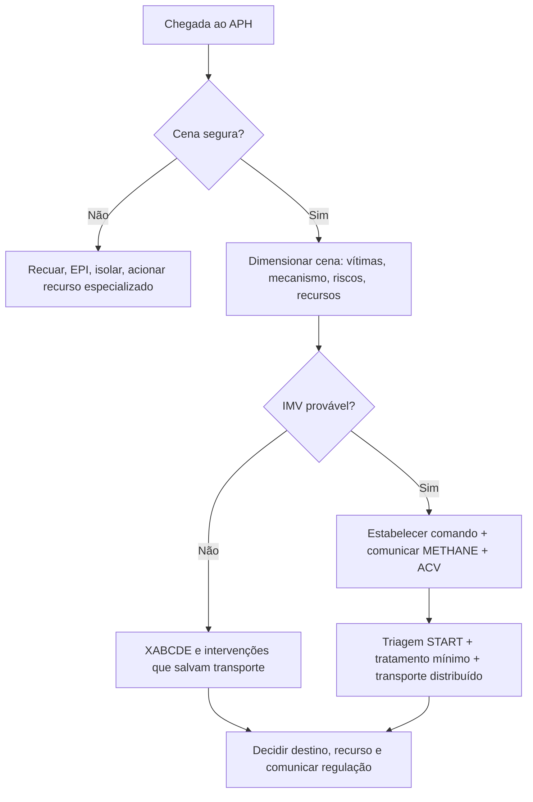
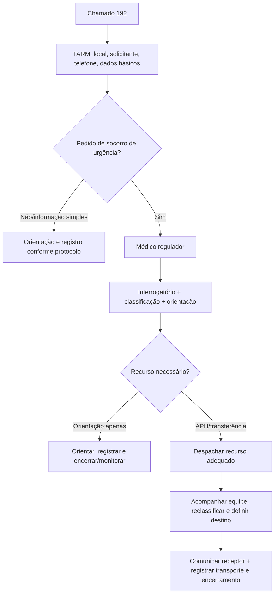
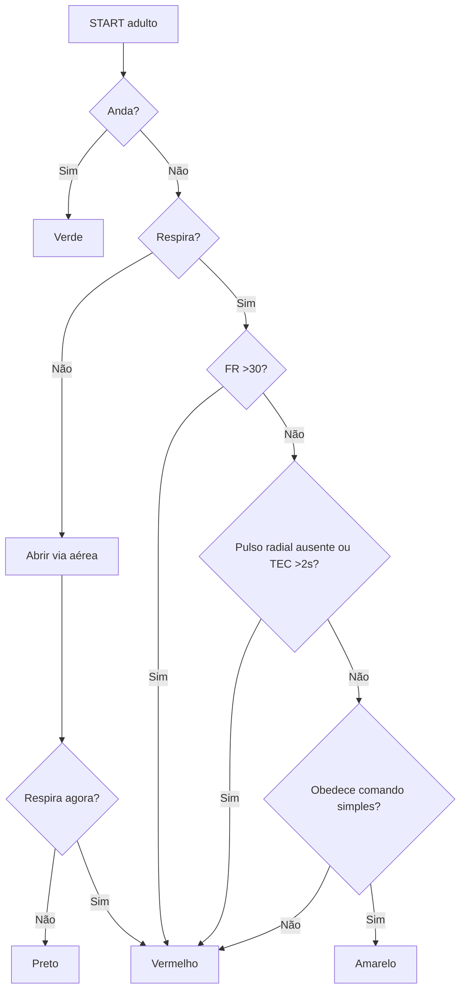
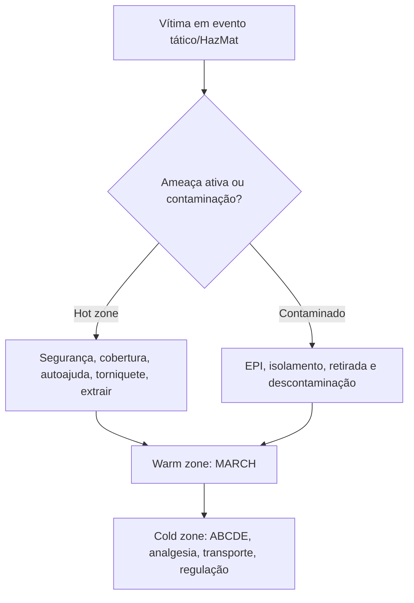

# APH, regulação, IMV, desastres e transporte

## Leitura de 30 segundos

- APH começa antes do ABCDE: segurança da cena, EPI, posicionamento da viatura, avaliação de riscos, número de vítimas e pedido precoce de recursos.
- No SAMU, o médico regulador não é telefonista: ele classifica gravidade, orienta, decide recurso, acompanha atendimento/transporte e define destino dentro da rede.
- IMV é medicina de massa: se os recursos são insuficientes, a meta muda de "melhor para cada um" para "maior benefício para o maior número".
- START de adulto: anda = verde; não respira após abrir via aérea = preto; respira após abrir = vermelho; FR >30, perfusão ruim ou não obedece comandos = vermelho; o restante = amarelo.
- Transporte e intervenção de risco: estabilize o que mata agora, escolha o recurso correto, comunique destino e registre mudanças. Paciente grave/de risco exige equipe e ambulância compatíveis.
- Temas ambientais que caem: afogamento = ventilação/rescue breaths; intermação = resfriar cedo; altitude = parar subida/descer; mergulho = O2 100%; hipotermia = manuseio gentil e aquecimento de tronco.

## Por que cai

- **Recorrência em provas/estações:** TEME22-26 cobrou cena de rodovia, cinemática, explosão, transporte aeromédico, mergulho/descompressão, altitude, afogamento, atendimento tático, intermação, papel do médico regulador e logística em contexto remoto/rural.
- **O que a banca costuma testar:** prioridade da primeira equipe, diferença entre APH e tratamento definitivo, START/SCI, "vaga zero", responsabilidades do regulador/transporte/receptor, zonas táticas, óbito em cena, preservação de vestígios, blast injury e condutas ambientais simples.
- **Como costuma aparecer:** caso cheio de distratores. A resposta certa geralmente protege equipe, organiza recurso, comunica a rede e não faz procedimento heroico em cena insegura ou com acesso limitado.

## Abordagem prática

### 1. Primeiro minuto do APH

1. **Pare antes de entrar:** cena segura? EPI? tráfego? violência? eletricidade? fogo? produto químico? água? estrutura instável?
2. **Posicione a viatura como proteção:** em acidente rodoviário, use a ambulância para proteger a área e sinalizar fluxo; outros veículos ficam no mesmo lado e fora do fluxo de tráfego.
3. **Dimensione a cena:** mecanismo, número de vítimas, gravidade aparente, necessidade de bombeiros, polícia, concessionária, HazMat, suporte avançado, transporte múltiplo ou aeromédico.
4. **Declare e comunique:** informe regulação cedo. Em incidente grande, uma mensagem estruturada evita caos.
5. **Trate ameaças imediatas:** hemorragia massiva, via aérea, ventilação, choque, rebaixamento, hipotermia e dor.
6. **Defina destino e modo de transporte:** levar para o lugar certo vale mais do que ficar fazendo procedimento que não muda segurança do transporte.

Use uma mensagem tipo METHANE:

| Letra | Conteúdo | Exemplo prático |
|---|---|---|
| M | Major incident? | "Possível IMV" |
| E | Exact location | Rodovia, km, sentido, acesso |
| T | Type of incident | Capotamento, explosão, colisão múltipla |
| H | Hazards | Fogo, produto químico, violência, eletricidade |
| A | Access/egress | Melhor entrada e saída |
| N | Number/severity | Número estimado e cores/críticos |
| E | Emergency services | Recursos já na cena e solicitados |

Crítico para transporte rápido:

- Via aérea ameaçada ou ventilação inadequada.
- FR <10 ou >29, dispneia importante, tórax instável/deformidade grave.
- Sangramento ativo que exige torniquete, compressão ou tamponamento.
- Choque, mesmo compensado.
- Alteração de consciência, convulsão, déficit neurológico novo ou suspeita de TRM.
- Trauma penetrante exceto extremidade distal isolada.
- Amputação ou quase amputação proximal a punho/tornozelo.
- Extricação prolongada, ejeção, morte no mesmo compartimento ou intrusão importante.

> **Resposta de prova TEME:** a primeira equipe em cena não "sai tratando todo mundo". Ela protege a cena, dimensiona, pede recurso, organiza e só então executa intervenções que mudam sobrevida/transporte.

### 2. Médico regulador, CRU e SAMU 192

O fluxo mental:

1. TARM identifica solicitante, local, callback e dados básicos.
2. Todo pedido de socorro de urgência deve chegar ao médico regulador.
3. O regulador interroga, estima gravidade, dá orientação, classifica prioridade e decide recurso.
4. Pode resolver por orientação, enviar USB, USA, motolância, aeromédico/hidroviário ou articular outro recurso.
5. Acompanha a equipe, reavalia com dados da cena, define destino e avisa/repassa informações ao receptor.
6. Registra decisões, horários, orientações e intercorrências.

O que cai:

- O regulador tem função técnica e gestora.
- A central regula acesso ao APH e aos serviços hospitalares de urgência.
- Experiência como intervencionista/urgência ajuda a estimar gravidade e coordenar recursos. Isso apareceu como armadilha no TEME25.
- Transporte e transferência não são responsabilidade "exclusiva" de uma ponta. Origem, regulador, equipe de transporte e receptor têm deveres próprios.

**Vaga zero, em uma linha:** em urgência com risco iminente e necessidade de recurso especializado, a unidade receptora deve acatar a determinação do médico regulador, independentemente de leito vago, com comunicação, registro e continuidade do cuidado.

> **Na prática clínica:** "vaga zero" não é autorização para jogar paciente sem estabilização, sem informação ou sem plano. É ferramenta regulatória excepcional para garantir acesso quando não aceitar o paciente seria mais perigoso.

### 3. Cena legal, óbito e debriefing

APH também é cenário legal e emocional. A equipe precisa tratar o paciente sem destruir informação importante nem abandonar o cuidado com quem atende.

**Preservação de cena e vestígios:**

- Em violência, suicídio, morte suspeita, atropelamento, arma de fogo, arma branca ou abuso, preserve a cena tanto quanto a assistência permitir.
- Não mexa em objetos, roupas, armas, cápsulas, medicamentos, bilhetes ou posição do corpo sem necessidade assistencial ou segurança.
- Se precisar mover algo para salvar vida ou proteger equipe, registre o motivo e comunique regulação/autoridade.
- Evite levar contaminação química/biológica para ambulância e hospital; descontaminação é parte da segurança da rede.

**Óbito em cena:**

- Segurança da cena primeiro; depois confirme sinais incompatíveis com vida ou critérios locais de não iniciar/suspender RCP.
- Em morte evidente, risco ativo ou situação legal suspeita, acione regulação e autoridade competente conforme protocolo local.
- Não transforme morte evidente em transporte improvisado para "resolver no hospital"; registre achados, horários, orientação recebida e responsáveis presentes.

**Debriefing e segurança psicológica:**

- Após caso grave, IMV, morte pediátrica, violência ou evento com falha operacional, faça debriefing curto e estruturado.
- O foco é aprendizado e segurança: o que aconteceu, o que funcionou, o que falhou, riscos pendentes e quem precisa de apoio.
- Debriefing não é caça a culpados; é ferramenta de CRM, comunicação e proteção da equipe.

### 4. Transporte terrestre e aeromédico

Antes de sair:

- Via aérea segura ou plano claro de resgate.
- Ventilação/oxigênio com reserva suficiente.
- Sangramento controlado, acesso venoso/IO funcional, drogas e bombas conferidas.
- Monitor, desfibrilador, aspiração, material de via aérea e analgesia disponíveis.
- Relatório MIST/SBAR para destino: mecanismo, lesões/queixa, sinais vitais, tratamentos, resposta.
- Documentos, exames e consentimentos quando aplicável.

Inter-hospitalar de paciente grave:

- Avaliação médica antes da remoção.
- Estabilização respiratória e hemodinâmica antes do transporte sempre que possível.
- Paciente grave ou de risco deve ir com equipe compatível, em geral suporte avançado com médico, enfermagem e condutor.
- Se o transporte for tecnicamente impossível conforme a regra ideal, compare risco de transportar versus risco de permanecer sem recurso.

Aeromédico que a banca gosta:

| Tema | Ponto de prova |
|---|---|
| Primário | Equipe/aeronave vai até a cena |
| Secundário | Transferência inter-hospitalar |
| Asa rotativa | Acesso remoto/urbano, resgate, pouso próximo; pouca cabine, ruído, vibração |
| Asa fixa | Distância maior, mais velocidade, cabine melhor; exige pista e transbordos |
| Altitude | Pressão cai e gases expandem na subida |
| Pneumotórax | Tratar/drenar antes do voo se risco relevante; estar pronto para descompressão |
| Cabine pressurizada | Geralmente equivale a 5.000-8.000 ft, não necessariamente nível do mar |
| Não pressurizada | Classicamente até 10.000 ft para compensação fisiológica em muitos protocolos |

Segurança com helicóptero:

- Zona de pouso isolada, sem pessoas/veículos próximos.
- Aproximar apenas com autorização da tripulação.
- Aproximar pela frente/lateral, abaixado, com objetos abaixo dos ombros.
- Nunca aproximar pela cauda.
- Em terreno inclinado, aproximar pelo lado mais baixo.

### 5. IMV, SCI e desastres

IMV é quando a demanda ultrapassa a resposta disponível. O primeiro erro é transferir o caos para o hospital mais próximo.

Primeira equipe:

1. Estabelecer comando.
2. Confirmar segurança e zonas.
3. Dimensionar número de vítimas e recursos.
4. Comunicar regulação/defesa civil/bombeiros/hospitais.
5. Criar área de concentração de vítimas (ACV), triagem, tratamento e transporte.
6. Distribuir pacientes por capacidade da rede, não por impulso.

Sistema de Comando de Incidentes (SCI/ICS):

- Estrutura modular: comando, operações, planejamento, logística e administração/finanças.
- Pode ser comando único ou unificado.
- Alcance de controle clássico: 3-7 subordinados por líder; 5 é referência ideal. Não é limite rígido: redistribuir conforme complexidade, risco e distância.
- Objetivo: usar recursos disponíveis de forma eficiente, com linguagem comum e cadeia clara.

Regra de ouro:

| Cenário | Prioridade |
|---|---|
| Recursos suficientes | Mais graves primeiro |
| Recursos insuficientes | Sobrevida do maior número |
| Hospital em sobrecarga | Triagem reversa, alta segura, expansão de área e fluxo |

### 6. START adulto

START é triagem primária rápida, não tratamento completo: procurar classificar em menos de 60 segundos por vítima, conforme segurança e protocolo.

1. **Consegue andar?** Verde.
2. **Não anda e não respira:** abrir via aérea.
3. **Não respira após abrir via aérea:** Preto.
4. **Respira após abrir via aérea:** Vermelho.
5. **FR >30/min:** Vermelho.
6. **Perfusão ruim:** sem pulso radial ou TEC >2 s = Vermelho.
7. **Não obedece comando simples:** Vermelho.
8. **Obedece, perfusão ok, FR <=30:** Amarelo.

Categorias:

| Cor | Nome | Significado |
|---|---|---|
| Verde | Mínimo | Deambula, baixo risco imediato |
| Amarelo | Tardio | Grave, mas pode esperar horas |
| Vermelho | Imediato | Intervenção/transporte em minutos |
| Preto | Sem respiração após abrir via aérea | Critério do START clássico; não confundir com categoria expectante do SALT |

**Não confundir algoritmos:** no START adulto clássico, preto corresponde à vítima que permanece apneica após abrir via aérea. Sistemas como SALT separam morto de expectante; a categoria expectante depende dos recursos e exige conforto e reavaliação, não abandono. Verde também precisa de avaliação secundária.

Limites:

- START não é ideal para crianças pequenas: use JumpSTART se disponível.
- CBRN/HazMat pode exigir triagem/descontaminação específica.
- Triagem muda com tempo e recursos. Re-triagem é obrigatória.

### 7. Atendimento tático

| Zona | Prioridade | O que fazer |
|---|---|---|
| Ameaça direta / hot zone | Sobreviver e sair da linha de ameaça | Cobertura, autoajuda, torniquete em hemorragia exsanguinante, extrair para local mais seguro |
| Ameaça indireta / warm zone | MARCH | Hemorragia massiva, via aérea, respiração, circulação, hipotermia/head |
| Evacuação / cold zone | APH convencional | ABCDE, analgesia, imobilização seletiva, transporte e comunicação |

Na hot zone, não perca tempo com via aérea invasiva, RCP completa ou restrição espinhal formal. Se ainda há tiro/risco ativo, o tratamento é mover e controlar hemorragia que mata em minutos.

### 8. HazMat, CBRN e descontaminação

Sequência:

1. Não entrar sem EPI adequado.
2. Isolar área e definir zonas quente, morna e fria.
3. Identificar produto quando possível sem se expor.
4. Retirar vítimas da zona quente.
5. Remover roupas contaminadas e descontaminar antes de colocar na ambulância/hospital, se a contaminação permitir.
6. Intervenções salvadoras e antídotos podem ocorrer em paralelo à descontaminação, por equipe protegida e no local adequado. Não esperar toda a descontaminação para ventilar/controlar hemorragia; não levar contaminação para a zona limpa.

Pegada de prova: vítima contaminada não deve contaminar equipe, ambulância, sala vermelha e outros pacientes. Cena insegura é indicação de recuar, não de "coragem".

### 9. Explosão, esmagamento e queimaduras em cena

Explosão:

| Tipo | Mecanismo | Exemplo que cai |
|---|---|---|
| Primária | Onda de pressão | Ruptura timpânica, barotrauma pulmonar, concussão |
| Secundária | Fragmentos/projéteis | Ferimentos penetrantes, lacerações |
| Terciária | Corpo arremessado/esmagado | Fraturas, trauma contuso |
| Quaternária | Calor/gases/ambiente | Queimaduras, inalação, intoxicação |
| Quinaria | Agentes adicionados | Químico, biológico, radiológico |

Esmagamento/rabdomiólise em APH:

- Controle hemorragia e dor.
- Pense em hiperK antes/depois de extricação prolongada.
- Acesso, ECG, cristaloide se indicado e coordenação com destino.
- Não libere vítima de esmagamento prolongado sem plano de sala vermelha/nefro/UTI se risco alto.

Queimadura/elétrica/química:

- Cena primeiro: eletricidade e produto químico matam equipe.
- Resfriar queimadura térmica recente, remover roupas/acessórios não aderidos, analgesia, cobrir limpo/seco.
- Alta voltagem, inalação, trauma associado, face/mãos/genital, grandes áreas ou criança = regular para centro adequado.
- Em queimadura química: descontaminar conforme agente e protocolo local; não neutralizar às cegas.

### 10. Ambiental e áreas remotas

**Afogamento**

- Problema central é hipóxia. Comece por via aérea/ventilação.
- Apneico: abrir via aérea e ventilar precocemente; RCP deve incluir ventilações e compressões. Cinco ventilações iniciais são a sequência de protocolos ERC/SOBRASA, não um número universal de todas as diretrizes. Resgate aquático só por pessoa capacitada e sem pôr socorrista em risco.
- Não tente "drenar água" com manobra de Heimlich ou cabeça para baixo.
- O2, VNI se alerta e hipoxemia leve-moderada; IOT se rebaixado, vômitos, hipoxemia grave ou falência.
- Rx inicial pode ser normal. Se assintomático, normaliza e não piora, observação de 4-6 h costuma ser aceitável em diretriz atual; aula local usa até 8 h.

**Intermação/heat stroke**

- Suspeite se hipertermia + alteração neurológica, especialmente após esforço/calor.
- Antitérmico não resolve.
- ABCDE e resfriamento agressivo. Se houver estrutura para resfriar, "cool first, transport second" é a mensagem de prova.
- Imersão em água fria é o método mais rápido quando viável; evaporativo/gelo em axila-virilha-pescoço se não.
- Alvo prático: interromper resfriamento quando temperatura central chegar perto de 38,6-39 °C ou houver melhora/protocolo local.

**Altitude**

- Risco em não aclimatados acima de 2.500 m.
- AMS: cefaleia associada a fadiga, náuseas/vômitos ou tontura após subida. Sono ruim pode acompanhar, mas não integra a pontuação atual de Lake Louise.
- Conduta: parar ascensão, repouso, analgesia/antiemético; descer se moderado/grave ou se piora. TEME cobrou descida de pelo menos 300 m.
- HACE: ataxia + alteração mental = descer/O2/dexametasona.
- HAPE: dispneia, queda de performance, tosse, hipoxemia/crepitantes = descer/O2/nifedipina se indicado.

**Mergulho**

- Pressão aumenta cerca de 1 atm a cada 10 m, somada a 1 atm da superfície. A 40 m, pressão absoluta é cerca de 5 ATA.
- Narcose por nitrogênio: parece embriaguez, clássica a partir de 30 m.
- Doença descompressiva: dor articular, rash/prurido, sintomas neurológicos ou vestibulares após mergulho/subida.
- Primeira conduta: O2 100% por máscara bem vedada/demand valve ou não reinalante 15 L/min, repouso, hidratação se alerta, contato com medicina hiperbárica/DAN e transporte.
- Não fazer recompressão improvisada na água. Transporte deve minimizar altitude/queda de pressão e ser coordenado com equipe hiperbárica; melhora com O2 não exclui doença descompressiva.

**Hipotermia**

- Hipotermia acidental: temperatura central <=35 °C ou quadro compatível quando não dá para medir bem.
- Manuseio gentil, retirar do frio, remover roupa molhada, barreira de vapor/isolamento e aquecer tronco.
- Moderada/grave: monitorização, evitar movimento brusco e aquecimento periférico isolado que favorece afterdrop.
- Se aparentemente sem pulso, checar pulso por até 1 minuto antes de iniciar RCP.
- Gasometria: não corrija valores pela temperatura para tomar decisões usuais de ventilação.

## Conceitos que sustentam a conduta

### Cena segura é tratamento

Equipe ferida vira mais vítima e reduz capacidade do sistema. Em APH, "entrar rápido" só é bom quando entrar é seguro. O primeiro procedimento pode ser estacionar bem, pedir recurso e isolar risco.

### Regulação e ato médico

Regulação de urgência envolve telemedicina, julgamento de gravidade e gestão de recursos escassos. A decisão não é só qual ambulância mandar; é orientar o solicitante, proteger a equipe, acompanhar a cena, escolher destino e garantir fluxo.

### Medicina individual vs medicina de massa

No plantão normal, a prioridade é o paciente mais grave. No IMV com recurso insuficiente, a prioridade é salvar o maior número possível. Isso explica por que uma vítima em PCR pode ser preto/expectante enquanto uma vítima vermelha respirando recebe recurso.

### Transporte pode descompensar

ambulância e aeronave são ambientes pequenos, barulhentos e com recursos finitos. Hipotensão, hipoxemia, pneumotórax, extubação, falta de O2 e falha de bateria acontecem no trajeto. Transporte seguro é checklist, não improviso.

## Fluxograma

## Doses, alvos e números

| Item | Número | Observação TEME |
|---|---:|---|
| START por vítima | Buscar <60 s | Triagem primária, não atendimento completo |
| START vermelho | FR >30/min | Ou respira após abrir VA, perfusão ruim, não obedece comando |
| START perfusão ruim | Sem pulso radial ou TEC >2 s | Depende do protocolo/local |
| START preto | Não respira após abrir VA | Em recurso insuficiente |
| SCI alcance de controle | 3-7; referência ideal 5 | Ajustar a incidentes e riscos |
| Queda de altura alto risco | >3 m | Cinemática de trauma |
| Intrusão veicular alto risco | >0,3 m no ocupante ou >0,5 m em qualquer área | Além de extricação, ejeção, morte no mesmo compartimento |
| SpO2 trauma/crítico APH | >=94% | O2 e ventilação, depois titular |
| Aeromédico não pressurizado | Até 10.000 ft clássico | TEME22 Q66 foi anulada, cuidado com absolutos |
| Cabine pressurizada | 5.000-8.000 ft usual | Não afirmar que é nível do mar |
| Helicóptero | 30 m zona livre; espectadores 60 m; sem correr/fumar 15 m | Números de aula |
| Pressão no mergulho | +1 atm/10 m + 1 atm superfície | 40 m ~= 5 ATA |
| Narcose por nitrogênio | Típica a partir de 30 m | Parece embriaguez |
| DCS/mergulho | O2 100%; MNR 15 L/min se sem demand valve | Chamar medicina hiperbárica/DAN |
| Altitude risco | >2.500 m em não aclimatado | Pode ocorrer mais baixo em suscetíveis |
| AMS TEME | Descer pelo menos 300 m se sintomático relevante | Descida é mais efetiva |
| Heat stroke | SNC alterado + hipertermia | Antitérmico não trata |
| Alvo de resfriamento | 38,6-39 °C | Evitar resfriamento excessivo; seguir protocolo |
| Afogamento | Ventilar cedo; 5 iniciais em ERC/SOBRASA | RCP com ventilações; não drenar água |
| observação afogamento | 4-6 h atual; até 8 h aula local | Se normal e sem deterioração |
| Hipotermia | <=35 °C | Diagnóstico clínico se sem termômetro confiável |
| Hipotermia grave | <28 °C | Alto risco de arritmia/PCR |
| Checar pulso hipotermia | Até 1 min | Antes de declarar sem pulso |
| Queimadura importante adulto | >20% SCQ | Aula local; depende de contexto e recurso |
| Queimadura importante criança | >10% SCQ | Regular para centro adequado |
| Torniquete | 5-7 cm proximal à ferida, fora de articulação | Alto e apertado se ferida não localizável/ameaça direta; registrar horário |

### Pontos de prova

- **Cena e APH:** segurança da equipe vem antes do procedimento. Em rodovia, viatura antes da vítima protegendo e desviando fluxo.
- **IMV:** START adulto não faz ventilações de resgate; JumpSTART pediátrico faz. Torniquete é intervenção mínima salvadora em sangramento maciço.
- **Afogamento:** parada é hipóxica; ventile cedo e não tente “drenar água” com Heimlich/cabeça baixa.
- **Mergulho/altitude:** doença descompressiva = O2 alto fluxo e hiperbárica; narcose por nitrogênio aparece em profundidade; mal agudo de altitude melhora com pausa/descida.
- **Temperatura:** heat stroke = resfriar antes de transportar se possível; hipotermia grave muda ritmo de desfibrilação e exige reaquecimento.
- **Regulação:** vaga zero existe para risco iminente em unidade sem recurso resolutivo; não é favor, é responsabilidade sistêmica.
- **Cena legal:** assistência vem primeiro, mas vestígios, óbito suspeito e cadeia de comunicação precisam ser preservados.

## Pegadinhas TEME

- **Cena insegura e "ABCDE heroico":** falso. Segurança vem antes.
- **Primeira equipe em IMV deve iniciar tratamento detalhado:** falso. Primeiro comando, dimensionamento, recursos e triagem.
- **IMV = salvar o paciente mais grave sempre:** falso se recurso insuficiente; é maior benefício coletivo.
- **START verde e paciente sem lesão:** falso. Verde deambula, mas ainda precisa reavaliação.
- **Não respira = preto imediatamente:** em START adulto, abra via aérea primeiro; se passar a respirar, é vermelho.
- **FR 28 no START é vermelho:** não pelo critério respiratório isolado; vermelho se >30 ou outros critérios.
- **START serve para qualquer CBRN/HazMat:** cuidado. Pode haver algoritmo e descontaminação específicos.
- **SCI é estrutura fixa e burocrática:** falso. É modular e escalável.
- **Span ideal do SCI é 12 por líder:** falso. Ideal clássico é 5.
- **Médico regulador só aciona viatura:** falso. Ele orienta, classifica, acompanha, decide recurso/destino e coordena fluxo.
- **Transferência assistida é responsabilidade exclusiva do regulador:** falso. Origem, transporte, regulação e receptor compartilham deveres.
- **Vaga zero dispensa estabilização/comunicação:** falso.
- **Aeronave pressurizada sempre equivale a nível do mar:** falso. Cabine costuma ficar em altitude equivalente.
- **Pneumotórax pequeno sempre pode voar sem plano:** falso. Avalie risco, pressão, ventilação positiva e capacidade de descompressão.
- **Intermação se trata com antitérmico e transporte imediato:** falso. Resfriamento agressivo é prioridade.
- **Afogamento: virar de cabeça para baixo para tirar água:** falso. Ventile.
- **Doença descompressiva leve pode apenas observar:** falso na prova. O2 100% e contato hiperbárico.
- **Ruptura timpânica em explosão é lesão secundária:** falso. É primária.
- **Hot zone tática pede RCP/VA invasiva:** falso. Controle hemorragia exsanguinante e evacue.

## Erros fatais na prática

- Entrar em cena com risco de atropelamento, violência, fogo, eletricidade ou contaminação.
- Não pedir recurso cedo e descobrir tarde que há mais vítimas do que equipe.
- Fazer procedimento demorado em paciente crítico que precisa de centro de trauma/UTI.
- Não comunicar destino, chegando com paciente grave sem preparo receptor.
- Transportar intubado sem O2/bateria/aspiração/droga suficiente.
- Não reconhecer IMV e levar todos para o hospital mais próximo.
- Misturar área contaminada com ambulância/sala vermelha.
- Desorganizar cena de crime/óbito suspeito sem necessidade assistencial ou registro.
- Errar triagem por compaixão individual e gastar recurso escasso no expectante.
- Não reavaliar verde/amarelo que deteriora.
- Levar paciente de mergulho/altitude/calor para observação simples sem tratar fisiologia tempo-dependente.
- Aquecer hipotérmico grave movimentando demais e aquecendo periferia isoladamente.

## Para prova vs na prática

> **Para prova TEME:** cena segura antes do ABCDE; rodovia exige posicionamento protetor da ambulância; START adulto usa andar, respiração, FR >30, perfusão e comando; IMV exige comando e maior benefício coletivo; médico regulador tem papel técnico/gestor; intermação deve ser resfriada antes de transporte quando possível; afogamento apneico recebe abertura de VA e 5 ventilações; DCS recebe O2 100%; ruptura timpânica e blast primário.
>
> **Na prática clínica:** protocolos locais de SAMU, bombeiros, defesa civil, polícia, concessionária e hospitais definem detalhes operacionais. START é muito cobrado, mas sistemas como SALT/JumpSTART podem ser preferidos em serviços específicos. Em "vaga zero", documentação, comunicação e estabilização proporcional ao risco protegem paciente, equipe e rede.

## Pontos quentes TEME26

- **SCI:** objetivo é reduzir discrepância entre demanda e capacidade; controle integral de recursos inclui identificar, mobilizar, usar, rastrear e desmobilizar.
- **Nível de incidente:** se o hospital ainda tem centro cirúrgico/UTI/equipes mobilizáveis, pode ser Nível II interno com ativação do SCI, não necessariamente catástrofe regional.
- **HazMat/radiológico:** zona quente é área contaminada; zona morna é transição/descontaminação; zona fria é atendimento limpo/logística.
- **Amônia/agente desconhecido:** entrada na zona quente sem concentração/risco definidos pede proteção máxima: traje encapsulado resistente a vapor/líquido + SCBA.
- **Descontaminação:** retirar roupas e descontaminar antes de triagem definitiva/ambulância quando há contaminação química; não leve contaminação para hospital.
- **Aeromédico:** altitude reduz pressão barométrica e expande gases; pneumotórax/coleções não drenadas podem piorar. Vibração/ruído atrapalham monitorização, então correlacione com clínica.
- **Equipamento complexo no voo:** ECMO ou tecnologia não familiar exige profissional capacitado e briefing de segurança, ou missão deve ser rediscutida.
- **RMC moderna:** evite prancha prolongada; faça restrição seletiva e transporte ao centro adequado quando mecanismo é de alto risco.

## Referências

Revisão editorial: 04/10/2026. Atualizações selecionadas abaixo; respostas históricas não substituem critérios atuais.

**Prova/TEME**

- Conteúdo programático TEME26.
- Provas teóricas TEME22, TEME23, TEME24 e TEME25.
- Referências oficiais do edital: Tratado ABRAMEDE 2024, Medicina de Emergência HCFMUSP, POCUS ABRAMEDE, Manual de Via aérea 2025 e demais capítulos de APH/desastres/trauma ambiental.

**Material local**

- Aulas de cursinho: Aula 07 - Princípios do APH.
- Aulas de cursinho: Aula 11 - Incidentes com múltiplas vítimas.
- Aulas de cursinho: Aula 37 - Trauma ambiental I.
- Aulas de cursinho: Aula 56 - Trauma ambiental II e áreas remotas.
- Aulas de cursinho: Aula 04 - Avaliação inicial do politraumatizado.
- Material local: `Emergency Talks/Resumo do Emergency.docx`.
- Material local: `Emergency Talks/Adendos para complementar.docx`.
- Livro local: Atendimento pré-hospitalar: abordagem prática (`Livros/Livro - Atendimento Pré-Hospitalar.pdf`).

**Atualização clínica e normativa**

- [Ministério da Saúde. Regulação Médica das Urgências.](https://www.gov.br/saude/pt-br/composicao/saes/samu-192/publicacoes/regulacao_medica_urgencias.pdf/view)
- [Ministério da Saúde. Portaria GM/MS 2.048/2002, Regulamento Técnico dos Sistemas Estaduais de Urgência e Emergência.](https://bvs.saude.gov.br/bvs/saudelegis/gm/2002/anexo/anexo_prt2048_05_11_2002.pdf)
- [Ministério da Saúde. Portaria GM/MS 1.010/2012, SAMU 192 e Central de Regulação das Urgências.](https://bvsms.saude.gov.br/bvs/saudelegis/gm/2012/prt1010_21_05_2012_atual.html)
- [Ministério da Saúde. Centrais de Regulação.](https://www.gov.br/saude/pt-br/composicao/saes/drac/regulacao/regulacao-do-acesso/centrais-de-regulacao/centrais-de-regulacao)
- [Conselho Federal de Medicina. Resolução CFM 2.110/2014, serviços pré-hospitalares móveis.](https://sistemas.cfm.org.br/normas/visualizar/resolucoes/BR/2014/2110)
- [Conselho Federal de Medicina. Resolução CFM 1.672/2003, transporte inter-hospitalar de pacientes.](https://sistemas.cfm.org.br/normas/visualizar/resolucoes/BR/2003/1672)
- [Conselho Federal de Medicina. Resolução CFM 2.077/2014, serviços hospitalares de urgência e emergência.](https://sistemas.cfm.org.br/normas/visualizar/resolucoes/BR/2014/2077)
- [CHEMM/ASPR/HHS. START Adult Triage Algorithm.](https://chemm.hhs.gov/startadult.htm)
- [CHEMM/ASPR/HHS. SALT Mass Casualty Triage Algorithm.](https://chemm.hhs.gov/salttriage.htm)
- [FEMA. National Incident Management System, 2017.](https://www.fema.gov/sites/default/files/2020-07/fema_nims_doctrine-2017.pdf)
- [Wilderness Medical Society. Heat Illness Clinical Practice Guidelines, 2024 update.](https://journals.sagepub.com/doi/full/10.1177/10806032241227924)
- [Wilderness Medical Society. Acute Altitude Illness Clinical Practice Guidelines, 2024 update.](https://journals.sagepub.com/doi/10.1016/j.wem.2023.05.013)
- [Wilderness Medical Society. Drowning Clinical Practice Guidelines, 2024 update.](https://journals.sagepub.com/doi/10.1177/10806032241227460)
- [Wilderness Medical Society. Accidental Hypothermia Clinical Practice Guidelines, 2019 update.](https://journals.sagepub.com/doi/10.1016/j.wem.2019.10.002)
- [Divers Alert Network. Decompression Illness: What Is It and What Is the Treatment?](https://dan.org/health-medicine/health-resources/diseases-conditions/decompression-illness-what-is-it-and-what-is-the-treatment/)

**Fontes da revisão de outubro de 2026**

- [FEMA. Alcance de controle no SCI: referência e adaptação.](https://emilms.fema.gov/_is0700b/groups/203.html)

- Livros locais: Medicina de Emergência HCFMUSP, 18ª edição, e Tratado ABRAMEDE, 1ª edição; consulta dirigida aos capítulos relacionados, não leitura integral nesta revisão.
