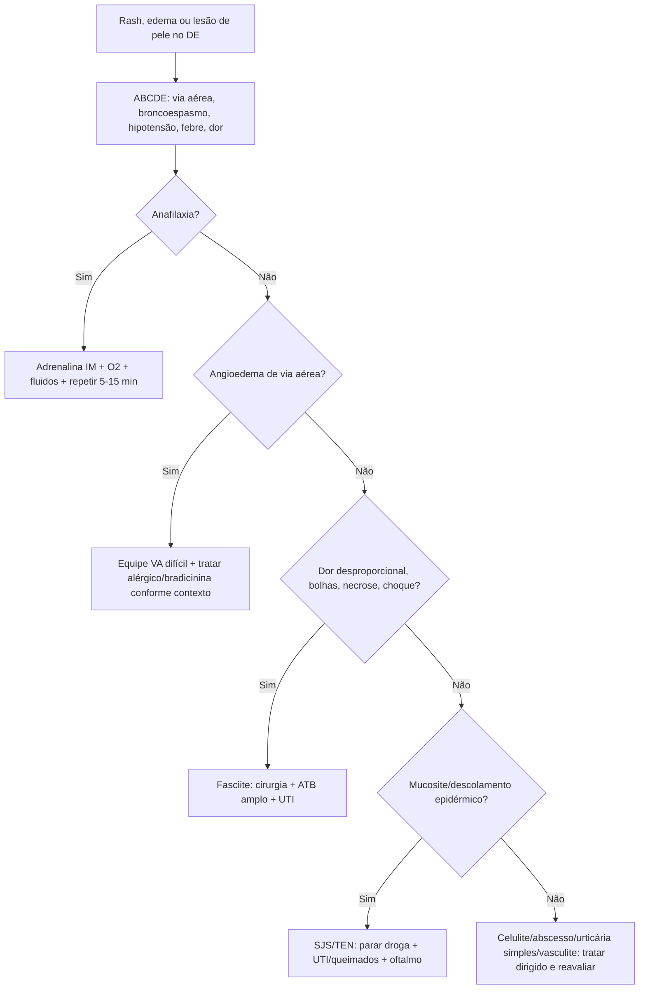
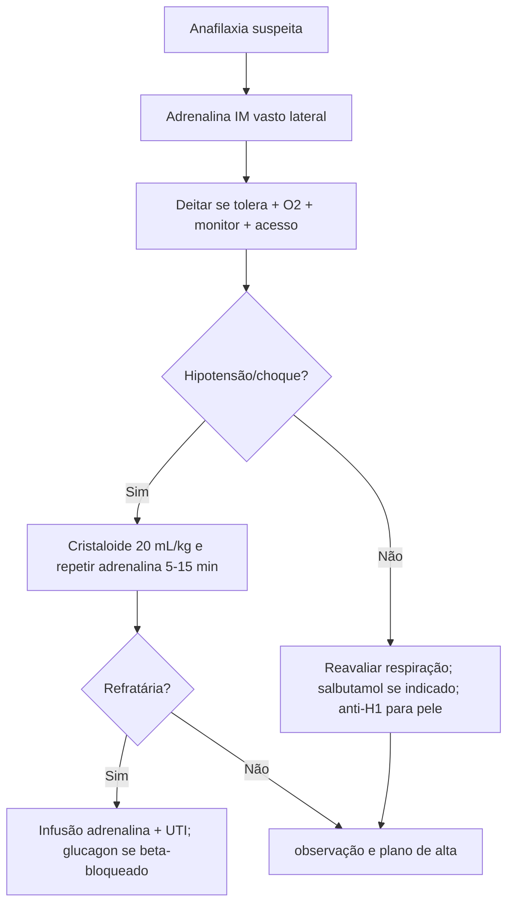
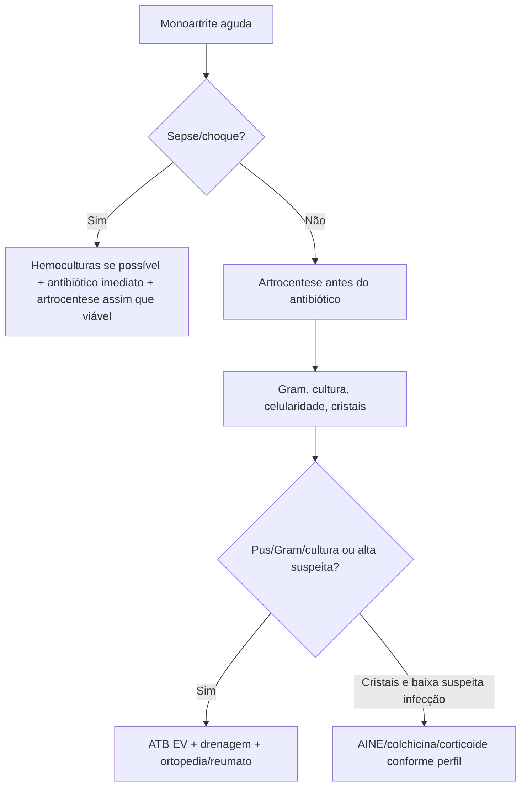

# Dermato, Reumato, Alergia E Anafilaxia

## Leitura de 30 segundos

- Anafilaxia é adrenalina IM primeiro. Anti-H1 apenas para sintomas cutâneos depois da estabilização; corticoide não é rotina e não previne bifásica de forma comprovada.
- Angioedema com língua, voz, disfagia, estridor ou progressão rápida e via aérea difícil antecipada. IECA/bradicinina pode não responder a adrenalina, anti-H1 ou corticoide.
- Celulite é clínica; abscesso drena; fasciite necrosante e cirurgia agora. Dor desproporcional, bolhas, necrose, crepitacao, anestesia cutanea ou choque não esperam TC.
- SJS/TEN: parar droga suspeita, suporte tipo queimado, oftalmo/dermato/UTI cedo. Antibiótico profilático não é rotina.
- Monoartrite aguda e séptica até prova em contrário. Artrocentese antes do antibiótico, exceto se sepse/choque.
- Gota/pseudogota não exclui infecção se há febre, imunossupressão, protese ou líquido muito inflamatório.
- Arterite temporal: cefaleia nova >50 anos, claudicação mandibular ou sintomas visuais = corticoide imediato antes de biópsia/imagem.
- Crise renal esclerodérmica: hipertensão + IRA/MAHA em esclerose sistêmica = IECA/captopril agora, mesmo com creatinina alta.

## Por que cai

- **Recorrência em provas/estações:** TEME22-26 cobrou angioedema por IECA e via aérea acordada, acidente por abelhas/anafilaxia vs envenenamento, celulite/erisipela e papel do exame clínico/US, queimaduras/bolhas, crise renal esclerodérmica, dor lombar/neoplasia, e infecções de partes moles.
- **O que a banca costuma testar:** primeira droga na anafilaxia, quando antecipar via aérea, diferença entre celulite e abscesso, sinais de fasciite, quando punir articulação, e emergências reumatológicas que chegam ou destroem rim.
- **Como costuma aparecer:** caso aparentemente dermatológico, mas com risco de via aérea, choque, sepse, necrose, perda visual, articulação séptica ou lesão renal.

## Abordagem prática

### 1. Rash, edema ou dor de pele: primeiro minuto

1. ABCDE: via aérea, estridor, sibilos, hipotensão, choque, febre, dor intensa.
2. Expor pele toda: mucosa, palmas/plantas, períneo, dor a palpação, bolhas, púrpura, necrose, crepitacao.
3. Medicações novas: antibiótico, anticonvulsivante, alopurinol, AINE, sulfa, IECA, imunobiológico, quimio.
4. Risco infeccioso: diabetes, DRC, cirrose, neutropenia, HIV, corticoide, asplenia, mordida, água doce/salgada, uso de droga injetável.
5. Pergunta-chave: é alergia simples, anafilaxia, angioedema, infecção necrosante, SJS/TEN, vasculite/púrpura ou sepse?

Red flags:

- Hipotensão, síncope, broncoespasmo, estridor, edema de língua/laringe.
- Dor fora de proporcao ao exame.
- Bolhas hemorrágicas, necrose, equimose progressiva, anestesia de pele.
- Mucosite ocular/oral/genital, Nikolsky, descolamento epidérmico.
- púrpura palpável com renal/abdominal, ou púrpura fulminante.
- Monoartrite febril.
- Cefaleia nova >50 anos com sintomas visuais ou mandibulares.

### 2. Anafilaxia

Diagnóstico prático: início agudo com pele/mucosa e comprometimento respiratório, hipotensão ou sintomas GI graves (dor cólica intensa/vômitos repetidos, especialmente após alérgenos não alimentares); ou hipotensão, broncoespasmo ou envolvimento laríngeo após alérgeno conhecido/altamente provável, mesmo sem urticária. Náusea isolada com urticária não deve ser equiparada automaticamente a choque anafilático.

Conduta:

1. Chamar ajuda, retirar gatilho, deitar com pernas elevadas se tolera; gestante em decúbito lateral esquerdo. Não deixar levantar/caminhar abruptamente. Desconforto respiratório pode exigir posição adaptada, sem ortostatismo.
2. Adrenalina IM no vasto lateral imediatamente.
3. O2 alto se respiratório/choque, monitor, acesso, cristaloide em bolus se hipotensão.
4. Repetir adrenalina IM a cada 5-15 min se resposta incompleta.
5. Comprometimento respiratório/circulatório persistente após duas doses IM adequadas: anafilaxia refratária; equipe experiente, infusão EV titulada de adrenalina, bomba, monitorização e UTI. Não usar bolus EV de adrenalina no paciente com pulso como rotina.
6. Salbutamol complementa broncoespasmo, não edema laríngeo/choque. Anti-H1 não sedativo para pele após estabilização. Corticoide só por indicação específica, como asma concomitante; não substitui adrenalina nem observação.
7. Beta-bloqueado com choque refratário: considerar glucagon.
8. Observar risco de bifásica: mais tempo se grave, precisou doses repetidas, asma, hipotensão, gatilho longo ou acesso dificil.
9. Alta: prescrever/treinar autoinjetor se disponível, plano escrito, retorno e alergologia.

**Observação após resolução (NICE NG258, 2026):** alta em 2 h só em baixo risco rigorosamente selecionado, resposta rápida a dose única, resolução completa, autoinjetores/treinamento e supervisão. Pelo menos 6 h se duas doses IM ou bifásica prévia; >=12 h se reação grave com >2 doses, asma grave/comprometimento respiratório importante, absorção contínua ou difícil acesso a atendimento. Não cronometrar a partir da chegada enquanto ainda há sintomas.

> **Resposta de prova TEME:** adrenalina IM é a primeira medicação. Anti-histamínico isolado em anafilaxia é erro.

### 3. Angioedema

Separe dois mundos:

| Tipo | Pistas | Resposta esperada |
|---|---|---|
| Histaminérgico/alérgico | Urticária/prurido, broncoespasmo, hipotensão, gatilho | Adrenalina se anafilaxia; anti-H1 para pele após estabilização |
| Bradicinina | IECA ou hereditário, geralmente sem urticária/prurido | Via aérea; tratamento específico comprovado no hereditário, não extrapolado automaticamente para IECA |

Conduta:

- Via aérea manda. Voz abafada, disfagia, sialorreia, estridor, língua crescente ou assoalho de boca = chamar anestesia/otorrino/cirurgia cedo.
- Se parece alérgico ou dúvida razoável, trate como anafilaxia com adrenalina IM.
- IECA: suspender definitivamente. Pode ocorrer mesmo após anos de uso.
- Angioedema por bradicinina pode precisar intubação acordada/fibro, equipe cirúrgica pronta e tubo menor.
- C1-INH/icatibant tratam crises de angioedema hereditário conforme produto. No causado por IECA, AAEM considera evidência insuficiente para uso rotineiro desses agentes, TXA ou plasma. Nenhuma tentativa medicamentosa deve atrasar proteção da via aérea.

> **Resposta de prova TEME24:** angioedema por enalapril com língua/lábios, dificuldade para falar/deglutir e estridor justifica intubação acordada pelo risco de falha de resgate/oxigenação.

### 4. Celulite, erisipela, abscesso e fasciite

**Celulite/erisipela**

- Diagnóstico é clínico: eritema, calor, dor, edema; erisipela costuma ser mais superficial e bem delimitada.
- Causas comuns: estreptococos beta-hemoliticos; S. aureus se purulência/abscesso/porta específica.
- US ajuda a achar abscesso, corpo estranho ou fascite; não é obrigatório para celulite simples.
- Trate porta de entrada: tinea pedis, ferida, edema, insuficiência venosa.

**Abscesso**

- Flutuação/pus = incisão e drenagem.
- Antibiótico se celulite extensa, SIRS, imunossupressão, face/mão/genital, falha, múltiplos abscessos ou risco MRSA.

**Fasciite necrosante**

Suspeite com:

- Dor desproporcional.
- Progressão rápida, toxicidade, choque.
- Bolhas, equimose, necrose, crepitacao.
- Anestesia cutanea.
- Hiponatremia, lactato, IRA, CPK alta podem ajudar, mas não excluem.

Conduta:

1. Cirurgia agora para exploração/desbridamento.
2. Antibiótico amplo: MRSA + Gram negativos + anaerobios + antitoxina.
3. Ressuscitação de sepse, analgesia, UTI.
4. Não atrasar por TC se paciente instável ou suspeita alta.

> **Pegada TEME:** LRINEC baixo não exclui fasciite. Exame clínico e progressão mandam.

### 5. SJS/TEN, DRESS e urticária simples

**SJS/TEN**

- Pródromo febre/mal-estar + dor de pele + lesões alvoides/violáceas + mucosite.
- Descolamento epidérmico: SJS <10% SCQ, overlap 10-30%, TEN >30%.
- Medicações clássicas: alopurinol, sulfas, anticonvulsivantes, AINEs oxicam, nevirapina, antibióticos.

Conduta:

1. Parar droga suspeita imediatamente.
2. Internar em UTI/queimados/dermato conforme extensão.
3. Cuidado de pele sem trauma, aquecimento, fluidos, analgesia, nutrição.
4. Oftalmologia precoce.
5. Culturas se suspeita, antibiótico só se infecção clínica.
6. Calcular SCORTEN nas primeiras 24 h e reavaliar.

**DRESS**

- Latência longa, tipicamente 2-8 semanas após droga.
- Febre, rash, edema facial, linfonodos, eosinofilia/linfócitos atípicos e órgão-alvo: hepatite, nefrite, pneumonite, miocardite.
- Conduta: parar droga, avaliar órgãos, internar se orgânico; corticoide sistêmico se moderado/grave conforme dermato.

**Urticária simples**

- Placas pruriginosas migratórias, sem hipotensão, broncoespasmo, GI importante ou via aérea.
- Anti-H1 e observação. Oriente retorno se anafilaxia.

### 6. Monoartrite e dor articular aguda

Monoartrite febril = séptica até prova em contrário.

Conduta:

1. Analgesia e avaliação de sepse.
2. Artrocentese: Gram, cultura, celularidade/diferencial e cristais.
3. Se sepse/choque, não espere punção para antibiótico.
4. Empírico usual: vancomicina + ceftriaxona/cefepime conforme risco local, gonococo, imunossupressão e Gram.
5. Drenagem seriada/artroscópica conforme articulação e ortopedia.

Cristais:

- Gota: podagra, urato, crise rápida; tratar com AINE, colchicina ou corticoide conforme rim/GI/anticoagulação.
- Pseudogota: idoso, joelho/punho, condrocalcinose, cristais de CPPD.
- Cristal no líquido não exclui infecção concomitante.
- Não iniciar alopurinol como analgésico de crise. Se já usa, em geral não suspender.
- Isso não significa proibir início de terapia redutora de urato durante crise: ACR admite iniciar quando indicada, com cobertura anti-inflamatória e seguimento. Colchicina exige ajuste ao produto disponível (comprimidos de 0,5 ou 0,6 mg), rim e interações; associação com claritromicina/inibidores fortes de CYP3A4/P-gp pode ser tóxica, sobretudo em DRC.

### 7. Emergências reumatológicas

**Arterite de células gigantes**

- >50 anos, cefaleia nova, dor temporal, claudicação mandibular, hipersensibilidade couro cabeludo, polimialeia, sintomas visuais.
- VHS/CRP ajudam, mas não espere para tratar se suspeita forte.
- Prednisona alta dose; se sintoma visual/ameaça visual, metilprednisolona EV e oftalmo/reumato.
- Biópsia/imagem temporal confirma depois; corticoide vem antes para evitar cegueira.

**Crise renal esclerodérmica**

- Esclerose sistêmica, hipertensão abrupta, IRA, proteinúria/hematúria, anemia hemolítica microangiopática, plaquetopenia.
- Captopril/IECA imediato e titulado. Não evitar IECA por creatinina alta nesse contexto.
- Emergência hipertensiva + nefro/reumato.

**LES/vasculites**

- Lupus com rebaixamento/convulsão, nefrite, pneumonite/hemorragia alveolar, pericardite/tamponamento ou citopenia grave = internar e especialista.
- púrpura palpável + rim/GI/neuro sugere vasculite sistêmica; procure plaquetas, urina, creatinina, hemoptise, dor abdominal.
- púrpura fulminante ou menineococcemia e sepse dermatológica: antibiótico imediato.

## Conceitos que sustentam a conduta

### Pele pode ser choque, via aérea ou cirurgia

Nem todo rash e "alergia". urticária com hipotensão e anafilaxia; eritema com dor desproporcional e fasciite; bolha com mucosite e SJS/TEN; púrpura com choque e sepse/vasculite.

### Adrenalina não tem substituto na anafilaxia

Anti-H1 melhora prurido, mas não reverte choque ou obstrução. Corticoide não tem benefício comprovado na prevenção de bifásica e não integra o resgate rotineiro. O atraso da adrenalina é a pegadinha principal.

### O pus da articulação é uma colecao fechada

Artrite séptica não é "dar antibiótico e ver". Precisa diagnóstico por líquido sinovial e drenagem quando confirmado/suspeito forte. Cristal e infecção podem coexistir.

### Corticoide certo no paciente certo

Na arterite temporal com ameaça visual, corticoide precoce busca prevenir perda adicional de visão. Em SJS/TEN e DRESS, imunomodulação depende de gravidade/especialista; em infecção necrosante não substitui desbridamento.

## Fluxograma

## Doses, alvos e números

| Item | Número | observação TEME |
|---|---:|---|
| Adrenalina anafilaxia | 0,01 mg/kg IM da solução 1 mg/mL | Máximo 0,5 mg; criança pequena usual até 0,3 mg, adolescente pode precisar 0,5 mg |
| Repetir adrenalina | 5-15 min | Se resposta incompleta |
| Cristaloide anafilaxia | 20 mL/kg, repetir conforme choque | Adulto pode precisar litros |
| Glucagon beta-bloqueado | 1-5 mg EV, depois 5-15 mcg/min | Se choque refratário |
| Icatibant HAE | 30 mg SC adulto | Conforme disponibilidade |
| C1-INH HAE | 20 U/kg EV | Conforme produto/protocolo |
| SJS | <10% SCQ | Mucosa geralmente presente |
| SJS/TEN overlap | 10-30% SCQ | Alto risco |
| TEN | >30% SCQ | UTI/queimados |
| SCORTEN | 7 itens | Calcular até 24 h e reavaliar |
| Fasciite ATB | Vancomicina + pip-tazo/carbapenem + clindamicina | Não substitui desbridamento |
| Clindamicina antitoxina | 900 mg EV 8/8 h adulto | Strepto/clostridio suspeito |
| Celulite simples | 5 dias pode bastar se boa resposta | IDSA; estender se lento |
| Artrite séptica líquido | WBC >50.000 sugere, mas não define | Valor menor não exclui |
| Colchicina crise gota | 1,2 mg VO + 0,6 mg 1 h depois | Ajustar renal/interações; max 1,8 mg dia 1 |
| Prednisona gota | 30-40 mg/dia por 5-10 dias | opção se AINE/colchicina ruins |
| Arterite temporal | Prednisona 40-60 mg/dia | Se visual: metilpred EV alta dose |
| Metilpred visual GCA | 500-1000 mg EV/dia por 3 dias | Protocolos variam |
| Crise renal esclerodérmica | Captopril 6,25-12,5 mg e titular | IECA imediato |

### Pontos de prova

- **Anafilaxia:** adrenalina IM é primeira linha. Anti-histamínico/corticoide são adjuvantes; não substituem adrenalina em choque, broncoespasmo ou edema de via aérea.
- **Angioedema por IECA:** pode fechar via aérea sem urticária; prepare via aérea acordada/cirúrgica se língua/orofaringe/estridor.
- **SJS/TEN:** dor cutânea, bolhas, mucosa e descolamento = suspender droga, suporte em unidade adequada e cuidado de superfície.
- **Púrpura/vasculite:** púrpura palpável, dor abdominal, rim ou neurologia não é alergia simples.
- **Crise renal esclerodérmica:** se aparecer no recorte reumato, lembre IECA e evite corticoide alto.

## Pegadinhas TEME

- **Anafilaxia sem urticária não existe:** falso. Pode ser choque/broncoespasmo/laringe.
- **Anti-histamínico antes da adrenalina:** falso em anafilaxia.
- **Corticoide previne toda reação bifásica:** falso; não substitui observação.
- **IECA só causa angioedema no início do tratamento:** falso, pode ocorrer anos depois.
- **Angioedema por bradicinina responde bem a adrenalina/anti-H1:** falso em geral, mas trate como anafilaxia se dúvida.
- **Celulite precisa US para diagnóstico:** falso. US ajuda abscesso/dúvida.
- **Abscesso trata só com antibiótico:** falso; precisa drenagem.
- **Fasciite espera TC/LRINEC:** falso se suspeita alta.
- **SJS/TEN recebe antibiótico profilático:** falso; antibiótico se infecção.
- **Cristal no líquido articular exclui artrite séptica:** falso.
- **Gota aguda inicia alopurinol para aliviar dor:** falso.
- **Arterite temporal espera biópsia para corticoide:** falso.
- **Crise renal esclerodérmica não pode receber IECA porque creatinina subiu:** falso.

## Erros fatais na prática

- Atrasar adrenalina em anafilaxia.
- Tentar RSI convencional em angioedema progressivo sem plano de via aérea dificil/cirúrgica.
- Mandar para casa angioedema de língua em progressão.
- Tratar fasciite necrosante como celulite.
- Não examinar períneo em suspeita de Fournier.
- Usar AINE em gota com DRC/desidratação/anticoagulação sem pesar risco.
- Dar corticoide em monoartrite antes de excluir infecção.
- Não punir articulação séptica.
- Perder SJS/TEN inicial como "alergia simples".
- Esperar biópsia temporal enquanto o paciente perde visão.
- Não reconhecer crise renal esclerodérmica.

## Para prova vs na prática

> **Para prova TEME:** anafilaxia = adrenalina IM; angioedema por IECA com estridor = via aérea acordada/antecipada; celulite é clínica, abscesso drena, fasciite opera; SJS/TEN para droga e suporte; monoartrite febril = artrocentese; arterite temporal = corticoide antes da confirmação; crise renal esclerodérmica = captopril/IECA.
>
> **Na prática clínica:** não equiparar evidência de angioedema hereditário à de IECA. Escolhas de antibiótico e imunomodulação dependem do contexto. A prioridade permanece: via aérea, adrenalina quando indicada, controle de foco e tratamento tempo-dependente de ameaça visual.

## Referências

Revisão editorial: 04/10/2026. Atualizações selecionadas abaixo; respostas históricas não substituem critérios atuais.

**Prova/TEME**

- Conteúdo programático TEME26.
- Provas teóricas TEME22, TEME23, TEME24 e TEME25.
- Referências oficiais do edital: Tratado ABRAMEDE 2024, Medicina de Emergência HCFMUSP e capítulos de alergia, dermatologia, reumatologia, infecções de partes moles e toxicologia.

**Material local**

- Aulas de cursinho: Aula 19 - Emergências reumato e dermato.
- Aulas de cursinho: Aula 37 - Trauma ambiental I.
- Aulas de cursinho: Aula 53 - Abordagem geral do paciente intoxicado.
- Aulas de cursinho: Aula 62 - Animais peçonhentos.
- Material local: `Emergency Talks/Resumo do Emergency.docx`.
- Material local: `Emergency Talks/Adendos para complementar.docx`.

**Atualização clínica**

- [World Allergy Organization. Anaphylaxis Guidance 2020.](https://pmc.ncbi.nlm.nih.gov/articles/PMC7607509/)
- [AAAAI/ACAAI. Anaphylaxis: 2023 practice parameter update.](https://www.guidelinecentral.com/guideline/7615/)
- [WAO/EAACI. Hereditary angioedema guideline, 2021 revision/update.](https://pmc.ncbi.nlm.nih.gov/articles/PMC9023902/)
- [IDSA. Skin and Soft Tissue Infections Guideline, 2014.](https://www.idsociety.org/practice-guideline/skin-and-soft-tissue-infections/)
- [WSES/SIS-E. Skin and soft-tissue infections consensus, 2018.](https://pmc.ncbi.nlm.nih.gov/articles/PMC6295010/)
- [British Association of Dermatologists. SJS/TEN guideline, 2016.](https://academic.oup.com/bjd/article/174/6/1194/6617016)
- [SANJO. Guideline for management of septic arthritis in native joints, 2023.](https://jbji.copernicus.org/articles/8/29/2023/)
- [American College of Rheumatology. Gout Guideline, 2020.](https://pmc.ncbi.nlm.nih.gov/articles/PMC10563586/)
- [EULAR. Large vessel vasculitis recommendations, 2018 update.](https://ard.bmj.com/content/79/1/19)
- [EULAR. Systemic sclerosis treatment recommendations, 2023 update.](https://ard.bmj.com/content/early/2024/10/17/ard-2024-226430)

**Fontes da revisão de outubro de 2026**

- [RCUK. Tratamento emergencial de anafilaxia, 2021.](https://www.resus.org.uk/sites/default/files/2021-05/Emergency%20Treatment%20of%20Anaphylaxis%20May%202021_0.pdf)
- [NICE NG258. Observação e encaminhamento após anafilaxia, 2026.](https://www.nice.org.uk/guidance/ng258/resources/anaphylaxis-assessment-and-referral-after-emergency-treatment-pdf-66144023784133)
- [AAEM. Angioedema por IECA: declaração clínica, 2020.](https://www.aaem.org/statements/ed-patients-angioedema-secondary/)

- Livros locais: Medicina de Emergência HCFMUSP, 18ª edição, e Tratado ABRAMEDE, 1ª edição; consulta dirigida aos capítulos relacionados, não leitura integral nesta revisão.
