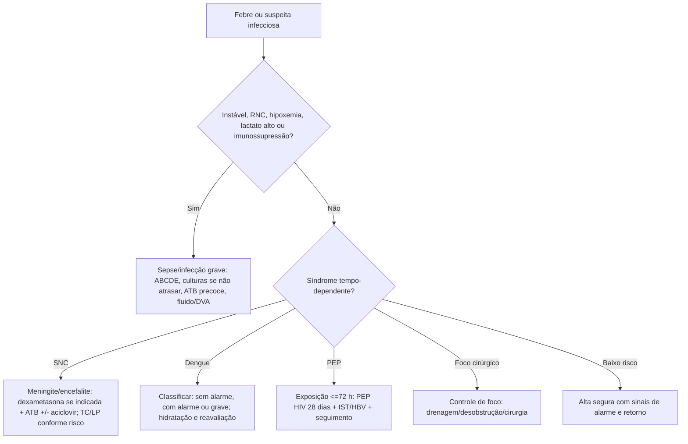

# Infectologia na Emergência

## Leitura de 30 segundos

- Infectologia no TEME é menos "decorar germe" e mais reconhecer gravidade, coletar o possível sem atrasar tratamento e iniciar antibiótico/antiviral/PEP quando tempo importa.
- Febre + disfunção orgânica = tratar como sepse enquanto procura foco. Febre + cefaleia/RNC/rigidez = meningite/encefalite até prova em contrário.
- HIV/TB, dengue/arboviroses, meningite, infecção urinária complicada, IST/violência sexual e doenças de notificação aparecem nas provas e no edital 2026.

## Por que cai

- **Recorrência em provas/estações:** TEME22-26 cobrou HIV com manifestações neurológicas, meningite tuberculosa, dengue, tuberculose, PEP HIV, infecção pulmonar/sepse e febre sem gravidade com alta segura.
- **O que a banca costuma testar:** prioridade, isolamento, notificação, antibiótico empírico, quando não esperar exame, sinais de alarme de dengue e profilaxias pós-exposição.
- **Como costuma aparecer:** paciente febril com um detalhe que muda tudo: imunossupressão, RNC, choque, viagem/área endêmica, exposição sexual, mordida, ferida contaminada ou obstrução.

## Abordagem prática

### 1. Febre no pronto-socorro

1. ABCDE e sinais de gravidade: hipotensão, confusão, hipoxemia, lactato alto, oligúria, petéquias, rigidez nucal, dor desproporcional, imunossupressão.
2. Se choque séptico ou sepse provável/definida: antibiótico idealmente até 1 h. Suspeita apenas possível sem choque permite avaliação rápida, até 3 h se a preocupação persistir (SSC 2026); não confundir isso com esperar exames em meningite/neutropenia febril. Culturas sem atrasar, suporte conforme perfusão.
3. Procure foco por síndrome: respiratório, urinário, SNC, abdominal, pele/partes moles, cateter, gineco/obstétrico.
4. Decida isolamento: respiratório para TB suspeita, meningite com gotículas conforme agente, contato para diarreia/C. difficile, precaução padrão sempre.
5. Alta só se estável, sem red flags, com hipótese provável benigna, orientação escrita, retorno claro e seguimento.

### 2. Meningite e encefalite

- Suspeite: febre + cefaleia intensa, rigidez, vômitos, fotofobia, petéquias, rebaixamento, crise convulsiva ou imunossupressão.
- Antibiótico e dexametasona quando indicado não podem esperar TC/LP se houver atraso.
- TC antes da punção se rebaixamento importante (Glasgow <10), déficit focal, papiledema, crise recente, imunossupressão grave ou suspeita de massa; não atrasar antibiótico para realizar TC.
- Encefalite: febre + alteração comportamental/RNC/crise/focalidade. Adicione aciclovir se suspeita de HSV/VZV.
- TB/criptococo em HIV/imunossuprimido: pense em evolução subaguda, cefaleia, febre, perda ponderal, meningismo discreto.

**Esquema adulto comunitário:** ceftriaxona 2 g EV 12/12 h; associar vancomicina conforme resistência pneumocócica local. Adicionar ampicilina 2 g EV 4/4 h se risco de Listeria (idade avançada, gestação, imunossupressão). Ajustar função renal/alergias; meningite pós-neurocirurgia tem outro espectro. Dexametasona 10 mg EV 6/6 h deve começar antes/junto da primeira dose quando indicada; OMS 2025 recomenda corticoide inicial na suspeita bacteriana em contexto não epidêmico, reavaliando LCR/agente.

TC não é requisito universal para punção. Não puncionar em instabilidade, coagulopatia relevante ou sinais de herniação; TC normal não torna toda punção segura. Meningococo: precauções de gotículas até 24 h de terapia eficaz, notificação e quimioprofilaxia dos contatos definidos pela vigilância (não todos que estiveram no ambiente). Encefalite herpética: aciclovir precoce, função renal/hidratação monitoradas; PCR inicial negativo pode precisar repetição se suspeita persistir.

### 3. HIV, TB e infecções oportunistas

- HIV novo ou irregular + dispneia/subagudo: TB, pneumocistose, pneumonia bacteriana e COVID/influenza entram no diferencial.
- TB pulmonar: tosse prolongada, febre vespertina, sudorese, perda ponderal, cavitação ou contato; isolar se suspeita respiratória.
- Pneumocistose: dispneia progressiva, hipoxemia e infiltrado intersticial; SMX-TMP por 21 dias, dose calculada pelo TMP (15-20 mg/kg/dia, dividida em 3-4 tomadas). Corticoide se PaO2 <70 em ar ambiente ou gradiente A-a >=35; não retirar O2 necessário para medir. Iniciar preferencialmente nas primeiras 72 h do antimicrobiano. Monitorar K, rim e citopenias.
- Neuro em HIV: toxoplasmose, criptococo, TB meníngea, linfoma, PML; imagem/LP conforme estabilidade.
- TARV tem tempo próprio por infecção: PCP costuma iniciar em até 2 semanas; criptococose do SNC geralmente posterga 4-6 semanas, e TB meníngea exige decisão específica. Na criptococose, medir pressão de abertura e tratar HIC com punções terapêuticas quando indicadas; não substituir por manitol/corticoide rotineiro. Coordenação com infectologia não deve virar atraso indefinido.

### 4. Dengue e arboviroses

- Dengue provável: febre em área de risco + mialgia, cefaleia, dor retro-orbitária, exantema, leucopenia ou prova do laço.
- Sinais de alarme: dor abdominal intensa, vômitos persistentes, sangramento de mucosa, letargia/irritabilidade, hipotensão postural, hepatomegalia, derrame/ascite, Ht subindo com plaqueta caindo.
- Dengue grave: choque, sangramento grave ou órgão-alvo grave.
- Evite AAS/AINE. Use hidratação guiada por gravidade, reavaliação e hemograma seriado quando indicado.
- Chikungunya: artralgia intensa; Zika: exantema/prurido/conjuntivite; febre amarela/leptospirose/malária entram se icterícia, sangramento, IRA, viagem ou epidemiologia.

**Classificação brasileira, MS 2024:** A = sem alarme/gravidade e sem condição de risco; B = sem alarme, mas sangramento cutâneo/condição especial, comorbidade ou risco social; C = qualquer sinal de alarme; D = choque, sangramento grave ou disfunção orgânica grave. Queda da febre pode abrir a fase crítica, não assegurar melhora. Plaquetopenia isolada não define grupo D nem indica transfusão profilática.

C: SF 0,9% 10 mL/kg na primeira hora, reavaliar e manter 10 mL/kg na segunda até hematócrito; D: expansão inicial 20 mL/kg em até 20 min com reavaliações frequentes. Ajustar em cardiopatia, DRC e idosos. Ht alto com choque sugere extravasamento; Ht caindo com choque persistente exige procurar hemorragia, não repetir soro indefinidamente. Reduzir volume conforme resposta/fase de recuperação. Não atrasar hidratação aguardando confirmação laboratorial.

### 5. IST, violência sexual e PEP

- Acolher e tratar antes de burocracia; boletim de ocorrência não é pré-requisito para cuidado.
- PEP HIV: iniciar o quanto antes se exposição de risco em até 72 h; curso de 28 dias.
- Cobrir IST conforme protocolo local: gonococo, clamídia, sífilis quando indicado, hepatite B e contracepção de emergência.
- Notificação e rede de seguimento são parte da conduta.

No Brasil, PEP adulta preferencial: tenofovir 300 mg + lamivudina 300 mg + dolutegravir 50 mg/dia; gestação não exclui esse esquema. Colher exames basais, sem atrasar início; revisar rim/interações, vacinação HBV e seguimento para HIV/IST. PrEP e PEP não são intercambiáveis.

### 6. Infecções que exigem controle de foco

- Pielonefrite obstrutiva: antibiótico EV + desobstrução.
- Colangite grave: antibiótico + drenagem/CPRE.
- Fasciite necrosante: antibiótico amplo + cirurgia imediata.
- Empiema: antibiótico + drenagem.
- Abscesso: antibiótico não substitui drenagem quando há coleção.

### 7. Epidemiologia que muda a primeira hora

- **Malária:** febre após área de transmissão, mesmo sem periodicidade típica, exige gota espessa/teste disponível urgente. Alteração neurológica, choque, hipoglicemia, IRA ou insuficiência respiratória sugerem forma grave: internação e antimalárico parenteral conforme MS; não esperar o próximo pico febril.
- **Leptospirose:** exposição a enchente/roedores + mialgia de panturrilha, sufusão conjuntival, icterícia/IRA; hemorragia pulmonar pode predominar. Forma grave recebe antibiótico EV e suporte precoce, sem esperar sorologia.
- **Febre maculosa:** febre após carrapato/área de risco, com ou sem exantema inicial, pede doxiciclina imediata se suspeita clínica; não esperar sorologia, inclusive em criança.
- **Mordida/exposição à raiva:** lavar abundantemente e avaliar animal, região, ferida e vacinação prévia. Imunoglobulina quando indicada deve ser infiltrada na ferida conforme protocolo; não aplicar apenas em local remoto por conveniência.
- **Antibiótico certo também significa parar/estreitar:** revisar cultura, foco, função renal e necessidade diariamente. Bacteriúria assintomática não é ITU por teste positivo isolado (exceções relevantes: gestação e procedimentos urológicos que lesam mucosa).

## Conceitos que sustentam a conduta

Infecção grave mata por disfunção orgânica, carga microbiana, toxinas e resposta inflamatória desregulada. Por isso a resposta de prova é fisiológica: reconhecer gravidade, iniciar tratamento tempo-dependente, fazer controle de foco e ajustar depois com cultura/epidemiologia. Exame complementar confirma; não deve ser usado como freio quando o paciente está grave.

## Fluxograma

## Doses, alvos e números

| Item | Número | Observação TEME |
|---|---:|---|
| Antibiótico na sepse provável/definida ou choque | Idealmente até 1 h | Possível sepse sem choque: avaliação rápida até 3 h se persiste |
| PEP HIV | até 72 h, por 28 dias | Urgência; iniciar quanto antes |
| Dexametasona meningite adulto | 10 mg EV 6/6 h | Antes ou junto da primeira dose se suspeita pneumococo |
| Ceftriaxona meningite comunitária adulto | 2 g EV 12/12 h | Vancomicina conforme resistência; ampicilina se risco Listeria |
| Ampicilina, cobertura Listeria adulto | 2 g EV 4/4 h | Ajustar renal; não substitui restante do esquema |
| Aciclovir encefalite | 10 mg/kg EV 8/8 h | Ajustar renal; pensar HSV/VZV |
| Dengue C / D, expansão inicial MS | 10 mL/kg em 1 h / 20 mL/kg em até 20 min de SF | Reavaliar; individualizar comorbidades e seguir fluxo completo |
| PCP em HIV | TMP 15-20 mg/kg/dia por 21 dias | Corticoide se PaO2 <70 ou A-a >=35 |
| TB suspeita respiratória | isolamento respiratório | Máscara/fluxo local; proteger equipe |
| Raiva pós-exposição | lavar ferida + vacina +/- imunoglobulina | Conforme risco animal/exposição e protocolo local |

### Pontos de prova

- **Dengue:** dor abdominal, vômitos persistentes, derrame/ascite, letargia, sangramento, Ht subindo e plaqueta caindo = sinal de alarme e hidratação EV.
- **HIV/TB/PCP:** hipoxemia com infiltrado intersticial e HIV = SMX-TMP; corticoide se hipoxemia relevante; cavitação exige isolamento/investigação de TB. TARV depende do contexto e risco de IRIS.
- **Toxoplasmose cerebral:** AIDS + lesões captantes em gânglios da base com edema = tratar empiricamente e reavaliar resposta.
- **C. difficile:** resultado discordante exige algoritmo laboratorial e diarreia compatível; NAAT positivo isolado pode ser colonização. Fidaxomicina é preferida em diretriz, vancomicina VO é alternativa; ver tema 14.
- **Sinusite bacteriana:** sintomas persistentes, graves ou dupla piora indicam antibiótico; TC fica para complicação, imunossupressão grave ou dúvida diagnóstica relevante.
- **Infecção cervical profunda:** edema submandibular/protrusão de língua após dentário é ameaça de via aérea, não “antibiótico oral e retorno”.

## Pegadinhas TEME

- **Esperar TC para tratar meningite:** errado se isso atrasar antibiótico.
- **Dengue = hidratar muito todo mundo:** errado. Classificar risco e reavaliar; excesso de volume também mata.
- **Dengue pode AINE porque dor é intensa:** errado. Prefira dipirona/paracetamol conforme protocolo e função hepática.
- **PEP HIV depois de 72 h como rotina:** errado. Até 72 h é a janela clássica de prova; depois individualizar com especialista.
- **Antibiótico resolve obstrução infectada:** errado. Obstrução urinária/colangite/empiema/fasciite exigem controle de foco.
- **HIV febril é sempre pneumonia comum:** errado. TB, pneumocistose, criptococo, toxoplasmose e sepse comum entram no jogo.

## Erros fatais na prática

- Dar alta para febre com hipotensão postural, confusão, petéquias, imunossupressão ou dor desproporcional.
- Atrasar antibiótico/aciclovir em meningite/encefalite para "fechar o diagnóstico".
- Não isolar TB suspeita.
- Não notificar doenças compulsórias quando indicado.
- Não chamar urologia/cirurgia/endoscopia quando o problema é controle de foco.

## Para prova vs na prática

> **Para prova TEME:** febre + disfunção orgânica = sepse; meningite/encefalite não espera exame se houver atraso; dengue se classifica por sinais de alarme; PEP HIV é até 72 h por 28 dias; foco obstruído/infectado precisa controle de foco.
>
> **Na prática clínica:** antibiótico empírico depende de epidemiologia local, resistência, alergia, foco, gravidade, gestação, imunossupressão e protocolos institucionais. Em HIV/TB/meningites crônicas, coordene cedo com infectologia.

## Referências

Revisão editorial: 04/10/2026. Atualizações selecionadas abaixo; respostas históricas não substituem critérios atuais.

**Prova/TEME**

- Conteúdo programático TEME26.
- Referências bibliográficas TEME26: Tratado ABRAMEDE 2024; PCDT HIV adultos; PCDT coinfecções e infecções oportunistas; Portaria 2048/2002; referências de toxicologia/POCUS conforme tema.

**Material local**

- Aulas de cursinho: Aula 12 - Convulsões e infecções do SNC; Aula 21 - HIV e tuberculose; Aula 22 - Sepse; Aula 63 - Emergências infecciosas.

**Atualização clínica**

- [Ministério da Saúde. Profilaxia Pós-Exposição](https://www.gov.br/saude/pt-br/assuntos/saude-de-a-a-z/a/aids-hiv/pep)
- [CDC. Clinical Guidance for PEP, 2025](https://www.cdc.gov/hivnexus/hcp/pep/index.html)
- [WHO. Dengue outbreak toolbox e sinais de alarme](https://www.who.int/emergencies/outbreak-toolkit/disease-outbreak-toolboxes/dengue-outbreak-toolbox)
- [CDC. Rabies post-exposure prophylaxis](https://www.cdc.gov/rabies/hcp/clinical-care/post-exposure-prophylaxis.html)

**Fontes da revisão de outubro de 2026**

- [OMS. Diagnóstico, tratamento e cuidado de meningite, 2025.](https://www.ncbi.nlm.nih.gov/books/NBK614844/)
- [Ministério da Saúde. Dengue: manejo clínico, 6ª edição, 2024.](https://www.gov.br/saude/pt-br/centrais-de-conteudo/publicacoes/svsa/dengue/dengue-diagnostico-e-manejo-clinico-adulto-e-crianca)
- [Ministério da Saúde. PCDT de PEP.](https://www.gov.br/conitec/pt-br/midias/protocolos/PCDTPEP.pdf/@@download/file)
- [NIH. Pneumocistose, revisão de maio de 2026.](https://clinicalinfo.hiv.gov/en/guidelines/hiv-clinical-guidelines-adult-and-adolescent-opportunistic-infections/pneumocystis)
- [NIH. Criptococose em adultos: TARV e pressão intracraniana.](https://clinicalinfo.hiv.gov/es/node/9402)
- [Ministério da Saúde. Esquemas de tratamento da malária, 2026.](https://www.gov.br/saude/pt-br/centrais-de-conteudo/publicacoes/guias-e-manuais/2026/esquemas-recomendados-para-o-tratamento-da-malaria-no-brasil)
- [Ministério da Saúde. Leptospirose: Nota Técnica 16/2024.](https://www.gov.br/saude/pt-br/assuntos/noticias/2024/marco/saude-reforca-recomendacoes-de-conduta-clinica-para-a-leptospirose/nota16_2024.pdf)
- [Ministério da Saúde. Febre maculosa: tratar na suspeita.](https://www.gov.br/saude/pt-br/assuntos/saude-de-a-a-z/f/febre-maculosa/febre-maculosa/)
- [SCCM/ESICM. SSC adulta, 2026.](https://www.sccm.org/clinical-resources/guidelines/guidelines/surviving-sepsis-campaign-international-guidelines-for-management-of-sepsis-and-septic-shock-2026)

- Livros locais: Medicina de Emergência HCFMUSP, 18ª edição, e Tratado ABRAMEDE, 1ª edição; consulta dirigida aos capítulos relacionados, não leitura integral nesta revisão.

