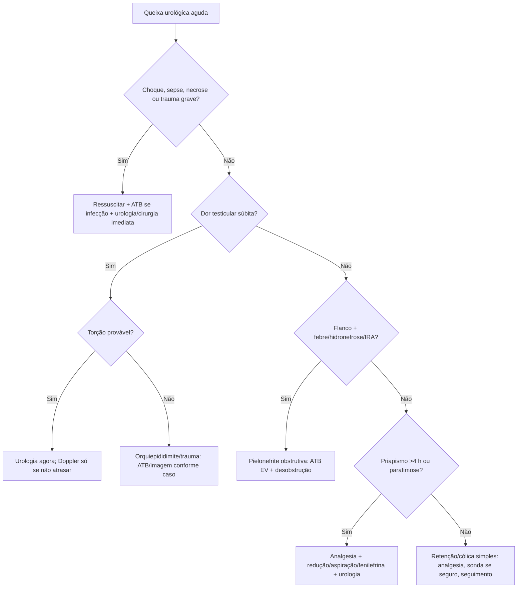

# Urologia na Emergência

## Leitura de 30 segundos

- Urologia no TEME é reconhecer tempo-dependência: torção testicular, pielonefrite obstrutiva, priapismo isquêmico, parafimose, retenção complicada e trauma urogenital.
- Dor testicular súbita com náuseas/vômitos e reflexo cremastérico ausente é torção até prova em contrário. Doppler não pode atrasar urologia quando a clínica é forte.
- Obstrução + infecção não melhora só com antibiótico: precisa drenagem/desobstrução.

## Por que cai

- **Recorrência em provas/estações:** TEME23 cobrou pielonefrite obstrutiva/hidronefrose; TEME25 cobrou torção testicular; TEME22-26 trazem termos testicular, hidronefrose, ureterolitíase, priapismo e retenção.
- **O que a banca costuma testar:** primeira conduta, quando chamar urologia, analgesia, controle de foco e armadilhas com imagem.
- **Como costuma aparecer:** dor lombar/flanco com febre, dor escrotal súbita, ereção prolongada dolorosa, prepúcio preso ou trauma pélvico com uretrorragia.

## Abordagem prática

### 1. Dor escrotal aguda

1. ABCDE se grave, analgesia e antiemético.
2. Pergunte início súbito, náusea/vômito, trauma, febre, sintomas urinários, atividade sexual.
3. Examine posição testicular, reflexo cremastérico, edema e sinais de Fournier. Prehn/reflexo presentes não excluem torção; fluxo ao Doppler pode persistir na torção parcial/intermitente.
4. Clínica forte de torção = urologia imediata, jejum, preparo cirúrgico. US Doppler se disponível sem atrasar.
5. Orquiepididimite provável: febre/disúria/corrimento/dor gradual; ATB conforme idade/risco IST/enterobactéria.

Detorção manual por profissional capacitado pode ganhar tempo enquanto organiza cirurgia, mas não substitui exploração e fixação bilateral; alívio da dor não prova detorção completa. Mais de 6 h não é motivo para desistir de avaliação cirúrgica. Epididimite com risco de IST: colher NAAT para gonococo/clamídia e cultura urinária, tratar conforme exposição/resistência, orientar parceiros e retorno se não melhora em 72 h.

### 2. Cólica renal e obstrução infectada

- Cólica simples: AINE se função renal/risco permitir, antiemético, hidratação sem "forçar", avaliação de complicações.
- Internar/avaliar intervenção se infecção, anúria, IRA, rim único ameaçado ou dor/vômitos intratáveis. Gestação/imunossupressão pedem limiar baixo e avaliação própria, mas não significam desobstrução automática de toda cólica.
- Pielonefrite obstrutiva: antibiótico EV + descompressão por duplo J ou nefrostomia.
- Colher culturas sem atrasar antibiótico/descompressão; adiar tratamento definitivo do cálculo até controlar infecção. US é inicial útil e preferido na gestação; TC sem contraste confirma quando indicada, sem atrasar abordagem do instável.
- Terapia expulsiva com alfa-bloqueador é opção para cálculo ureteral distal de 5-10 mm, sem complicação, com seguimento e decisão compartilhada; não serve para obstrução infectada. Orientar retorno imediato por febre, anúria ou dor persistente; hematúria ausente não exclui cálculo.

### 3. Retenção urinária

- Dor suprapúbica, bexigoma, oligúria/anúria.
- Sonda vesical de demora se sem suspeita de lesão uretral.
- Suspeita de lesão uretral: sangue no meato, trauma pélvico, hematoma perineal/escrotal ou dificuldade de sondagem = urologia/uretrografia; não insistir. "Próstata alta" tem baixa confiabilidade e não deve decidir sozinha.
- Sem trauma uretral, descompressão vesical completa é aceitável: clampear periodicamente não é rotina. Diurese pós-obstrutiva >200 mL/h por 2 h ou >3 L/24 h exige acompanhamento de volume, Na/K e perfusão; reposição é individualizada, não litro por litro automaticamente.

**Hematúria com coágulos/retenção:** estabilizar, avaliar Hb/coagulação/rim e acionar urologia; sonda de três vias calibrosa, retirada de coágulos e irrigação conforme equipe/protocolo se uretra segura. Não atribuir hematúria apenas a anticoagulante e dispensar investigação de neoplasia/lesão.

### 4. Priapismo

- Ereção >4 h, geralmente dolorosa e rígida = priapismo isquêmico até prova em contrário.
- Analgesia, gasometria cavernosa quando disponível, urologia urgente.
- Tratamento de prova: aspiração/irrigação cavernosa e fenilefrina intracavernosa titulada, além de tratar causa.
- Falciforme: oxigênio se hipoxemia, analgesia, hidratação cuidadosa, hematologia; não atrasar manejo local se isquêmico.
- Diferenciar alto fluxo: após trauma, geralmente menos doloroso e não totalmente rígido, com gasometria arterializada; manejo não é o mesmo resgate do isquêmico. No baixo fluxo, sangue cavernoso típico tem pO2 <30, pCO2 >60 e pH <7,25. Aspiração + fenilefrina requer preparo correto, PA/FC/ECG monitorados e avaliação de resposta; falha pede intervenção urológica, não doses indefinidas.

### 5. Parafimose e fratura de pênis

- Parafimose: glande edemaciada com anel constritor; analgesia/bloqueio, compressão/redução manual; urologia se falha/necrose.
- Fratura de pênis: estalo, dor, detumescência, hematoma em berinjela. Cirurgia precoce.
- Não sondar às cegas se uretrorragia ou retenção após trauma peniano/pélvico.
- Após qualquer sondagem, recolocar prepúcio sobre a glande para evitar parafimose iatrogênica.

### 6. Fournier e infecção genital grave

- Dor intensa, edema, crepitação, necrose, febre, choque, diabetes/imunossupressão.
- Antibiótico amplo, ressuscitação, cirurgia/urologia imediata. Imagem não deve atrasar se instável ou suspeita alta.

## Conceitos que sustentam a conduta

Muitas emergências urológicas são síndromes compartimentais ou obstrutivas: torção corta fluxo arterial/venoso; priapismo isquêmico acidifica o corpo cavernoso; obstrução urinária infectada prende pus sob pressão; parafimose estrangula glande. O tratamento certo é aliviar a obstrução/isquemia, não apenas medicar sintomas.

## Fluxograma

## Doses, alvos e números

| Item | Número | Observação TEME |
|---|---:|---|
| Torção testicular | ideal <6 h | Não atrasar cirurgia por Doppler se clínica forte |
| Priapismo isquêmico | >4 h | Emergência; corpo cavernoso funciona como compartimento |
| Fenilefrina intracavernosa, EAU | 200 mcg a cada 3-5 min; máximo 1 mg em 1 h | Diluir corretamente; monitorar PA/FC/ECG; reduzir em criança/doença CV |
| Cólica renal | AINE primeira linha se seguro | Evitar se DRC avançada, sangramento, hipovolemia importante |
| Pielonefrite obstrutiva | ATB EV + drenagem | Controle de foco obrigatório |
| Retenção urinária | sondagem se sem trauma uretral | Não insistir se sangue no meato/trauma pélvico |
| Epididimite provável gonococo/clamídia, adulto | Ceftriaxona 500 mg IM única + doxiciclina 100 mg VO 12/12 h por 10 dias | CDC: ceftriaxona 1 g se >=150 kg; adequar ao protocolo brasileiro |
| Diurese pós-obstrutiva | >200 mL/h por 2 h ou >3 L/24 h | Monitorar eletrólitos/volemia após drenagem |

### Pontos de prova

- **Pielonefrite obstrutiva:** febre/calafrios + dor lombar + hidronefrose = antibiótico EV e urologia para desobstrução.
- **Cólica renal complicada:** febre, sepse, rim único, anúria, dor refratária, IRA, gestação ou obstrução infectada mudam de “analgesia e alta” para internação/intervenção.
- **Torção testicular:** dor súbita, náuseas/vômitos e testículo alto/horizontal são pistas; Prehn/reflexo não excluem. Não espere imagem se alta suspeita.
- **Priapismo falciforme:** não esperar transfusão/hidratação resolver antes de aspirar e tratar localmente.
- **Retenção com coágulos:** exige desobstrução e investigação da causa, não apenas analgésico.

## Pegadinhas TEME

- **Torção espera Doppler se clínica forte:** falso.
- **Reflexo cremastérico presente exclui torção:** falso, mas ausência aumenta suspeita.
- **Obstrução infectada trata com antibiótico e observa:** falso. Precisa desobstruir.
- **Cólica renal deve receber litros de soro para expulsar cálculo:** falso. Analgesia e avaliação de complicação.
- **Priapismo é urgência ambulatorial:** falso se >4 h e doloroso.
- **Sangue no meato e trauma pélvico = passar sonda com cuidado:** falso. Chame urologia/uretrografia.

## Erros fatais na prática

- Liberar dor testicular súbita porque o Doppler demoraria.
- Não reconhecer Fournier em dor genital desproporcional.
- Insistir em sonda em trauma uretral.
- Tratar pielonefrite obstrutiva sem acionar drenagem.
- Subtratar dor escrotal/cólica renal e perder reavaliação.

## Para prova vs na prática

> **Para prova TEME:** torção testicular é clínica e cirúrgica; obstrução infectada exige ATB EV + desobstrução; priapismo isquêmico >4 h exige aspiração/fenilefrina/urologia; parafimose é redução urgente; trauma uretral não deve ser sondado às cegas.
>
> **Na prática clínica:** escolha de antibiótico, via de drenagem e técnica de priapismo depende de recurso, urologia, idade, risco de IST, cultura e protocolo local.

## Referências

Revisão editorial: 04/10/2026. Atualizações selecionadas abaixo; respostas históricas não substituem critérios atuais.

**Prova/TEME**

- Conteúdo programático TEME26: emergências urológicas, escroto agudo, emergências penianas, ITU complicada e POCUS renal/litíase.
- Referências bibliográficas TEME26: Tratado ABRAMEDE 2024; POCUS ABRAMEDE 2024.

**Material local**

- Aulas de cursinho: Aula 24 - Emergências Urológicas; Aula 14/15 - Abdome agudo; Aula 35 - POCUS procedimentos.

**Atualização clínica**

- [EAU. Urological Trauma Guidelines](https://uroweb.org/guidelines/urological-trauma/chapter/urogenital-trauma-guidelines)
- [EAU. Priapism](https://uroweb.org/guidelines/sexual%20-and-reproductive-health/chapter/priapism)

**Fontes da revisão de outubro de 2026**

- [EAU. Litíase urinária, atualização 2026.](https://uroweb.org/guidelines/urolithiasis/chapter/guidelines)
- [EAU. Escroto agudo, versão consultada em outubro de 2026.](https://uroweb.org/guidelines/paediatric-urology/chapter/acute-scrotum)
- [CDC. Epididimite: esquemas e seguimento.](https://www.cdc.gov/std/treatment-guidelines/epididymitis.htm)
- [Halbgewachs e Domes. Diurese pós-obstrutiva: critérios e acompanhamento, Canadian Family Physician, 2015.](https://pmc.ncbi.nlm.nih.gov/articles/PMC4325860/)

- Livros locais: Medicina de Emergência HCFMUSP, 18ª edição, e Tratado ABRAMEDE, 1ª edição; consulta dirigida aos capítulos relacionados, não leitura integral nesta revisão.
