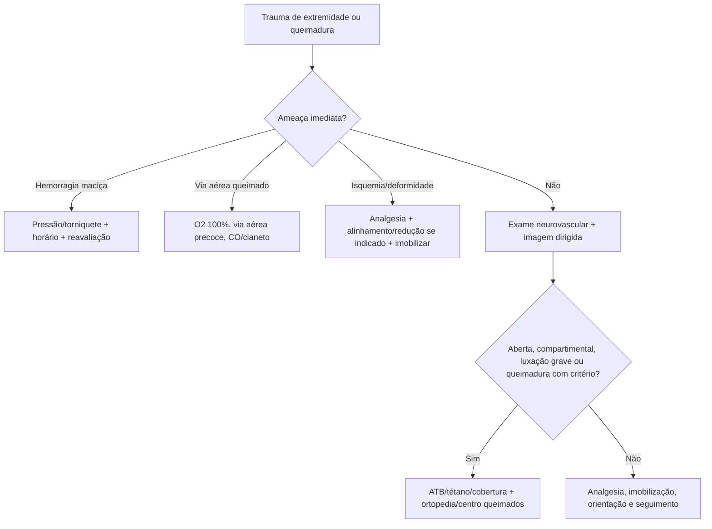

# Ortopedia, Trauma de Extremidades e Queimaduras

## Leitura de 30 segundos

- Extremidade no TEME é MARCH/ABCDE: hemorragia, perfusão, função neurovascular, alinhamento, analgesia, antibiótico/profilaxia e ortopedia.
- Fratura exposta recebe remoção cuidadosa de contaminação grosseira, cobertura estéril, antibiótico precoce, profilaxia antitetânica, imobilização e cirurgia. Não fazer lavagem/desbridamento improvisado nem fechar no PS.
- Queimado grave mata por via aérea, CO/cianeto, choque, hipotermia e erro de cálculo de superfície/profundidade.

## Por que cai

- **Recorrência em provas/estações:** TEME22-26 cobrou fratura exposta, controle de hemorragia em extremidade, START com fratura, luxações, síndrome compartimental, queimadura, lesão inalatória, blast, bloqueios e analgesia.
- **O que a banca costuma testar:** primeira conduta, torniquete, antibiótico, imobilização, redução urgente, quando chamar centro de queimados e quando não atrasar fasciotomia/cirurgia.
- **Como costuma aparecer:** membro deformado, dor intensa, ferida contaminada, pulso alterado, queimadura com bolhas, incêndio em local fechado ou fratura/luxação com risco neurovascular.

## Abordagem prática

### 1. Extremidade no trauma

1. Controle hemorragia: pressão direta, curativo compressivo, torniquete se sangramento ameaçador em membro.
2. Avalie e documente neurovascular antes e depois de manipular: pulso, perfusão, motricidade, sensibilidade.
3. Analgesia cedo: dipirona/paracetamol, opioide, cetamina baixa dose, bloqueio guiado por US se treinado.
4. Alinhe deformidade grosseira com isquemia/pele ameaçada quando seguro; imobilize articulação acima e abaixo.
5. Ferida aberta: cobrir estéril, antibiótico, tétano, ortopedia.

### 2. Fratura exposta

- Não atrasar antibiótico para raio X.
- Remover apenas contaminação grosseira acessível, sem explorar a ferida; cobrir com gaze umedecida em salina e filme oclusivo conforme protocolo. BOAST desaconselha mini-lavagens fora do centro cirúrgico em fraturas expostas de ossos longos/retropé/mediopé.
- Não fechar ferida no pronto-socorro.
- Ortopedia precoce para desbridamento, estabilização e decisão cirúrgica.
- Gustilo ajuda prognóstico, mas a primeira hora é controle de hemorragia, antibiótico e imobilização.
- Antibioticoprofilaxia EV idealmente até 1 h da lesão; classificação definitiva após desbridamento. Contaminação agrícola, aquática, fecal e lesão vascular exigem planejamento específico, não uma ampliação única para todo caso. Não usar a antiga regra de 6 h como justificativa para esperar: isquemia/contaminação importante aceleram a cirurgia.

### 3. Luxações e reduções

- Reduzir urgente se déficit neurovascular, pele ameaçada, luxação de joelho/quadril, dor intratável ou atraso de especialista.
- Ombro posterior pode passar no AP; suspeite após convulsão/choque elétrico com rotação interna.
- Quadril luxado: reduzir cedo pelo risco de necrose avascular.
- Joelho luxado: risco de lesão poplítea; ABI/angioTC conforme pulso/índice e protocolo.
- Luxação de joelho pode ter reduzido espontaneamente. Pulso palpável não exclui lesão arterial: ITB <0,9 ou exame alterado exige investigação vascular urgente; mesmo exame inicial normal pede vigilância neurovascular seriada. Não atrasar tratamento da isquemia para exames eletivos.

### 4. Síndrome compartimental

- Dor desproporcional, dor à extensão passiva, parestesia, tensão compartimental.
- Pulso pode estar presente até tarde; ausência de pulso é sinal tardio.
- Medir pressão se dúvida e disponível, mas clínica forte exige ortopedia/fasciotomia.
- Risco: fratura de tíbia/antebraço, esmagamento, reperfusão, queimadura circunferencial, anticoagulação.
- Retirar curativos/gesso constritivos, manter membro ao nível do coração e corrigir hipotensão. Delta de pressão = PAD menos pressão compartimental; valor <30 mmHg aumenta suspeita, mas não decide isoladamente nem exclui quadro pela medida única. Analgesia/bloqueio exige plano de avaliação seriada, especialmente no paciente incapaz de relatar dor.

### 5. Queimaduras

1. Cena segura, retirar da fonte, remover roupas/acessórios não aderidos, resfriar queimadura térmica recente com água corrente se precoce e sem hipotermia.
2. ABCDE: estridor, falha ventilatória, rebaixamento ou edema progressivo exigem proteção precoce da via aérea. Face queimada/fuligem/ambiente fechado elevam suspeita e pedem avaliação seriada; isoladamente não tornam a IOT obrigatória.
3. CO: oximetria comum pode ser falsamente normal; O2 100%.
4. Cianeto: incêndio fechado + lactato alto/choque/RNC = hidroxocobalamina conforme disponibilidade.
5. Calcular SCQ: não contar primeiro grau para fórmula.
6. Cobrir limpo, analgesia, aquecer, tétano e transferir se critério.

**SCQ e fluidos:** Lund-Browder é especialmente útil na criança; a mão inteira do paciente, com dedos, aproxima 1% para áreas pequenas. Só espessura parcial/total entra na fórmula. ABA 2024 recomenda começar com 2 mL/kg/%SCQ nas primeiras 24 h em adultos com >=20% SCQ; Parkland clássica usa 4. Fórmula é ponto de partida, não volume obrigatório: descontar o já administrado, contar desde a queimadura e titular por perfusão/diurese. Crianças precisam cálculo próprio e manutenção, incluindo glicose quando indicada; não extrapolar a recomendação adulta.

**Escarotomia não é fasciotomia:** escara circunferencial profunda com perfusão distal comprometida ou restrição ventilatória exige avaliação urgente para escarotomia. Lesão muscular compartimental, sobretudo elétrica, pode exigir fasciotomia. Não esperar pulso desaparecer. Queimadura elétrica pede ECG, avaliação de trauma e rabdomiólise conforme exposição; lesão cutânea pequena não mede dano profundo. Antibiótico sistêmico profilático não é rotina na queimadura térmica sem infecção.

### 6. Critérios práticos de centro de queimados

- Parcial profunda/total relevante, face/mãos/pés/genitália/períneo/grandes articulações.
- Inalatória, elétrica/química, trauma associado, comorbidade, crianças, idosos, suspeita de violência/necessidade social.
- Grande queimado: ressuscitação guiada por fórmula e diurese, evitando tanto sub quanto hiper-hidratação.
- ABA: consultar imediatamente e considerar transferência em espessura parcial >=10% SCQ, qualquer espessura total, áreas especiais com lesão profunda ou suspeita inalatória. Queimaduras potencialmente profundas menores também merecem consulta; necessidade pediátrica e suporte familiar entram na decisão.

## Conceitos que sustentam a conduta

Extremidade ferida pode matar por sangue, perder função por isquemia/compartimento e infectar por osso exposto. Queimadura é trauma sistêmico: edema de via aérea evolui, CO desloca oxigênio sem derrubar oximetria, e fluido demais causa complicações. A banca gosta de conduta ordenada, não de heroísmo improvisado.

## Fluxograma

## Doses, alvos e números

| Item | Número | Observação TEME |
|---|---:|---|
| Antibiótico fratura exposta | o mais precoce possível | Cefazolina é base comum; ampliar conforme gravidade/contaminação |
| Torniquete | registrar horário | Não afrouxar intermitentemente |
| Síndrome compartimental | dor à extensão passiva | Pulso presente não exclui |
| Queimadura adulta >=20% SCQ, ABA 2024 | Início: 2 mL x kg x %SCQ/24 h | Titular; Parkland clássica = 4; metade inicial em 8 h desde a lesão |
| Diurese adulto queimado | 0,5 mL/kg/h | Maior alvo em elétrica/rabdomiólise conforme protocolo |
| Centro de queimados | face, mãos, pés, períneo, articulações, inalatória, elétrica/química | Critérios variam; usar referência oficial/local |
| CO | O2 100% | SatO2 pode enganar |

### Pontos de prova

- Hemorragia exsanguinante de extremidade: pressão direta/curativo compressivo; se não controla ou é amputação/sangramento ameaçador, torniquete com horário registrado. Não afrouxar intermitentemente.
- Choque hemorrágico persistente após cristalóide/torniquete pede ressuscitação hemostática balanceada, não mais cristalóide como resposta principal.
- Fratura exposta: antibiótico precoce é parte da primeira hora. Gustilo I-II sem contaminação grosseira costuma receber cefazolina; ferida extensa/contaminada amplia cobertura, como cefazolina + aminoglicosídeo conforme protocolo.
- Ferida simples limpa suturada no DE não exige antibiótico profilático de rotina; contaminação grosseira, mordedura, imunossupressão, osso/tendão/articulação e ferida de alto risco mudam a resposta.
- Síndrome compartimental: dor desproporcional e dor à mobilização passiva são pistas precoces; pulso presente não exclui e laboratório não deve atrasar fasciotomia.
- Luxações: anterior de ombro é trauma esportivo/abdução-rotação externa; posterior lembra convulsão/choque elétrico e pode passar despercebida no AP. Quadril luxado deve ser reduzido cedo.
- Queimadura: primeiro grau não entra na SCQ da Parkland; criança hidrata com menor %SCQ que adulto; elétrica/química/inalatória e áreas nobres elevam complexidade.
- Queimadura química: retirar agente, irrigar, escovar particulado seco quando indicado e usar antídoto específico quando existir; ácido fluorídrico pede gluconato de cálcio.
- Incêndio fechado: SatO2 pode enganar em CO; lactato muito alto, choque ou rebaixamento sugerem cianeto e hidroxocobalamina conforme disponibilidade.

## Pegadinhas TEME

- **Fratura exposta espera ortopedia para antibiótico:** falso.
- **Pulso presente exclui compartimental:** falso.
- **Primeiro grau entra na fórmula de Parkland:** falso.
- **Oximetria normal exclui intoxicação por CO:** falso.
- **Queimado de face sempre precisa IOT imediata:** não sempre; mas sinais de via aérea/ambiente fechado/edema progressivo exigem agressividade.
- **Luxação posterior de ombro aparece fácil no AP:** falso.

## Erros fatais na prática

- Esquecer exame neurovascular antes/depois da redução.
- Sedar/reduzir sem preparo de via aérea, monitor e analgesia adequada.
- Cobrir fratura exposta e esquecer antibiótico/tétano.
- Hiper-hidratar queimado e piorar edema/compartimento.
- Perder lesão inalatória em incêndio fechado.

## Para prova vs na prática

> **Para prova TEME:** controle hemorragia, documente neurovascular, antibiótico precoce na fratura exposta, redução urgente se risco neurovascular/pele, compartimental é clínica e queimadura exige via aérea/CO/cálculo correto de SCQ.
>
> **Na prática clínica:** antibiótico e critério de centro de queimados seguem protocolo regional. Bloqueios e sedação são excelentes quando há equipe treinada, monitorização e plano de resgate.

## Referências

Revisão editorial: 04/10/2026. Fórmulas históricas de prova foram distinguidas das recomendações atuais.

**Prova/TEME**

- Conteúdo programático TEME26: trauma de extremidades, reduções, queimaduras, explosão, eletrocussão e causas ambientais.
- Referências bibliográficas TEME26: Tratado ABRAMEDE 2024; APH ABRAMEDE 2025; diretriz europeia de sangramento no trauma.

**Material local**

- Aulas de cursinho: Aula 37 - Trauma ambiental I; Aula 39 - Trauma de extremidades; Aula 44 - Trauma de partes moles; Aula 56 - Trauma ambiental II e áreas remotas.

**Atualização clínica**

- [ABA. Critérios de encaminhamento.](https://www.ameriburn.org/burn-care-team/resources/guidelines-for-burn-patient-referral)
- [ABA. Ressuscitação do choque por queimadura, 2024.](https://doi.org/10.1093/jbcr/irad125)
- [BOAST. Fraturas expostas.](https://www.boa.ac.uk/resource/boast-4-pdf.html)
- [BOAST. Síndrome compartimental: versão disponível consultada.](https://www.boa.ac.uk/resource/boast-10-pdf.html)
- Livro local: Medicina de Emergência HCFMUSP, 18ª edição; consulta dirigida sobre queimaduras, não leitura integral.

