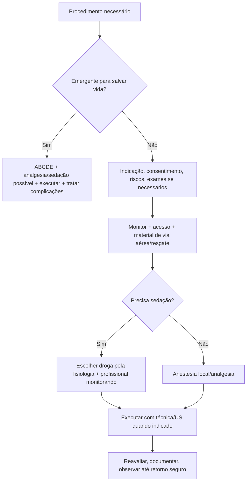

# Procedimentos, Analgesia e Sedação

## Leitura de 30 segundos

- Procedimento em emergência é pré-procedimento, execução e pós-procedimento. A banca pune quem sabe a técnica mas esquece consentimento, monitorização, via aérea, analgesia e complicações.
- Analgesia não mascara abdome agudo; melhora exame e cuidado. Sedação procedural não é anestesia improvisada.
- POCUS guiando agulha, toracocentese, paracentese, bloqueios, acesso vascular e analgesia regional já apareceram nas provas e práticas.

## Por que cai

- **Recorrência em provas/estações:** TEME22-26 cobrou analgesia em abdome/trauma, bloqueios guiados por US, toracocentese, paracentese, punção guiada na prática de POCUS, sedação pós-IOT e sedação contínua no TCE.
- **O que a banca costuma testar:** indicação, contraindicação, preparo, monitorização, escolha de droga, técnica segura e complicações.
- **Como costuma aparecer:** paciente com dor e procedimento necessário, alternativa que nega analgesia, ou estação pedindo verbalizar monitor/via aérea/agulha.

## Abordagem prática

### 1. Antes de qualquer procedimento

1. Indicação clara e alternativa: por que fazer agora?
2. Risco/benefício, consentimento se possível e time-out.
3. Checar alergia, anticoagulação/coagulopatia, plaquetas, jejum quando aplicável, gestação, via aérea e acesso.
4. Monitor: PA, FC, SpO2, ECG se sedação/risco; capnografia quando sedação moderada/profunda disponível.
5. Material de resgate: O2, aspiração, BVM, via aérea, reversores quando aplicáveis, drogas de emergência.
6. Analgesia antes da técnica.

### 2. Analgesia multimodal

- Dor leve/moderada: dipirona/paracetamol, AINE se seguro.
- Dor forte: opioide titulado, cetamina em dose analgésica, bloqueio regional quando treinado.
- Trauma de costelas: analgesia sistêmica + bloqueio plano eretor/intercostal/serrátil conforme local.
- Abdome agudo: analgesia é correta; reexaminar depois.

### 3. Sedação procedural

- Objetivo: nível de sedação suficiente para procedimento com segurança.
- Separar papéis: quem faz procedimento não deve ser o único monitorando sedação.
- Escolha por fisiologia: cetamina preserva drive/PA em muitos cenários; propofol é rápido mas hipotensor; midazolam/fentanil somam depressão respiratória; etomidato pode ser útil em cardioversão/redução curta conforme protocolo.
- Reavaliar até retorno ao basal, via aérea protegida e critérios de alta/observação.

**Sedação não é analgesia:** propofol, midazolam e etomidato não tratam dor por si; associar analgesia quando necessária, reduzindo doses pela interação. Cetamina não garante via aérea: apneia, laringoespasmo e vômito ainda são possíveis. Em choque com depleção catecolaminérgica pode haver hipotensão, não apenas aumento da PA.

**Jejum e recuperação:** não atrasar procedimento urgente apenas por horas de jejum; considerar urgência, risco de aspiração e plano de resgate. Capnografia identifica hipoventilação antes da dessaturação, sobretudo com O2 suplementar; saturação normal não prova ventilação. Monitorização prossegue na recuperação. Para alta, retorno ao basal, sinais vitais estáveis, dor/náusea controladas, acompanhante e orientação; não usar apenas um tempo fixo.

### 4. Bloqueios guiados por US

- Verbalizar: probe correto, assepsia, imagem do nervo/plano, agulha em plano ou fora de plano, aspiração, injeção fracionada, visualizar dispersão.
- Sempre calcular dose máxima de anestésico local.
- LAST: zumbido, gosto metálico, agitação, convulsão, arritmia/choque. Tratamento com suporte, benzo e emulsão lipídica 20%.

**Resgate de LAST (ASRA 2020):** suspender injeção, chamar ajuda, oxigenar/ventilar e tratar convulsão com benzodiazepínico. Iniciar lipídio 20%: <70 kg, bolus 1,5 mL/kg em 2-3 min e infusão 0,25 mL/kg/min; >70 kg, aproximadamente 100 mL e 250 mL em 15-20 min. Instabilidade persistente permite repetir bolus/dobrar infusão conforme checklist; continuar >=15 min após estabilidade, máximo 12 mL/kg. Reanimação difere do ACLS habitual: se adrenalina, começar <1 mcg/kg; evitar vasopressina, betabloqueadores, bloqueadores de cálcio e mais anestésico local. Observar pelo menos 2 h após convulsão e 4-6 h após instabilidade cardiovascular.

### 5. Toracocentese e drenagem pleural

- Indicações: diagnóstico de derrame relevante, alívio, suspeita de empiema; drenagem se pus/pH baixo/glicose baixa/loculado ou pneumotórax/hemotórax conforme caso.
- Use US se disponível: reduz complicação.
- Evitar punção às cegas em derrame pequeno, coagulopatia grave não corrigida quando não emergente, instabilidade sem preparo.
- No derrame, localizar com US na posição do procedimento; não marcar e depois reposicionar sem reconferir. Aspirar lentamente por seringa/gravidade, em geral até 1,5 L por tentativa; interromper antes se dor torácica, dispneia ou tosse persistente. Evitar sucção a vácuo. RX após punção simples e assintomática não é automático; sintomas/complicação mudam a indicação (BTS 2023).

### 6. Paracentese

- Cirrótico internado com ascite nova/piora, dor, febre, HDA, IRA, encefalopatia ou hipotensão merece paracentese diagnóstica.
- POCUS ajuda local e profundidade.
- PBE: PMN >=250/mm3 no líquido ascítico; antibiótico precoce.
- Albumina quando PBE com risco renal ou grande volume conforme protocolo.
- Paracentese na cirrose é de baixo risco: INR elevado isolado não indica plasma profilático, nem deve atrasar investigação de PBE. Considerar sangramento ativo, CIVD, trombocitopenia grave e anticoagulante real individualmente. Na retirada >5 L, albumina usual 6-8 g por litro do volume total retirado, não apenas dos litros acima de cinco.

### 7. Acesso vascular e punção guiada

- Linear, veia compressível, diferenciar artéria/veia, técnica estéril.
- Visualizar ponta da agulha. Na prática 2025 isso pontuou.
- Antes de dilatar CVC, confirmar fio na veia por US; sangue escuro/sem pulsatilidade não basta em choque. Se dúvida arterial, parar e confirmar. Cateter calibroso/dilatador colocado em artéria não deve ser arrancado às cegas: acionar equipe vascular. Confirmar ponta e excluir complicações conforme sítio/método validado; RX não é obrigatório para todo acesso, como femoral.

## Conceitos que sustentam a conduta

Procedimento bom é aquele que resolve um problema sem criar outro. Na emergência, o risco não vem só da agulha: vem da dor, hipóxia, hipotensão, anticoagulação, anatomia difícil, sedação excessiva e falta de plano de resgate. Por isso o checklist vale ponto.

## Fluxograma

## Doses, alvos e números

| Item | Número | Observação TEME |
|---|---:|---|
| Morfina | 0,05-0,1 mg/kg EV titulado | Cuidado hipotensão/DRC; reavaliar |
| Fentanil | 0,5-1 mcg/kg EV titulado | Rápido; dose alta/rápida pode dar rigidez |
| Cetamina analgesia | 0,1-0,3 mg/kg EV | Pode ajudar trauma/procedimento |
| Cetamina dissociativa | 1-2 mg/kg EV ou 4-5 mg/kg IM | Preparar salivação/vômito/agitação |
| Propofol | 0,5-1 mg/kg EV, titular | Hipotensão/apneia |
| Midazolam | 1-2 mg EV titulado | Idoso/álcool/opioide: cuidado respiratório |
| Lidocaína sem adrenalina | 4,5 mg/kg; teto usual 300 mg | Conferir bula/técnica, somar todos os locais |
| Lidocaína com adrenalina | 7 mg/kg; teto usual 500 mg | Reduzir se risco; não usar onde perfusão comprometida |
| Bupivacaína | 2-2,5 mg/kg | Mais cardiotóxica; cuidado LAST |
| Emulsão lipídica LAST, <70 kg | Bolus 1,5 mL/kg a 20%; infusão 0,25 mL/kg/min | ASRA: máximo 12 mL/kg; ver resgate acima |

### Pontos de prova

- Abscesso pequeno, flutuante, em paciente hígido e afebril: incisão, drenagem, limpeza, curativo e orientação; antibiótico não é automático sem celulite extensa, imunossupressão ou gravidade.
- Analgesia não atrapalha abdome agudo; leucograma normal não exclui inflamação e ultrassom é forte para via biliar.
- Sedação procedural exige monitorização, acesso, oxigênio, aspiração, BVM, material de via aérea e profissional dedicado à vigilância contínua, além de quem executa o procedimento.
- Bloqueio regional: escolha pelo território anatômico. Ciático poplíteo cobre tornozelo/maléolo lateral; fáscia ilíaca é quadril/fêmur proximal; ESP block é bom para fraturas costais posteriores.
- LAST: calcular dose máxima, injetar fracionado, aspirar e observar sinais neurológicos/cardiovasculares; toxicidade de anestésicos locais é aditiva quando se misturam drogas.
- Torsades adquirida: corrigir K/Mg, suspender drogas que prolongam QT, magnésio EV e, se recorrente, aumentar frequência com overdrive pacing/isoproterenol conforme contexto.
- Crise renal esclerodérmica: hipertensão + IRA em esclerose sistêmica pede IECA, não corticoide em dose alta.

## Pegadinhas TEME

- **Analgesia mascara abdome agudo:** falso.
- **Sedação sem capnografia é proibida:** falso se indisponível, mas monitorização e via aérea são obrigatórias; capnografia é desejável.
- **Quem faz o procedimento também monitora sedação sozinho:** armadilha.
- **Bloqueio guiado por US elimina LAST:** falso. Calcular dose e injetar fracionado.
- **Paracentese só se dor abdominal:** falso; cirrótico internado/descompensado tem várias indicações.
- **Toracocentese às cegas é igual ao US:** falso quando US está disponível.

## Erros fatais na prática

- Sedar paciente sem BVM/aspiração/O2/acesso.
- Não calcular dose máxima de anestésico local.
- Não reconhecer LAST.
- Fazer paracentese/toracocentese sem revisar anticoagulação, plaqueta e anatomia quando não emergente.
- Não reavaliar após opioide/sedação.

## Para prova vs na prática

> **Para prova TEME:** analgesia é parte da conduta; sedação exige monitor, via aérea e resgate; US deve guiar procedimentos quando disponível; paracentese é obrigatória em cirrótico descompensado/internado; bloqueio exige dose máxima e vigilância de LAST.
>
> **Na prática clínica:** drogas, doses e exigência de jejum/capnografia dependem de protocolo, treinamento e recurso. Emergência verdadeira não espera jejum, mas exige preparo proporcional.

## Referências

Revisão editorial: 04/10/2026. Doses são pontos de partida; conferir produto, população e protocolo.

**Prova/TEME**

- Conteúdo programático TEME26: analgesia e sedação procedural adulto/pediátrica, monitorização, POCUS procedimentos, bloqueios periféricos, toracocentese e paracentese.
- Referências bibliográficas TEME26: Tratado ABRAMEDE 2024; POCUS ABRAMEDE 2024; Manual de Via Aérea 2025.

**Material local**

- Aulas de cursinho: Aula 35 - POCUS procedimentos; Aula 29 - POCUS cardíaco; Aula 39 - Trauma de extremidades; Aula 32 - HDA/hepatopatia.

**Atualização clínica**

- [ACEP. Sedação procedural: documentos e recomendações.](https://www.acep.org/by-medical-focus/procedural-sedation)
- [ACEP. Política clínica de sedação, 2014: jejum, capnografia e equipe.](https://www.acep.org/siteassets/new-pdfs/clinical-policies/clinical-policy-procedural-sedation-and-analgesia-in-the-emergency-department.pdf)
- [ASRA. Checklist de toxicidade sistêmica por anestésico local, 2020.](https://asra.com/news-publications/asra-updates/blog-landing/guidelines/2020/11/01/checklist-for-treatment-of-local-anesthetic-systemic-toxicity)
- [BTS. Procedimentos pleurais, 2023.](https://thorax.bmj.com/content/78/Suppl_3/s43)
- [AASLD. Ascite/PBE/síndrome hepatorrenal, 2021.](https://www.aasld.org/practice-guidelines/diagnosis-evaluation-and-management-ascites-spontaneous-bacterial-peritonitis)
- [AASLD. Risco hemorrágico periprocedimento na cirrose, 2024.](https://www.aasld.org/liver-fellow-network/core-series/clinical-pearls/peri-procedural-management-bleeding-risk-cirrhosis)
- [Bula Xylocaine. Limites de dose em adultos saudáveis.](https://www.dailymed.nlm.nih.gov/dailymed/getFile.cfm?setid=441a0cfa-a5fc-4ace-8dd8-84bb8c804c2e&type=pdf)
- Livro local: HCFMUSP, 18ª edição, capítulo de sedação e analgesia em procedimentos não eletivos; consulta dirigida.
