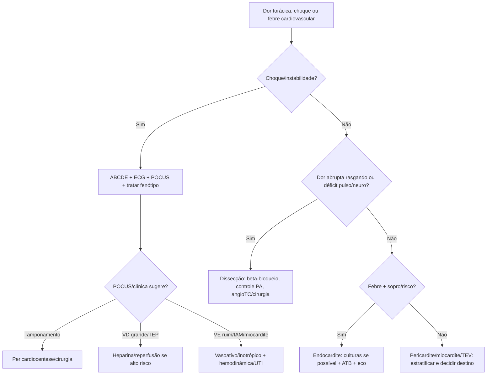

# Cardiovascular Complementar

## Leitura de 30 segundos

- Este capítulo fecha o que ficou fora de SCA/arritmia/PA: pericardite, miocardite, endocardite, tamponamento, doenças da aorta, TVP/TEV e complicações mecânicas do IAM.
- Choque com turgência, abafamento, pulso paradoxal ou POCUS com derrame/colapso = tamponamento até prova em contrário.
- Dor torácica rasgando, déficit de pulso/neuro, síncope ou dor migratória = dissecção. Controle FC/PA antes de vasodilatar.

## Por que cai

- **Recorrência em provas/estações:** TEME22-26 trouxe tamponamento/pericárdio, miocardite, endocardite, aorta/dissecção, aneurisma, TVP/TEV e choque obstrutivo/cardiogênico.
- **O que a banca costuma testar:** reconhecer fenótipo grave, usar POCUS, não trombolisar dissecção, controlar PA corretamente e chamar hemodinâmica/cirurgia.
- **Como costuma aparecer:** dor torácica com ECG confuso, choque com POCUS, paciente pós-IAM deteriorando, febre+sopro, dor lombar/síncope com AAA.

## Abordagem prática

### 1. Pericardite e tamponamento

- Pericardite típica: dor pleurítica/posicional, atrito, supra difuso/PR baixo, derrame.
- Troponina elevada na pericardite sugere acometimento miocárdico. Miopericardite clássica preserva função ventricular; disfunção nova ou arritmia aumenta suspeita de predomínio de miocardite e gravidade, não é apenas pericardite simples.
- Tamponamento: hipotensão/choque, turgência, abafamento, pulso paradoxal, taquicardia, POCUS com derrame + colapso AD/VD + VCI cheia.
- Instável: pericardiocentese como ponte, cirurgia quando traumático/purulento/dissecção/iatrogênico conforme caso.

**Pericardite sem complicação:** combinar AAS/AINE com colchicina e proteção gástrica quando indicada, após avaliar rim, sangramento e interações. Esquema usual de colchicina no primeiro episódio: 0,5 mg/dia se <=70 kg ou 0,5 mg 12/12 h se >70 kg, por 3 meses, ajustado ao paciente/produto. Corticoide não é primeira escolha automática; excluir causa infecciosa relevante e discutir indicação específica.

**Destino:** febre >38 °C, curso subagudo, derrame >20 mm/tamponamento ou falha de resposta ao anti-inflamatório são alertas; imunossupressão, trauma, anticoagulação e acometimento miocárdico também aumentam cautela. Baixo risco pode ter seguimento ambulatorial próximo com orientação de retorno. ECG sem supra difuso não exclui; não chamar todo supra de pericardite sem avaliar SCA.

**Tamponamento:** avaliar fisiologia e contexto, não apenas tamanho do derrame. Ventilação positiva e indução podem precipitar colapso; preparar drenagem e suporte antes quando possível. Fluido cauteloso pode servir de ponte, não substituir drenagem; evitar diurético/vasodilatador no choque obstrutivo. Hemopericárdio traumático pode conter coágulos e exigir cirurgia.

### 2. Miocardite

- Pode parecer SCA, sepse, arritmia, IC ou choque.
- Pistas: viral recente, jovem, dor torácica, troponina, arritmia, disfunção de VE, choque desproporcional.
- Evitar exercício; internar se troponina alta, ECG alterado, arritmia, síncope, IC, disfunção ventricular ou instabilidade.
- Choque: suporte hemodinâmico, inotrópico/vasopressor, considerar centro com suporte circulatório.
- ECG/troponina/eco normais isoladamente não excluem miocardite. RM cardíaca ajuda no estável; biópsia é selecionada, sobretudo em apresentações graves quando muda tratamento. Bloqueio AV avançado, arritmia ventricular ou choque exigem avaliação urgente. Restrição de exercício e retorno devem ser individualizados por remissão clínica, função e avaliação arrítmica, não por um prazo único para todos.

### 3. Endocardite

- Febre + sopro novo, fenômenos embólicos, uso de droga IV, prótese valvar, dispositivo, hemodiálise ou bacteremia persistente.
- Coletar hemoculturas antes do antibiótico se estável; se choque/sepsis, não atrasar antibiótico.
- Complicações de emergência: IC aguda por regurgitação, AVC/embolias, abscesso, bloqueio AV, choque séptico.
- Eco e infecto/cardio/cirurgia conforme gravidade.
- No estável, ESC recomenda três conjuntos de hemoculturas periféricas antes do antibiótico. Eco transtorácico inicial; transesofágico se prótese/dispositivo, exame inconclusivo ou suspeita persistente. Eco inicial negativo não encerra investigação. IC por lesão valvar, infecção não controlada/abscesso e risco embólico podem indicar cirurgia. Trombólise no AVC por endocardite não é tratamento de rotina; discutir neurologia/endocardite.

### 4. Dissecção de aorta

- Dor abrupta intensa torácica/dorsal/abdominal, síncope, déficit neurológico, assimetria de pulso/PA, novo sopro aórtico, isquemia.
- Analgesia e controle anti-impulso: ACC/AHA 2022 propõe FC 60-80 e PAS <120, ou menor pressão que preserve perfusão. Betabloqueador EV antes do vasodilatador quando indicado; em choque, bradicardia ou insuficiência aórtica grave, individualizar, não perseguir números às custas da perfusão.
- Nunca dar vasodilatador isolado antes de controlar FC.
- Tipo A: cirurgia. Tipo B complicada: vascular/endovascular.
- Trombólise/anticoagulação em SCA/TEP sem excluir dissecção pode ser desastre.

### 5. AAA sintomático/roto

- Idoso, dor abdominal/lombar, síncope/choque, massa pulsátil nem sempre presente.
- POCUS aorta ajuda no instável; angioTC se estável.
- Instável com AAA provável: vascular/cirurgia, hemoderivados, permissiva até controle conforme protocolo.

### 6. TVP e TEV

- TVP: edema unilateral, dor, risco recente. US compressivo: veia não colaba.
- TEP está no capítulo respiratório, mas o raciocínio cardíaco é VD.
- Anticoagular se alta probabilidade e baixo risco de sangramento quando imagem atrasar, conforme protocolo.
- TEP alto risco: choque/hipotensão/PCR; considerar reperfusão se benefício > sangramento.
- TVP segue probabilidade clínica + D-dímero/US, não D-dímero em todo edema. No algoritmo NICE, US proximal negativo com D-dímero positivo pede repetição em 6-8 dias; US limitado de poucos pontos não exclui trombo distal/ilíaco. Escolha do anticoagulante considera rim, gestação, câncer, interações e sangramento; TVP proximal costuma requerer pelo menos 3 meses, com reavaliação da duração.

### 7. Complicações mecânicas do IAM

- Ruptura de músculo papilar: EAP/choque + sopro de IM aguda, geralmente inferior.
- CIV pós-IAM: choque + sopro novo rude.
- Ruptura de parede livre: tamponamento/PCR.
- Pseudoaneurisma/aneurisma e choque cardiogênico: POCUS/eco e cirurgia/hemodinâmica.

## Conceitos que sustentam a conduta

O capítulo inteiro é sobre não ser enganado pela dor torácica "parecida com SCA". Dissecção, miocardite, pericardite, tamponamento e TEP mudam completamente o tratamento. POCUS e ECG ajudam, mas a chave é fisiologia: obstrutivo drena/desobstrui, aorta reduz shear stress, endocardite controla infecção e complicação, complicação mecânica chama cirurgia.

## Fluxograma

## Doses, alvos e números

| Item | Número | Observação TEME |
|---|---:|---|
| Síndrome aórtica aguda, ACC/AHA | FC 60-80; PAS <120 ou menor que preserve perfusão | Controle anti-impulso; exceções hemodinâmicas |
| Esmolol | bolus 500 mcg/kg, infusão 50-200 mcg/kg/min | Titular; alternativa labetalol |
| Pericardiocentese | imediata se tamponamento instável | POCUS guiado quando possível |
| Pericardite baixo risco | AINE + colchicina | Internar se febre, grande derrame, anticoag, trauma, imunossupressão, miocardite |
| Hemoculturas endocardite | 3 conjuntos periféricos no estável | Antes de ATB; não atrasar tratamento do choque |
| TVP US | não compressibilidade | Achado central no POCUS vascular |
| TEP alto risco | choque/hipotensão/PCR | Reperfusão se sem contra ou benefício supera risco |

### Pontos de prova

- Derrame pericárdico no eco: discreto <10 mm, moderado 10-20 mm e importante >20 mm em diástole. Tamponamento é fisiologia, não só volume.
- Tamponamento: colapso sistólico do átrio direito, colapso diastólico do ventrículo direito, VCI cheia e variação respiratória de fluxos. No choque, a conduta é drenagem/pericardiocentese ou cirurgia conforme contexto.
- Trauma com bulhas abafadas e choque é tamponamento/choque obstrutivo até prova em contrário; pneumotórax hipertensivo e hemotórax maciço têm outras pistas no exame pulmonar.
- POCUS com VD dilatado, septo em D, PSAP alta e VE preservado sugere TEP com cor pulmonale agudo; espessura do VD <5 mm favorece agudo, não crônico.
- TEP segmentar baixo risco, estável, troponina/VD sem gravidade e com boa compreensão/seguimento pode ser tratado ambulatorialmente.
- Dissecção/AAA: dor dorsal/lombar/abdominal intensa + choque pede estabilização e cirurgia/vascular; beta-bloqueio é central na dissecção estável, mas não antes de tratar choque.
- IC aguda sem choque e hipertensiva/congesta responde a vasodilatador; choque com VD grave e congestão pode precisar diurético + inodilatador como milrinona conforme a fisiologia.
- Síncope de esforço em jovem é alto risco: internar e investigar cardiopatia estrutural com ecocardiograma antes de pensar em liberação.
- IC terminal com PPS 20, sonolência, recusa alimentar e mottling sugere fase ativa de morte; dispneia terminal responde a morfina em baixa dose e reavaliação.

## Pegadinhas TEME

- **Dor torácica com supra = trombólise sempre:** falso; dissecção/pericardite entram no diferencial.
- **Dissecção trata primeiro com nitroprussiato:** falso se sem beta-bloqueio.
- **Tamponamento precisa tríade de Beck completa:** falso; POCUS pode ser decisivo.
- **Pericardite com troponina alta é sempre alta:** falso; miopericardite muda risco.
- **Endocardite estável recebe antibiótico antes de hemocultura:** em geral colete antes se não atrasar e paciente estável.
- **VD dilatado fecha TEP:** falso; precisa contexto.

## Erros fatais na prática

- Anticoagular/trombolisar dissecção confundida com IAM/TEP.
- Não fazer POCUS em choque indiferenciado.
- Perder complicação mecânica pós-IAM em paciente que "já reperfundiu".
- Dar alta para pericardite com sinais de alto risco.
- Não acionar cirurgia/vascular em dissecção tipo A ou AAA roto.

## Para prova vs na prática

> **Para prova TEME:** dissecção = beta-bloqueio antes de vasodilatar; tamponamento instável = drenagem; endocardite estável = hemoculturas antes de antibiótico; miocardite/pericardite com alto risco interna; complicação mecânica pós-IAM exige eco e cirurgia/hemodinâmica.
>
> **Na prática clínica:** escolha de anti-hipertensivo, anticoagulação e reperfusão depende de recurso, imagem, equipe, risco de sangramento e protocolo de aorta/TEP/cardiologia.

## Referências

Revisão editorial: 04/10/2026. Metas atuais foram diferenciadas de simplificações clássicas de prova.

**Prova/TEME**

- Conteúdo programático TEME26: emergências cardiovasculares, miocardites, endocardites, pericardites, tamponamento, doenças da aorta, embolia pulmonar, TVP/TEV e complicações mecânicas do infarto.
- Referências bibliográficas TEME26: Tratado ABRAMEDE 2024; POCUS ABRAMEDE 2024; ACS 2025.

**Material local**

- Aulas de cursinho: Aula 34 - Síncope e arritmias; Aula 36 - SCA; Aula 38 - Emergências vasculares; Aula 48 - Pericardite, miocardite e endocardite; Aula 29 - POCUS cardíaco.

**Atualização clínica**

- ACC/AHA/ACEP/NAEMSP/SCAI. ACS Guideline 2025, listado no edital TEME26.
- [ESC/ERS. TEP, 2019: referência histórica.](https://academic.oup.com/eurheartj/article/41/4/543/5556136)
- [ESC. Miocardite e pericardite, 2025.](https://www.escardio.org/guidelines/clinical-practice-guidelines/all-esc-practice-guidelines/myocarditis-and-pericarditis)
- [Ensaio ICAP. Colchicina no primeiro episódio, 2013.](https://pubmed.ncbi.nlm.nih.gov/23992557/)
- [ACC/AHA. Aorta, 2022: síntese oficial.](https://www.acc.org/Latest-in-Cardiology/ten-points-to-remember/2022/11/01/12/21/2022-Guideline-on-Aortic-Disease-2-gl-ad)
- [ESC. Endocardite, 2023.](https://academic.oup.com/eurheartj/article/44/39/3948/7243107)
- [NICE NG158. TVP/TEP: diagnóstico e seguimento.](https://www.nice.org.uk/guidance/ng158/resources/visual-summary-pdf-11193380893)
- [AHA/ACC. TEP, 2026; consultar também o tema respiratório.](https://www.jacc.org/doi/10.1016/j.jacc.2025.11.005)
- Livro local: HCFMUSP, 18ª edição; consulta dirigida à diferenciação de pericardite/tamponamento na dor torácica.
