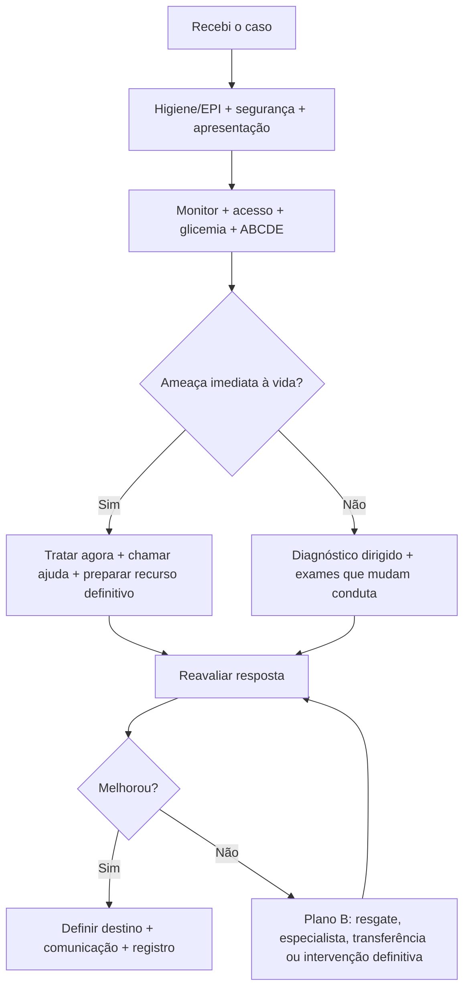

# Estratégia de prova e estações práticas

## Leitura de 30 segundos

- A prova teórica costuma premiar decisão segura, fisiologia e conduta tempo-dependente.
- A prova prática não avalia só a técnica; avalia segurança, priorização, comunicação, reavaliação e fechamento do caso.
- Em estação, pense: **entrar seguro, estabilizar, executar, reavaliar, comunicar e registrar**.
- Quando ficar em dúvida, escolha a alternativa/conduta que trata primeiro a ameaça imediata à vida e evita atrasos perigosos.

## Por que cai

- **Recorrência em provas/estações:** nas provas TEME22-25 há questões multidisciplinares e, nas estações, vários pontos de checklist que não pertencem a um tema clínico único.
- **O que a banca costuma testar:** higiene/EPI, chamada de ajuda, monitorização, ABCDE, verbalização de raciocínio, conduta tempo-dependente, uso correto de recursos e reavaliação.
- **Como costuma aparecer:** estação de PCR, via aérea, trauma, POCUS, pediatria ou neurocrítico em que o procedimento técnico é apenas uma parte da nota.

## Abordagem prática

### Antes de tocar no paciente

1. Higienizar as mãos e usar EPI adequado.
2. Apresentar-se e confirmar o papel na estação.
3. Checar segurança da cena/ambiente.
4. Chamar ajuda e distribuir funções quando o caso é crítico.
5. Pedir monitorização, acesso venoso, glicemia capilar e material crítico conforme cenário.

Frase útil de estação:

> "Vou priorizar ameaças imediatas à vida, chamar equipe, monitorizar, obter acesso, tratar a causa reversível, reavaliar resposta e definir destino."

### Durante a estação

1. Faça **ABCDE em voz alta**, com intervenção junto da avaliação.
2. Não espere exame para corrigir hipóxia, choque, hipoglicemia, convulsão, arritmia instável, hemorragia exsanguinante ou via aérea ameaçada.
3. Verbalize hipótese principal e diferenciais perigosos.
4. Use comunicação em alça fechada: peça, confirme e confira execução.
5. Reavalie depois de cada intervenção importante.

### Ao fechar o caso

1. Diga o diagnóstico sindrômico mais provável.
2. Diga a conduta definitiva ou próximo passo.
3. Defina destino: sala vermelha, centro cirúrgico, hemodinâmica, UTI, transferência, observação ou alta segura.
4. Registre horário, resposta clínica, comunicação com especialista/regulação e pendências.

## Conceitos que sustentam a conduta

### A banca procura maturidade de emergência

O erro típico é tentar "dar aula" enquanto o paciente morre no cenário. A resposta madura é curta: reconhecer gravidade, pedir recursos, tratar o que mata agora e reavaliar. O detalhe técnico importa, mas geralmente vem depois da prioridade fisiológica.

Exemplo: em trauma, torniquete e controle de hemorragia vêm antes de discutir tomografia. Em via aérea, pré-oxigenação, plano de resgate e capnografia valem tanto quanto passar o tubo. Em POCUS, a pergunta clínica vale mais que descrever imagem bonita sem conduta.

### Teórica: como pensar a alternativa

Leia primeiro o comando da questão: **correta, incorreta, melhor conduta, próxima conduta, exceção, contraindicação**. Depois procure o eixo do caso:

- O paciente está instável?
- Existe conduta tempo-dependente?
- Há contraindicação clássica?
- A alternativa atrasa tratamento essencial?
- A alternativa troca prioridade por exame?
- A alternativa usa palavra absoluta: sempre, nunca, obrigatório, contraindicado em todos?

Se duas alternativas parecem certas, a melhor costuma ser a que resolve o risco imediato com menor atraso e menor dano.

### Prática: como ganhar ponto mesmo sob pressão

O avaliador só pontua o que você faz ou verbaliza. Se você pensou, mas não disse, a estação pode tratar como não feito. Por isso, verbalize ações críticas de forma objetiva:

- "Paciente instável: vou chamar ajuda."
- "Vou monitorizar, obter acesso venoso e checar glicemia."
- "A intervenção imediata é..."
- "Vou reavaliar PA, pulso, consciência, SpO2 e resposta clínica."
- "Vou registrar horário e comunicar equipe/destino."

## Fluxograma

## Doses, alvos e números

| Item | Número/alvo | Observação TEME |
|---|---:|---|
| Pausa para pulso/ritmo na PCR | <10 s | Se usar POCUS, não prolongar pausa |
| Ciclo de RCP | 2 min | Trocar compressor e reavaliar ritmo no momento certo |
| Compressões adulto | 100-120/min | Profundidade 5-6 cm, retorno completo |
| Torniquete | registrar horário | Controle de hemorragia exsanguinante é prioridade |
| Hipoglicemia possível | checar glicemia cedo | Rebaixamento, convulsão e pediatria cobram isso |
| Procedimento guiado por US | visualizar ponta da agulha | Não basta "ver a agulha" parcialmente |
| Via aérea | capnografia após IOT | Ausculta isolada não confirma tubo |
| Reavaliação | após intervenção | PA, pulso, perfusão, SpO2, consciência e resposta clínica |

### Pontos de prova

- Antes de responder, identifique o comando: correta, incorreta, melhor próxima conduta, exceção, contraindicação ou associação. Muito erro vem de marcar a frase verdadeira quando a questão pede a falsa.
- Nas questões TEME, a alternativa certa costuma respeitar a ordem: segurança, ABCDE, intervenção tempo-dependente, confirmação/monitorização e destino.
- Em estação prática, fale o que está fazendo: chamar ajuda, monitorizar, acesso, glicemia, oxigênio, checar material, preparar plano B e reavaliar. O avaliador não pontua pensamento silencioso.
- Quando houver procedimento, verbalize indicação, contraindicações rápidas, monitorização, analgesia/sedação, técnica e complicações esperadas.
- Em POCUS, não basta descrever a imagem: diga a pergunta clínica, o achado e a conduta que muda agora.
- Para desempenho por tema, resolva as questões sem olhar o gabarito, cheque uma vez, leia a explicação de todas as alternativas e só depois use “Limpar respostas” se quiser repetir.
- Não troque resposta depois de checar: a taxa de acerto do tema deve refletir sua primeira decisão, porque é isso que simula a prova.

## Pegadinhas TEME

- **Pedir TC antes de corrigir ABC:** se instável, estabilize e trate ameaça imediata.
- **Fazer procedimento sem segurança:** EPI, monitor, acesso, material de resgate e equipe contam.
- **Tratar estação prática como prova oral longa:** resposta boa é objetiva e operacional.
- **Não verbalizar:** se não foi dito ou feito, pode não pontuar.
- **Confundir estabilidade aparente com baixo risco:** jovem, gestante, criança, hipertenso crônico e atleta compensam até descompensar.
- **Trocar conduta por exame:** exame entra quando muda decisão e não atrasa intervenção crítica.
- **Escolher pela letra mais frequente:** distribuição ajuda pouco; eliminação por fisiologia ajuda mais.
- **Usar "sempre/nunca" sem contexto:** alternativas absolutas costumam esconder exceção.

## Erros fatais na prática

- Entrar na cena sem EPI/segurança mínima.
- Não chamar ajuda em paciente crítico.
- Não monitorizar, não obter acesso ou não checar glicemia quando indicado.
- Não tratar hipóxia, choque, hemorragia, convulsão, hipoglicemia ou arritmia instável imediatamente.
- Repetir tentativa fracassada sem plano de resgate.
- Não confirmar IOT com capnografia.
- Não registrar horário de torniquete, drogas críticas, choque, início de RCP ou transferência.
- Encerrar estação sem reavaliação e destino.

## Para prova vs na prática

> **Para prova TEME:** escolha a conduta que resolve primeiro a ameaça imediata, segue algoritmo oficial e não atrasa intervenção tempo-dependente por exame ou discussão excessiva.
>
> **Na prática clínica:** protocolos locais, recursos disponíveis, equipe, fluxo de regulação e segurança operacional ajustam a execução. A lógica permanece: estabilizar, tratar o que mata agora, reavaliar e comunicar.

## Checklist de revisão

### Checklist mental para estação

- [ ] Higienizei mãos/EPI e chequei segurança.
- [ ] Chamei ajuda quando o paciente era crítico.
- [ ] Pedi monitor, acesso, glicemia e material necessário.
- [ ] Fiz ABCDE em voz alta.
- [ ] Tratei ameaça imediata antes de exame.
- [ ] Usei comunicação objetiva com a equipe.
- [ ] Reavaliei após intervenção.
- [ ] Falei diagnóstico sindrômico e próximo passo.
- [ ] Defini destino e necessidade de especialista/regulação.
- [ ] Registrei horários e condutas críticas.

### Checklist mental para questão teórica

- [ ] Li o comando: correta, incorreta, próxima conduta ou exceção.
- [ ] Identifiquei estabilidade e ameaça imediata.
- [ ] Procurei contraindicação clássica.
- [ ] Eliminei alternativa que atrasa tratamento essencial.
- [ ] Diferenciei resposta de prova de detalhe avançado da prática.
- [ ] Não chutei por padrão de letras sem raciocínio.

## Questões e estações relacionadas

- **TEME22-25 teórica:** questões multidisciplinares, gestão, decisão sob incerteza, regulação, segurança e condutas que cruzam mais de um tema.
- **Prática 2022:** RCP de alta qualidade, higiene/checklist, via aérea com BVM/dispositivo supraglótico, trauma com FAST, choque cardiogênico/miocardiopatia periparto.
- **Prática 2023:** PCR pediátrica/TSV, IOT com bougie, BLUE protocol, IMV/desastres, sepse e CAD.
- **Prática 2024:** bradicardia instável/IAMCST/FV, cricotireoidostomia, POCUS em SCAPE, trauma pediátrico e protocolo de morte encefálica.
- **Prática 2025:** VM/auto-PEEP, trauma hemorrágico, POCUS com AAA/punção guiada, intoxicação pediátrica por carbamato/organofosforado e neurocrítico/TCE-HIC.

## Referências

**Prova/TEME**

- Conteúdo programático TEME26.
- Provas teóricas TEME22-25 e gabaritos oficiais disponíveis no projeto.
- Estações práticas TEME22-25 disponíveis no projeto.

**Material local**

- Resumos de temas 001-024.
- Mapa de questões TEME22-25.

**Atualização clínica**

- AHA Guidelines for CPR and ECC.
- ATLS/trauma e protocolos institucionais de atendimento ao politrauma.
- Protocolos locais de segurança do paciente, regulação, transferência e procedimentos.
