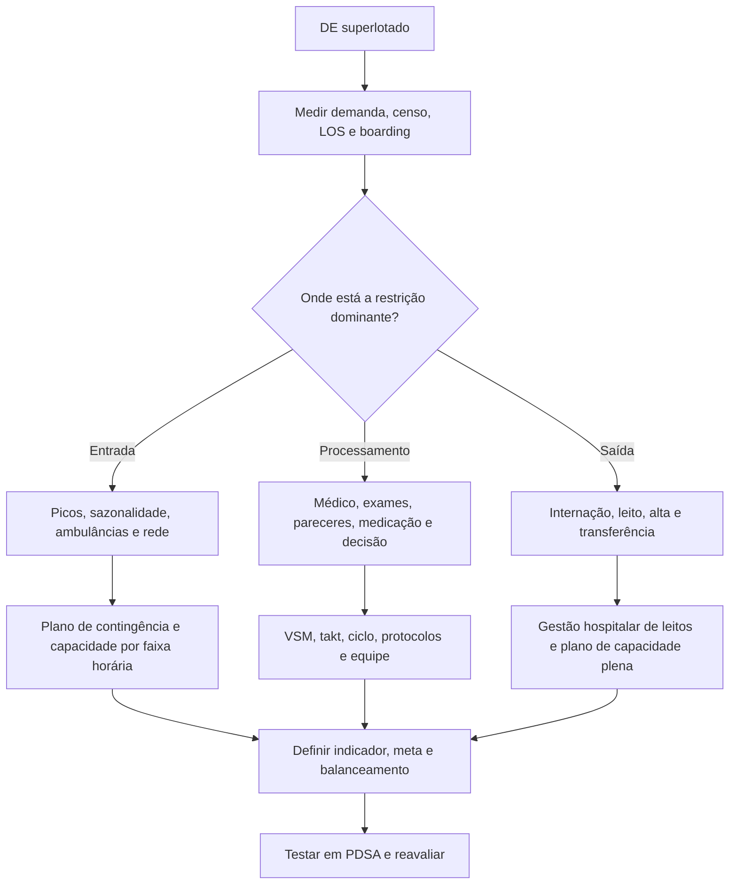
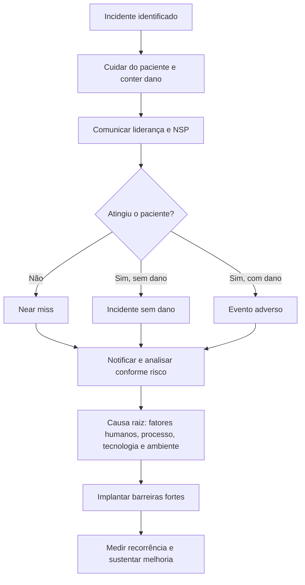

# Gestão Do Departamento De Emergência

## Leitura de 30 segundos

- **Superlotação é problema do hospital inteiro.** Pense em entrada, processamento e saída; o `boarding` de pacientes já internados costuma ser o principal determinante.
- **Classificar risco não é diagnosticar nem dispensar.** Manchester prioriza por gravidade/tempo-alvo; ESI combina gravidade e previsão de recursos.
- **Lean remove desperdício e melhora fluxo.** `Takt time = tempo disponível / demanda`; há gargalo quando o tempo de ciclo de uma etapa excede o takt.
- **Capacidade igual à demanda não basta.** Com variabilidade e utilização próxima de 100%, a fila cresce de forma não linear.
- **Evento adverso pede cuidado imediato, notificação e aprendizagem sistêmica.** Cultura justa não é impunidade nem caça automática ao culpado.
- **Acreditação é externa, voluntária, periódica e orientada à melhoria contínua.** Não substitui licença sanitária nem auditoria interna.
- **Gestão é assistência.** Fluxo, equipe, informação, leitos, passagem de plantão e plano de contingência alteram desfechos clínicos.

## Por que cai

- **Recorrência:** provas TEME22-26 cobraram ESI, indicadores, regulação, escala de plantão, Resolução CFM 2.077/2014, Lean, takt time, acreditação, psicologia da espera, capacidade, superlotação, análise de causa raiz e Manchester como dado de governança.
- **Mudança no TEME26:** gestão deixou de ser apêndice de ética e virou bloco de alto retorno, com oito questões diretamente relacionadas a processo, qualidade e fluxo.
- **O que a banca testa:** reconhecer a ferramenta certa para o problema, separar entrada de `boarding`, interpretar capacidade e identificar alternativas que culpam pessoas ou prometem soluções isoladas.
- **Como aparece:** caso de um DE superlotado, painel de indicadores, incidente assistencial ou definição objetiva de uma ferramenta.

## Abordagem prática

### 1. Comece definindo o problema

Antes de propor solução, descreva o problema em uma frase mensurável:

> "Entre 14h e 20h, pacientes amarelos aguardam mediana de 110 minutos para avaliação médica, acima do tempo-alvo local, com crescimento de evasão antes do atendimento."

Uma boa definição contém:

1. população e período;
2. etapa do fluxo;
3. indicador;
4. tamanho do desvio;
5. consequência clínica ou operacional.

Evite frases vagas como "o pronto-socorro está caótico" ou soluções disfarçadas de problema, como "faltam mais dez leitos". Primeiro prove onde está a restrição.

### 2. Localize o gargalo: entrada, processamento ou saída

| Domínio | Exemplos | Indicadores úteis | Intervenções típicas |
|---|---|---|---|
| **Entrada (input)** | pico de demanda, epidemia, acesso ambulatorial insuficiente, chegada simultânea de ambulâncias | chegadas/hora, perfil de risco, taxa de ambulâncias, sazonalidade | plano de contingência, previsão de demanda, integração com rede |
| **Processamento (throughput)** | espera por médico, exame, interconsulta, medicação ou decisão | porta-médico, tempo até exame/laudo, tempo até decisão, LOS de altas | fluxo rápido selecionado, protocolos, coleta precoce, equipe por faixa horária |
| **Saída (output)** | paciente internado sem leito, atraso de alta, transferência bloqueada | tempo decisão-leito, número/horas de boarders, ocupação, LOS de internados | gestão de leitos, alta oportuna, rounds de fluxo, escalonamento hospitalar |

**Atalho de prova:** macas em corredor + pacientes já avaliados + demora para transferência interna = problema predominante de **saída/boarding**. Acelerar somente a triagem não libera leitos.

### 3. Faça um huddle operacional curto

O huddle não é reunião longa. Em poucos minutos, a equipe alinha:

- lotação atual e pacientes críticos;
- número de pacientes aguardando internação/UTI/transferência;
- exames, pareceres e altas travados;
- riscos imediatos: isolamento, agitação, deterioração, medicação tempo-dependente;
- responsável e prazo para cada ação;
- gatilho para ativar ou desativar contingência.

Use comunicação fechada: tarefa, responsável, prazo e confirmação. Sem dono e sem horário, a pendência vira paisagem.

### 4. Escolha a ferramenta pelo tipo de problema

| Pergunta | Ferramenta mais útil |
|---|---|
| Onde o paciente espera e o que agrega valor? | Mapa de fluxo de valor (VSM) |
| Qual etapa limita a vazão? | Takt time + tempo de ciclo + análise de capacidade |
| Há deslocamento físico desnecessário? | Diagrama de espaguete |
| Materiais estão desorganizados ou faltam no momento crítico? | 5S + gestão visual/kanban |
| Por que este evento ocorreu? | Análise de causa raiz + 5 porquês + Ishikawa |
| A mudança funciona em pequena escala? | PDSA/PDCA |
| Onde o processo pode falhar antes de causar dano? | FMEA/análise prospectiva de risco |
| Como acompanhar o serviço? | Painel balanceado de indicadores |

### 5. Termine toda intervenção com medida e reavaliação

Defina antes de mudar:

- indicador de resultado: o que se quer melhorar;
- indicador de processo: se a nova rotina está sendo executada;
- indicador de equilíbrio: qual efeito indesejado pode surgir;
- linha de base, meta, prazo e responsável.

Exemplo: reduzir porta-médico sem acompanhar retorno em 72 h, eventos adversos e tempo de permanência pode apenas transferir risco para outro ponto.

## Conceitos que sustentam a conduta

### Gestão Lean no DE

Lean busca maximizar valor para o paciente e reduzir atividades sem valor. Não significa cortar equipe indiscriminadamente.

**Princípios operacionais:**

1. definir valor do ponto de vista do paciente;
2. mapear a cadeia de valor;
3. criar fluxo contínuo quando possível;
4. ajustar produção à demanda;
5. melhorar continuamente.

**Desperdícios clássicos adaptados à emergência:**

| Desperdício | Exemplo no DE |
|---|---|
| Espera | paciente aguarda exame, parecer, medicação ou leito |
| Movimento | equipe percorre longas distâncias para buscar material |
| Transporte | paciente muda de setor sem necessidade clínica |
| Estoque | excesso, falta ou vencimento de insumos |
| Superprocessamento | registro duplicado e exames sem impacto na decisão |
| Defeito/retrabalho | prescrição incorreta, coleta repetida, informação perdida |
| Produção excessiva | solicitar exames antecipados sem indicação |
| Talento não utilizado | equipe treinada sem autonomia para resolver problemas |

#### Takt time, tempo de ciclo e gargalo

- **Takt time:** ritmo necessário para absorver a demanda.
- **Tempo de ciclo:** tempo necessário para uma etapa produzir uma unidade de atendimento.
- **Gargalo:** etapa cuja capacidade limita o fluxo total.

```text
Takt time = tempo disponível de operação / demanda esperada
Capacidade aproximada da etapa = número de recursos / tempo de ciclo
Utilização = demanda / capacidade
```

Exemplo: há 240 minutos úteis e 40 pacientes esperados. `Takt = 240/40 = 6 minutos por paciente`. Se a etapa leva 8 minutos por paciente por recurso equivalente, não acompanha o ritmo e forma fila.

**Pegadinha central:** gargalo ocorre quando **tempo de ciclo > takt time**. Se a capacidade da etapa for exatamente igual à demanda, qualquer variabilidade cria espera. Por isso, sistemas urgentes precisam de folga operacional.

#### Lei de Little

Em regime estável:

```text
Pacientes no sistema = taxa média de chegada x tempo médio no sistema
L = lambda x W
```

Se chegam 10 pacientes/h e o LOS médio é 6 h, haverá em média 60 pacientes no sistema. Reduzir LOS reduz o censo simultâneo, mesmo sem ampliar área física.

### 5S, VSM, kanban e gestão visual

**5S:**

1. **Seiri - utilização:** manter o necessário.
2. **Seiton - ordenação:** cada item em local definido e acessível.
3. **Seiso - limpeza:** identificar e eliminar fontes de sujeira/falha.
4. **Seiketsu - padronização:** tornar o estado correto visível e reproduzível.
5. **Shitsuke - disciplina:** sustentar, auditar e melhorar.

**VSM:** representa etapas, esperas, informação e tempo que agrega ou não valor ao percurso. Não é mapa de custos isolados.

**Kanban:** sinaliza estado e necessidade de reposição/ação. Em fluxo de pacientes, pode mostrar pendências e destino; não deve expor dados sensíveis em área pública.

**Gestão visual:** mostra risco, meta, capacidade e pendências de forma simples. Painel sem rotina de resposta é decoração.

### Classificação de risco

Classificação de risco:

- prioriza por urgência, não por ordem de chegada;
- é dinâmica e exige reavaliação se houver piora ou espera prolongada;
- não é diagnóstico médico definitivo;
- não autoriza dispensar o paciente sem avaliação médica nos serviços abrangidos pela Resolução CFM 2.077/2014;
- gera dados úteis sobre demanda, gravidade, tempos e gargalos.

#### Manchester x ESI

| Sistema | Lógica central | O que não confundir |
|---|---|---|
| **Manchester (MTS)** | queixa/fluxograma, discriminadores e prioridade clínica com tempo-alvo | não estima diretamente o consumo de recursos como eixo principal |
| **Emergency Severity Index (ESI)** | primeiro identifica risco imediato/alto risco; nos níveis menos graves, estima recursos necessários | não é apenas uma escala de cores/tempo |

Tempos clássicos do Manchester:

| Cor | Prioridade | Tempo-alvo para avaliação médica |
|---|---|---:|
| Vermelho | Emergência | Imediato |
| Laranja | Muito urgente | 10 min |
| Amarelo | Urgente | 60 min |
| Verde | Pouco urgente | 120 min |
| Azul | Não urgente | 240 min |

> **Atenção normativa:** a Resolução CFM 2.077/2014 estabelece, para os serviços hospitalares que abrange, acesso imediato à classificação e referência de até 120 minutos para acesso médico na categoria de menor urgência. Para prova, leia exatamente qual norma ou protocolo está sendo perguntado.

**Uso gerencial correto:** distribuição por cor não prova, sozinha, erro de protocolo, superclassificação ou necessidade de trocar o sistema. Cruze com adesão aos tempos-alvo, desfechos, internação, consumo de recursos e auditoria das classificações.

### Superlotação e boarding

- **Crowding/superlotação:** demanda por espaço, equipe ou recursos excede a capacidade de atendimento oportuno.
- **Boarding:** paciente permanece no DE após decisão de internação/transferência, aguardando destino adequado.
- **Paciente vertical:** consegue aguardar e receber parte do cuidado sentado, se clinicamente seguro.
- **Paciente horizontal:** necessita maca/leito; consome espaço físico escasso e exige vigilância proporcional.

O modelo entrada-processamento-saída evita soluções simplistas. Baixa complexidade pode contribuir para demanda, mas pacientes internados bloqueando leitos costumam exercer impacto maior sobre superlotação.

Medidas hospitalares de maior alcance:

- rounds de fluxo com direção, NIR, enfermarias, diagnóstico e DE;
- previsão de altas e alta mais cedo, sem alta insegura;
- nivelamento de cirurgias/eletivos ao longo da semana;
- serviços diagnósticos e transporte interno compatíveis com picos;
- plano de capacidade plena e escalonamento progressivo;
- leitos de retaguarda e responsabilidade compartilhada do paciente internado;
- transferência regulada quando a instituição não oferece continuidade adequada.

### Qualidade: estrutura, processo e resultado

Modelo de Donabedian:

- **Estrutura:** equipe, espaço, equipamentos, leitos, tecnologia.
- **Processo:** o que foi feito e com que adesão, como antibiótico no tempo adequado.
- **Resultado:** mortalidade, retorno, dano, satisfação, tempo de permanência.

Um painel útil mistura dimensões:

| Dimensão | Exemplos |
|---|---|
| Acesso | porta-classificação, porta-médico, abandono sem atendimento |
| Fluxo | LOS de alta, LOS de internado, decisão-leito, horas de boarding |
| Segurança | eventos adversos, deterioração na espera, atraso de medicação crítica |
| Efetividade | adesão a protocolo, mortalidade ajustada, retorno não programado |
| Experiência | atualização sobre espera, reclamações, comunicação |
| Pessoas | absenteísmo, rotatividade, violência, afastamento, treinamento |

**Indicador isolado engana.** Mediana descreve o centro, percentil 90 mostra a cauda de espera, e a média sofre com extremos. Sempre estratifique por turno, risco, destino e população.

### PDSA/PDCA e melhoria contínua

1. **Planejar:** problema, hipótese, medida, meta e pequena mudança.
2. **Executar:** testar em escala limitada.
3. **Estudar/checar:** comparar resultado com linha de base e procurar efeitos indesejados.
4. **Agir/ajustar:** adotar, adaptar ou abandonar; iniciar novo ciclo.

Não implemente em todo o hospital antes de testar processo novo, salvo intervenção de segurança que não possa esperar.

### Medidas epidemiológicas e indicadores

- **Incidência:** casos novos em uma população sob risco durante um período. Responde "quantos adoeceram agora?".
- **Prevalência:** total de pessoas com a condição em um ponto ou período. Responde "quantos têm a condição?".
- **Taxa:** incorpora uma dimensão de tempo no denominador.
- **Proporção:** numerador está contido no denominador; varia de 0 a 1 ou 0 a 100%.
- **Razão:** compara grandezas; o numerador não precisa estar contido no denominador.

Para gestão, defina numerador, denominador, janela temporal, fonte do dado e regra de inclusão. "Número de eventos" sem volume assistencial pode aumentar apenas porque o serviço atendeu mais.

### Acreditação

Acreditação é:

- avaliação externa por entidade independente;
- adesão voluntária;
- caráter periódico;
- baseada em padrões previamente definidos;
- orientada à qualidade, segurança e melhoria contínua;
- não fiscalizatória e não substitui licenciamento sanitário.

Na ONA, os níveis progridem da segurança dos processos para gestão integrada e maturidade/excelência organizacional. Evite decorar nomes sem entender a progressão.

### Segurança do paciente e cultura justa

| Situação | Definição prática |
|---|---|
| Circunstância notificável | potencial importante de dano, mesmo sem incidente consumado |
| Near miss/quase erro | incidente não alcançou o paciente |
| Incidente sem dano | alcançou o paciente, mas não causou dano discernível |
| Evento adverso | incidente alcançou o paciente e causou dano |

Exemplo TEME26: insulina em dose dez vezes maior alcançou o paciente e causou hipoglicemia grave revertida. É **evento adverso**, ainda que sem sequela permanente.

#### Resposta imediata ao evento

1. cuide do paciente e mitigue o dano;
2. comunique a liderança e acione o NSP conforme fluxo;
3. preserve equipamentos, registros e cronologia;
4. comunique paciente/família conforme política institucional;
5. notifique sem adulterar prontuário;
6. analise fatores contribuintes e implante barreiras;
7. acompanhe se a barreira reduziu recorrência.

#### Cultura justa

- **Erro humano:** consolar, corrigir sistema e treinar quando necessário.
- **Comportamento de risco:** orientar, remover incentivos ao atalho e redesenhar barreiras.
- **Conduta temerária/violação consciente injustificável:** responsabilização proporcional.

Cultura justa não elimina responsabilidade individual. Ela evita tratar toda falha como desvio moral e também evita normalizar violação deliberada.

#### Análise de causa raiz e Ishikawa

Ishikawa organiza fatores em categorias como método, mão de obra, máquina, material, medição e meio ambiente. A ferramenta amplia hipóteses; sozinha, não prova causalidade.

Perguntas úteis:

- O que aconteceu e qual foi o dano?
- Quais barreiras deveriam impedir o evento?
- Por que cada barreira falhou?
- Que condições latentes favoreceram a falha?
- Qual ação reduz risco de recorrência sem depender apenas de memória?

Prefira barreiras fortes: padronização, simplificação, bloqueio tecnológico, diferenciação de embalagens, dupla checagem independente em pontos de alto risco e redução de interrupções. "Reorientar a equipe" isoladamente é barreira fraca.

### Psicologia da espera e experiência do paciente

A espera parece maior quando é:

- sem explicação;
- incerta;
- desconfortável;
- solitária;
- percebida como injusta;
- iniciada sem reconhecimento da chegada.

Conduta útil:

- reconhecer o paciente;
- informar prioridade clínica e lógica da fila;
- fornecer estimativa realista, sem prometer "em breve";
- atualizar quando houver mudança;
- tratar dor, náusea, sede/jejum e necessidades básicas quando seguro;
- reavaliar clinicamente quem espera.

Comunicação melhora experiência, mas não substitui correção do risco assistencial.

### Rede, regulação, vaga zero e plantões

- A rede não exige passagem sequencial obrigatória por UBS, UPA e hospital. O destino deve corresponder à necessidade clínica e à regulação.
- Núcleo Interno de Regulação organiza acesso e leitos, mas não elimina comunicação entre médico solicitante, regulador e receptor.
- **Vaga zero** é recurso excepcional do médico regulador para risco de morte ou sofrimento intenso quando o destino de referência é necessário. A unidade receptora estabiliza e, se não puder dar continuidade, mantém articulação com a regulação.
- Transferência não é abandono quando há estabilização proporcional, documentação, comunicação e transporte compatível.
- Passagem de plantão deve ocorrer médico a médico, com ciência dos pacientes sob responsabilidade.
- A escala de plantão é documento de responsabilidade. O plantonista não deixa o serviço antes da chegada efetiva do substituto; falta ou impossibilidade deve ser comunicada e coberta formalmente.

> **Resposta de prova TEME25:** na normatização cobrada pela questão, unidades do Programa de Atenção Básica Ampliada podem manter observação por até 8 horas. Na prática, confirme a modalidade real do serviço e a norma vigente/local; não transforme esse número em autorização para manter paciente sem capacidade assistencial adequada.

### Governança e Resolução CFM 2.077/2014

Pontos de alto rendimento para serviços hospitalares de urgência e emergência abrangidos pela resolução:

- classificação de risco obrigatória e acesso imediato;
- todo paciente deve ser atendido por médico;
- coordenador médico de fluxo necessário acima de 50.000 atendimentos/ano;
- passagem de plantão médico a médico e registro completo obrigatórios;
- permanência máxima de 24 h no DE, seguida de alta, internação ou transferência;
- paciente não deve permanecer mais de 4 h na sala de reanimação;
- referência desejável de até 3 pacientes/hora/médico no primeiro atendimento, usada para dimensionamento, não como cadência rígida;
- sala de reanimação: referência de até 2 leitos por médico exclusivo;
- observação: referência mínima de 1 médico para 8 leitos;
- superlotação, falta de leito de UTI e chegada em vaga zero exigem acionamento do coordenador de fluxo ou diretor técnico.

O coordenador de fluxo exerce função exclusivamente administrativa, acompanha tempos, exames, altas, leitos e segurança. Não se confunde com o chefe do serviço nem define sozinho a indicação clínica de UTI.

## Fluxogramas

### Diagnóstico da superlotação



### Resposta a incidente assistencial



## Alvos, fórmulas e números

| Item | Número/fórmula | Observação TEME |
|---|---:|---|
| Takt time | tempo disponível / demanda | ritmo necessário, não duração real da tarefa |
| Gargalo | tempo de ciclo > takt | ou capacidade da etapa abaixo da demanda |
| Lei de Little | L = lambda x W | censo = chegada x permanência, em sistema estável |
| Utilização | demanda / capacidade | perto de 100%, variabilidade aumenta fila |
| Manchester | 0/10/60/120/240 min | vermelho/laranja/amarelo/verde/azul |
| Coordenador de fluxo CFM 2.077 | > 50.000 atendimentos/ano | função médica administrativa |
| Permanência no DE | até 24 h | depois alta, internação ou transferência |
| Sala de reanimação | até 4 h | referência normativa |
| Primeiro atendimento | até 3 pacientes/h/médico | referência desejável de dimensionamento |
| Reanimação | até 2 leitos/médico exclusivo | dimensionar pela demanda |
| Observação | 1 médico/8 leitos | referência mínima do anexo |
| Óbito por evento adverso | notificação em até 72 h | RDC Anvisa 36/2013 |

## Pegadinhas TEME

- **Lean = cortar custo/pessoal:** falso. O foco é valor, fluxo e desperdício.
- **Takt time = tempo que o profissional leva:** falso. Isso é tempo de ciclo.
- **Tempo de ciclo menor que takt gera gargalo:** falso. O problema é ciclo maior que takt.
- **Capacidade igual à demanda resolve a fila:** falso diante de variabilidade.
- **VSM é mapa de custos:** falso. Mapeia fluxo, informação, espera e valor.
- **5S é segurança, sobrecarga, satisfação, sistematização e sinalização:** falso; é acrônimo inventado.
- **Manchester prevê recursos como o ESI:** falso.
- **Distribuição por cores prova erro do protocolo:** falso sem auditoria e desfechos.
- **Superlotação se resolve acelerando triagem:** falso quando há boarding.
- **Desviar baixa complexidade sempre é a medida mais efetiva:** falso; depende do gargalo.
- **Acreditação é fiscalização obrigatória e definitiva:** falso; é externa, voluntária e periódica.
- **Paciente recuperado sem sequela sofreu near miss:** falso se houve dano e intervenção.
- **Cultura justa significa não responsabilizar ninguém:** falso.
- **Análise de causa raiz procura quem errou:** falso; procura fatores e barreiras, sem excluir conduta temerária quando existente.
- **Indicador melhorou, então qualidade melhorou:** falso sem indicador de equilíbrio e contexto.

## Erros fatais na prática

- Deixar paciente deteriorar na espera sem reclassificação.
- Manter internados no DE sem responsável, prescrição, reavaliação e plano de escalonamento.
- Tratar boarding como problema exclusivo da equipe da emergência.
- Aumentar entrada sem criar capacidade a jusante e piorar o congestionamento.
- Punir automaticamente quem notificou e destruir a cultura de segurança.
- Ocultar incidente, alterar registro ou atrasar cuidado para discutir responsabilidade.
- Usar painel com dados nominais expostos a pacientes e visitantes.
- Fazer passagem de plantão sem pendências, riscos e plano se houver piora.
- Criar protocolo sem treinamento, auditoria, responsável e data de revisão.
- Confundir velocidade com segurança e dar alta sem comunicação ou seguimento.

## Para prova vs. na prática

> **Para prova TEME:** takt time é tempo disponível dividido pela demanda; ciclo maior que takt forma gargalo; operação a 100% aumenta fila; Manchester prioriza por gravidade/tempo e gera informação gerencial; ESI incorpora previsão de recursos; acreditação é externa, voluntária e periódica; superlotação com boarding exige ação sobre leitos/altas/internação; evento com dano não é near miss; causa raiz analisa sistema.
>
> **Na prática clínica:** escolha indicadores, metas, escalas e gatilhos segundo população, contrato, protocolo local e maturidade de dados. A Resolução CFM 2.077/2014 traz referências normativas para serviços hospitalares; UPA, APH e outros cenários têm regulamentação própria. Mudanças de fluxo devem ser monitoradas quanto a segurança, equidade e efeitos indesejados.

## Checklist de revisão

- [ ] Sei diferenciar entrada, processamento, saída e boarding.
- [ ] Sei calcular takt time e reconhecer ciclo maior que takt.
- [ ] Entendo por que capacidade igual à demanda não oferece folga.
- [ ] Sei aplicar a Lei de Little a um exemplo simples.
- [ ] Sei os cinco sensos do 5S e o objetivo do VSM.
- [ ] Diferencio Manchester de ESI.
- [ ] Sei interpretar tempos e distribuição da classificação sem conclusões precipitadas.
- [ ] Sei escolher indicadores de resultado, processo e equilíbrio.
- [ ] Diferencio incidência de prevalência.
- [ ] Diferencio near miss, incidente sem dano e evento adverso.
- [ ] Sei conduzir resposta imediata e análise de causa raiz.
- [ ] Sei definir cultura justa sem confundir com impunidade.
- [ ] Sei caracterizar acreditação.
- [ ] Sei os números mais cobrados da Resolução CFM 2.077/2014.
- [ ] Sei o papel da vaga zero, da regulação e da passagem de plantão.
- [ ] Sei montar um huddle curto com responsável e prazo.
- [ ] Sei explicar por que informação honesta melhora a experiência da espera.

## Questões e estações relacionadas

- **TEME22 Q30:** ESI e previsão de recursos.
- **TEME23 Q54/Q96:** incidência e regulação/vaga zero.
- **TEME24 Q46/Q75/Q87:** escala de plantão, classificação de risco e Resolução CFM 2.077/2014.
- **TEME25 Q87:** organização do atendimento pré-hospitalar fixo.
- **TEME26 Q7/Q12/Q24/Q29/Q48/Q56/Q62/Q96:** Lean, acreditação, espera, capacidade, boarding, causa raiz e Manchester.
- **Prova prática:** liderança, distribuição de tarefas, comunicação fechada, segurança, registro e destino pontuam transversalmente em qualquer estação.

[Resolver as questões de Gestão](../provas/026_gestao-departamento-emergencia.md)

## Referências

**Prova e material local**

- Provas e gabaritos oficiais TEME22-26 disponíveis no projeto.
- Tratado de Medicina de Emergência ABRAMEDE, capítulos "Protocolos de classificação de risco", "Normatizações e resoluções aplicadas à medicina de emergência no Brasil" e "Acreditação no departamento de emergência".
- Medicina de Emergência HCFMUSP, 18ª ed., abordagem inicial/classificação de risco e comunicação/handoff.

**Normas e fontes oficiais**

- [Resolução CFM 2.077/2014](https://portal.cfm.org.br/images/PDF/resolucao2077.pdf).
- [RDC Anvisa 36/2013](https://bvsms.saude.gov.br/bvs/saudelegis/anvisa/2013/rdc0036_25_07_2013.html).
- [Segurança do paciente - Anvisa](https://www.gov.br/anvisa/pt-br/assuntos/servicosdesaude/seguranca-do-paciente/seguranca-do-paciente).
- [Lean nas Emergências - Ministério da Saúde](https://www.gov.br/saude/pt-br/assuntos/saude-de-a-a-z/l/lean-nas-emergencias).
- [Diagrama de Ishikawa - Ministério da Saúde](https://www.gov.br/saude/pt-br/assuntos/saude-de-a-a-z/l/lean-nas-emergencias/ferramentas/diagrama-causa-efeito-ishikawa-ou).
- [Manual das Organizações Prestadoras de Serviços de Saúde - ONA](https://www.ona.org.br/uploads/LIVRO_ONA_-_FINAL_16-03-2021.pdf).

**Atualização clínica e operacional**

- [Emergency Department Boarding and Crowding - ACEP](https://www.acep.org/administration/crowding--boarding).
- [Improving Patient Flow and Reducing Emergency Department Crowding - AHRQ](https://www.ahrq.gov/research/findings/final-reports/ptflow/index.html).
- Kelen GD, Wolfe R, D'Onofrio G, et al. Emergency department crowding: the canary in the health care system. *NEJM Catalyst*. 2021.
- Boudi Z, Lauque D, Alsabri M, et al. Association between boarding in the emergency department and in-hospital mortality: a systematic review. *PLoS One*. 2020;15:e0231253.
